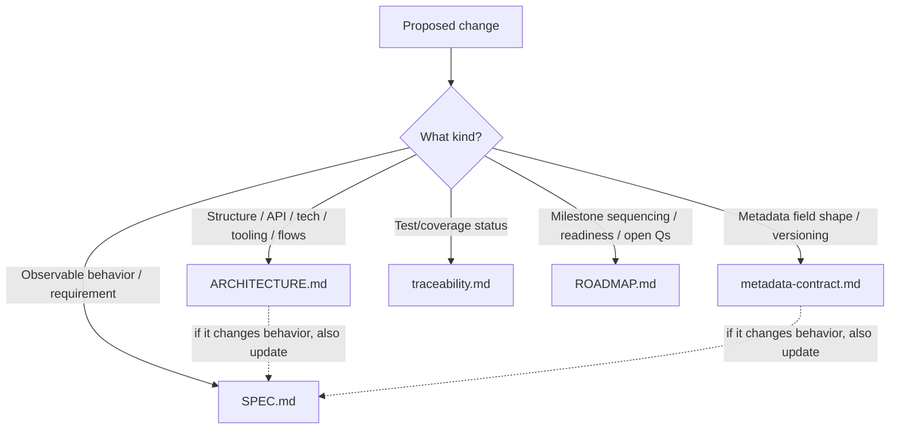
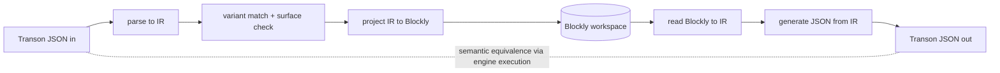
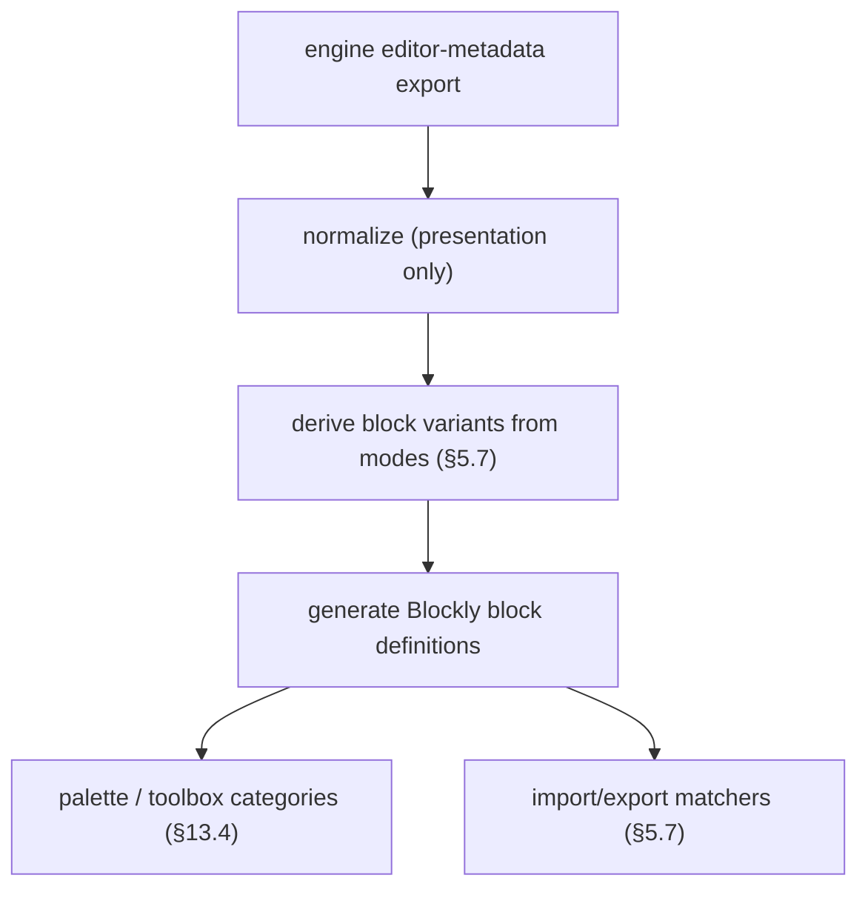
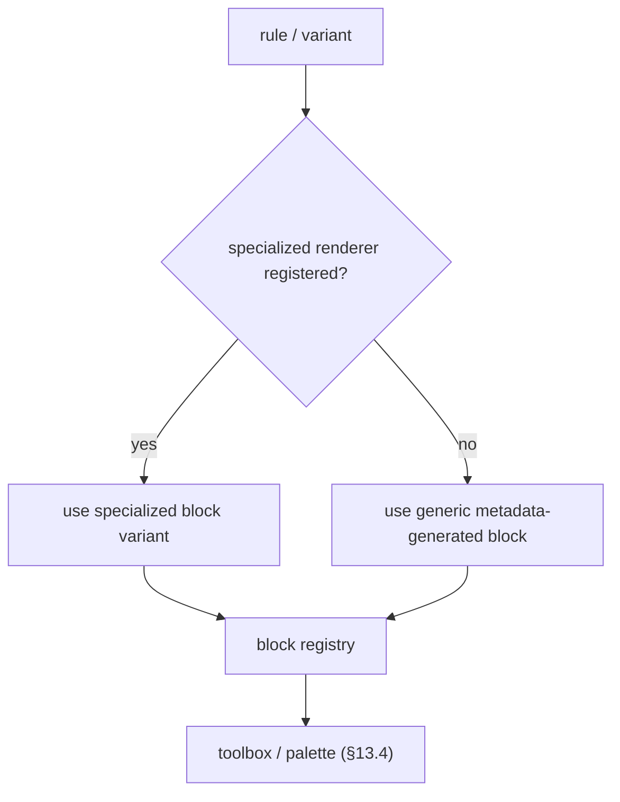
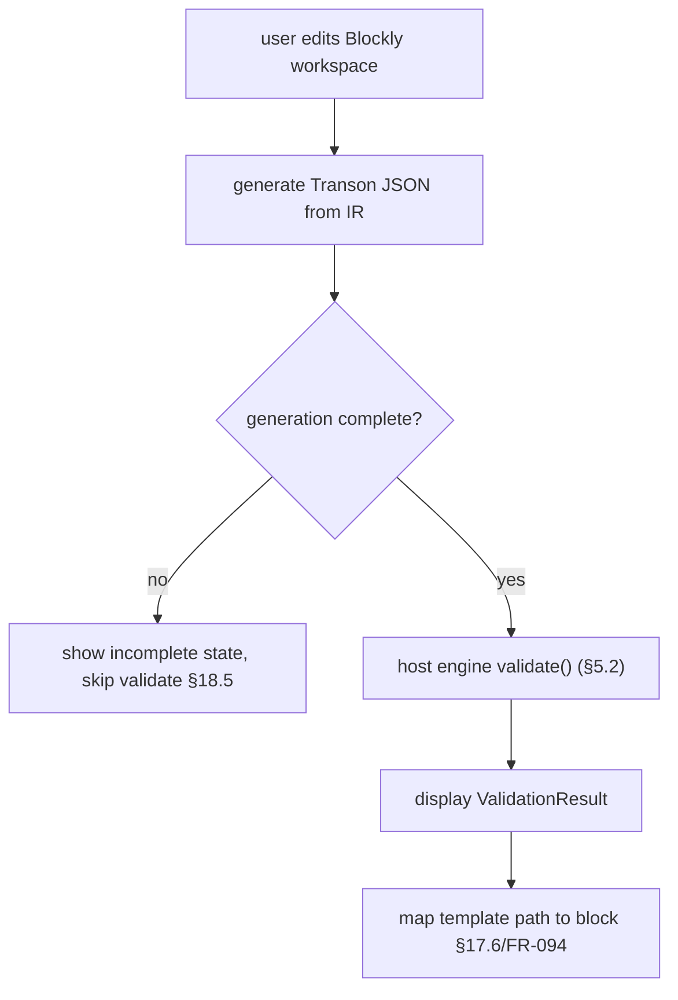
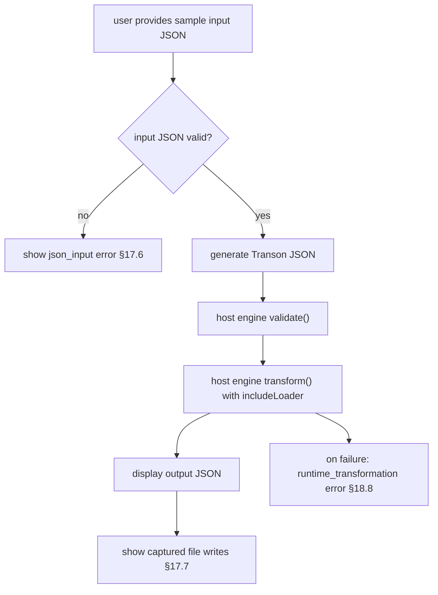
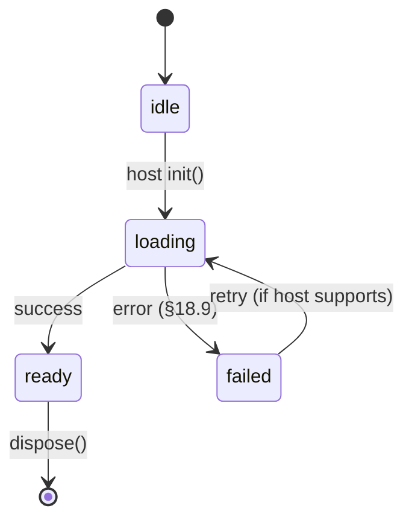

# ARCHITECTURE.md — Transon Visual Editor

> **Version:** 1.0 · **Status:** Pre-implementation baseline
> **Last updated:** 2026-06-23

This document is the single source of truth for **how** the Transon Visual Editor is built:
package/module structure, the host boundary and public API, the intermediate representation
(IR) used for round-trip, distribution, build tooling, technology choices, and the
architecture decision records (`AD-018`+) made during design. It also holds the
implementation detail for the metadata/block-generation flows (§5.5–§5.7) and the
validation/execution flows (§6.4).

It complements — and does not restate — [`SPEC.md`](SPEC.md) (the *what*),
[`metadata-contract.md`](metadata-contract.md) (the metadata *shape*),
[`traceability.md`](traceability.md) (the *verification*), and [`ROADMAP.md`](ROADMAP.md)
(the *sequencing*). SPEC requirement IDs are cited inline as
`FR-xxx` / `NFR-xxx` / `AD-xxx` / `AC-xxx` / `OQ-xxx`.

> **Governance note.** Per `SPEC.md` §22.1, any decision here that changes observable behavior
> must also be reflected in `SPEC.md`.

---

## 1. Document map — what belongs where

These four documents partition the project knowledge with as little overlap as possible.

| Document | Owns (source of truth for) | Does **not** contain |
|---|---|---|
| [`SPEC.md`](SPEC.md) | Product behavior: use cases, FR/NFR/AC, behavioral architecture decisions (`AD-001..AD-017`), conceptual domain model, UX model, rule coverage, import/export & round-trip semantics, canonical error taxonomy, open questions. The **what** and observable behavior. | Concrete package/module layout, language/tooling choices, public API signatures, build/distribution mechanics, implementation flows. |
| [`metadata-contract.md`](metadata-contract.md) | The cross-repo **data contract**: metadata field shapes for rules/params/operators/functions, the engine-owned export, schema versioning. The metadata **shape**. | Editor internals, UI, runtime wiring. |
| [`traceability.md`](traceability.md) | **Verification**: requirement→code→test matrix, engine-parity (anti-drift) checks, round-trip corpus coverage, AC coverage. The **is-it-covered**. | Design rationale, behavior definitions. |
| [`ARCHITECTURE.md`](ARCHITECTURE.md) (this doc) | Implementation **how**: package/module decomposition, ports & adapters, host boundary & public API, IR design, variant-matching + validation/execution flows, state/error/theming strategy, distribution, build/tooling, technology choices, decision records (`AD-018`+). | Behavioral requirements (SPEC), metadata field lists (contract), test matrices (traceability), milestone sequencing (roadmap). |
| [`ROADMAP.md`](ROADMAP.md) | **Sequencing**: milestones (M0–M5), per-milestone scope/deliverables/Definition of Done, readiness assessment, locked decisions, open questions, future considerations. The **in-what-order**. | Behavior definitions, design rationale, test matrices. |

**Routing rule for future changes**



---

## 2. Architectural principles

1. **JSON is canonical** (`AD-003`). Transon JSON is the artifact; the Blockly workspace is a
   projection. Round-trip equivalence is *semantic*, proven by execution (§5.4, AD-025).
2. **The editor is engine-free** (`AD-018`). It ships no Python, Pyodide, wheel, or `pip`
   logic. All runtime concerns (validation, execution, include resolution, `file` capture,
   even the metadata source) cross **one host-provided boundary** (§5.2, `AD-021`).
3. **Metadata-driven, engine-owned** (`AD-006`, `AD-014`, `AD-016`, `AD-022`). Blocks and
   palette are generated from metadata the **engine** owns and exports. The editor adds only
   presentation.
4. **Framework-agnostic on the outside, React on the inside** (`AD-019`). Usable from pure
   HTML or any framework; React is a bundled implementation detail.
5. **Correctness isolated and tested first.** The semantic core (IR + codec + variant
   matching + surface check) is pure TypeScript with no Blockly/React/engine dependency and is
   the first deliverable (§9, `AD-023`).
6. **Variants over hidden modes** (`AD-015`). Mutually exclusive parameter groups become
   separate palette block variants whose matchers derive mechanically from engine modes
   (§5.7).

---

## 3. Decision records (AD-018+)

Implementation architecture decisions **continue the `AD-xxx` family** from `SPEC.md` §9
(which ends at `AD-017`). They are append-only and never renumbered (`SPEC.md` §22.2).

### AD-018 — The editor owns no runtime; the host injects all runtime concerns
**Decision.** The editor defines a runtime **port** and consumes a host-provided object
(`TransonEditorHost`, §5.2). The editor never bundles or initializes an engine; Transon,
Python, and any in-browser runtime are the embedding host's responsibility.
**Consequences.** Validation/execution/include/`file`-capture are host responsibilities. The
editor works with no engine (authoring, round-trip, export remain live). A reference host
lives only in the demo/consumers (§5.1), never in an editor package.
**SPEC link.** Underpins `AD-005`; relates to `NFR-025`, `NFR-028`, `NFR-029`, `AD-011`,
`AD-012`, `SPEC.md` §11.9, §17, §18.9.

### AD-019 — Framework-agnostic public surface; React internal
**Decision.** Public surface = a vanilla `createTransonEditor()` primitive + a
`<transon-editor>` Web Component + an optional native React entry. React is bundled inside the
standalone builds; the React entry treats React as a peer.
**Consequences.** Three thin public adapters over one internal React UI. The web component
passes rich props via properties + events (not attributes).
**SPEC link.** Resolves `OQ-012`.

### AD-020 — Distribution: ESM primary + self-contained IIFE global
**Decision.** Ship ESM (primary, tree-shakeable) plus a self-contained IIFE/UMD global that
auto-registers `<transon-editor>` for zero-build `<script>` usage; `.d.ts` types; CDN-ESM +
importmap documented.
**Consequences.** Multiple build outputs; the global bundle inlines React + Blockly and is
large; engine adapters are never in this bundle (`AD-018`).

### AD-021 — Engine runtime is a port (`EngineProvider`)
**Decision.** Core declares an `EngineProvider` interface (validate/transform/version/init/
dispose). Concrete adapters (e.g. an in-browser runtime in a worker, Node→Python, server, or
mock) are implemented by **consumers and tests**, not by editor packages.
**Consequences.** Engine swappable and mockable; execution-based round-trip tests inject a
Node→Python adapter (`AD-025`).
**SPEC link.** Underpins `AD-005` and §11.9.

### AD-022 — Engine-owned, versioned editor-metadata export
**Decision.** Add a dedicated, **versioned** editor-metadata export to the Transon engine
(`transon/editor_metadata.py::get_editor_metadata()`), independent of the docs API: serialize
`__rule_schema__` (`required`, `modes`) and add structured per-parameter `kind`
(`dynamic`/`constant`) at the source. The editor consumes this directly; its normalization
layer is presentation-only.
**Consequences.** The editor maintains no parallel semantic source of truth. Parity checks
([`traceability.md`](traceability.md)) compare against the engine's own export.
**SPEC/contract link.** Resolves `OQ-001`, `OQ-013`; defined in `metadata-contract.md` §3–§4.

### AD-023 — Typed IR as the round-trip pivot
**Decision.** A typed intermediate representation sits between Transon JSON and Blockly.
`JSON ⇄ IR` is pure/headless and hosts variant matching (§5.7), surface checks (§16.10),
marker escape (§12.4), and the `JsonPathBlockMap` (§10.12). `IR ⇄ Blockly` is the only
Blockly-coupled mapping.
**Consequences.** Round-trip = `JSON→IR→Blockly→IR→JSON`; correctness is unit-testable without
a browser. Implements `AD-003`/`AD-004`.

### AD-024 — Hybrid block generation (generic + specialized)
**Decision.** Generic blocks are generated **at runtime** from metadata (so new/custom rules
need no editor code — `FR-131`, `AC-028`); specialized blocks are authored TS override modules
selected by `rule_name`/`variant_id` (§5.6).
**Consequences.** Both paths must emit identical JSON per variant → guarded by shared
variant/generator definitions and round-trip tests. Resolves `OQ-002`, `OQ-014`. Implements
`AD-014`.

### AD-025 — Execution-based round-trip verification
**Context.** `SPEC.md` §16.1 defines equivalence semantically; `OQ-010` drafted a hybrid.
**Decision.** Verify round-trip by **executing** imported and exported templates through an
injected engine and comparing outputs. For corpus entries with **no sample input**, fall back
to normalized-output + validation-result comparison (`OQ-010`). CI uses a Node→Python
`EngineProvider` adapter (`AD-021`); Pyodide is not required for tests.
**Consequences.** A real engine is needed in the test harness from **M1**. Refines `AD-004`;
resolves `OQ-010`.

### AD-026 — Blockly Zelos renderer (Scratch-like), configurable
**Decision.** Default to the Zelos renderer to match `SPEC.md` §1 ("similar to Scratch") and
the low-code audience (§5.1); expose renderer/theme via the theming hook (`FR-112`).

### AD-027 — Light DOM + scoped CSS (shadow optional)
**Decision.** Render in light DOM with scoped/prefixed CSS by default to avoid Blockly's
`document.head` CSS-injection and sizing/focus friction; a Shadow-DOM mode is optional,
validated by the M2 spike (§9).

### AD-028 — Monorepo tooling
**Decision.** pnpm workspaces + Turborepo + Vite (library mode) + Vitest + Changesets;
independent of the docs-site (CRA) stack.

---

## 4. System overview (ports & adapters)


The dashed edges are the **host boundary**: everything below it is supplied by the embedder
(`AD-018`).

---

## 5. Components

### 5.1 Package map

| Package | Public | Depends on | Responsibility |
|---|:--:|---|---|
| `@transon/editor-core` | ✅ | pure TS | IR, `JSON⇄IR` codec, variant matcher (§5.7), surface check (§16.10), marker escape (§12.4), `JsonPathBlockMap` (§10.12), metadata model, `EngineProvider` **port**, error taxonomy (§17.6). Engine-free, headless. **Deliverable #1.** |
| `@transon/editor-blockly` | ✅ | core, blockly | Zelos generic block generation + specialized overrides + `IR⇄Blockly` + toolbox |
| `editor-ui` (internal) | — | core, blockly, react | panels, sandbox/compact modes, `EditorSession` store, theming (light DOM) |
| `@transon/editor-element` | ✅ | editor-ui (React bundled) | `createTransonEditor()` + `<transon-editor>`; ESM + IIFE global |
| `@transon/editor-react` | ✅ (opt) | editor-ui (React peer) | native React entry |
| `examples/pyodide-host` | demo | core port | **reference** Pyodide-in-worker `EngineProvider`; powers the sandbox/playground |
| `test/engine-node-adapter` | dev | core port | Node→local Python `transon` `EngineProvider` for execution round-trip CI |


### 5.2 The host boundary & contracts (`AD-018`, `AD-021`; `SPEC.md` §11.9)

```ts
interface TransonEditorHost {
  metadata: EditorMetadata;        // host-supplied (engine editor_metadata export)
  marker?: string;                 // default "$"
  engine?: EngineProvider;         // omit → validate/run disabled; authoring still works
  examples?: ExampleCase[];        // host-supplied corpus
  theme?: ThemeTokens;
}

interface EngineProvider {         // implemented by the HOST, not the editor
  readonly status: 'idle' | 'loading' | 'ready' | 'failed';
  init(): Promise<void>;
  validate(template: Json, o: { marker: string }): Promise<ValidationResult>;
  transform(template: Json, input: Json, o: {
    marker: string;
    includeLoader?(name: string): Json | undefined;   // host owns includes (AD-012)
  }): Promise<ExecutionResult>;    // ExecutionResult.filesWritten = captured `file` writes (AD-011)
  version(): Promise<{ engine: string; metadata: string }>;
  dispose(): void;
}
```

`file` capture and `include` resolution map directly onto the engine's `write_file` and
`template_loader` constructor delegates (`transon/rules.py`), so a host adapter wires them
without touching engine internals.

### 5.3 Public surface & distribution (`AD-019`, `AD-020`)

```ts
function createTransonEditor(target: HTMLElement, options: TransonEditorHost & {
  mode?: 'sandbox' | 'compact';
  template?: Json; input?: Json;
  readOnly?: boolean;
  onChange?(t: Json): void;
  onValidate?(r: ValidationResult): void;
  onExecute?(r: ExecutionResult): void;
}): TransonEditorHandle;  // { getTemplate, setTemplate, validate, run, destroy }
```

- ESM is primary; the IIFE global auto-registers `<transon-editor>` for `<script>` usage.
- `@transon/editor-react` exposes `<TransonEditor {...options} />` with React as a peer.

### 5.4 Intermediate Representation (IR) & round-trip (`AD-023`, `AD-025`)

The IR is a small typed tree:

```text
TemplateNode =
  | Scalar(string | number | boolean | null)
  | ArrayNode(TemplateNode[])
  | LiteralObject(Map<string, TemplateNode>)         // no marker key
  | LiteralMarkerObject(...)                          // emitted via object/fields escape (§12.4)
  | RuleInvocation(rule, variantId, params: Map<string, TemplateNode>)
```



Ordering semantics for `set`/`chain` (`SPEC.md` §14.12, §16.3) are preserved in the IR
(ordered object keys, ordered array items, ordered `chain` steps).

### 5.5 Metadata normalization & generic block generation

Post-`AD-022` the normalization layer is **presentation-only** (it owns no semantic fields):

- map rules to canonical palette categories (`SPEC.md` §13.4);
- derive block variants from the engine `modes` (mechanical; §5.7);
- palette ordering, labels/titles, colors;
- select the specialized renderer where one exists (§5.6).

Generic block generation flow:



### 5.6 Specialized block override (`AD-024`)

Generic blocks come from metadata at runtime; specialized blocks are authored TS modules that
override generic rendering for selected rules/variants. A registry resolves specialized over
generic; both paths must emit identical JSON per variant.



### 5.7 Import variant matching

**Variant matcher format.** A variant's `import_matcher` (referenced by `FR-122`, `FR-124`,
`FR-125`, and the domain model §10.6/§10.7) is derived mechanically from the engine rule
schema (`__rule_schema__`: `_required` and `_modes`; see
[`metadata-contract.md`](metadata-contract.md) §2.1). A matcher is three sets of parameter
names:

- `required_present` — the rule's always-required params (`_required`) plus the params of this
  variant's mode. All must be present.
- `forbidden` — params that belong only to other modes of the same rule. None may be present
  (this is what makes mutually exclusive modes distinguishable).
- `optional` — remaining declared params (not in any mode, not required). May be present or
  absent.

A rule invocation matches a variant when every `required_present` key is present, no
`forbidden` key is present, and no parameter outside the rule's declared params appears (an
undeclared parameter is out of surface, §16.10).

Examples (derived from the engine):

```text
attr  _modes=(('name',),('names',))  optional: default
  variant "name":  required_present={name}   forbidden={names}  optional={default}
  variant "names": required_present={names}  forbidden={name}   optional={default}

expr  _required=('op',)  _modes=((),('value',),('values',))
  variant "current": required_present={op}          forbidden={value,values}
  variant "value":   required_present={op,value}    forbidden={values}
  variant "values":  required_present={op,values}   forbidden={value}
```

The empty mode `()` yields a valid zero-extra-parameter variant whose `required_present` is
just the rule's `_required` and whose `forbidden` is every moded param (covers `expr` and
`call` "current value" forms).

**Algorithm.** When importing a rule invocation:

1. Read rule name from marker key.
2. Load rule metadata.
3. Identify available block variants for that rule (and their matchers, above).
4. Compare present parameters against each variant matcher.
5. Select exactly one matching variant.
6. If zero or multiple variants match, report an `import_unsupported` error (§17.6, §18.6).
7. Populate required and optional inputs from imported JSON.
8. Validate generated output against original semantic template.

### 5.8 Engine-side editor metadata export (transon repo) (`AD-022`)

New, versioned export emitting [`metadata-contract.md`](metadata-contract.md) §2 fields:

- rules: `name`, `description`, `required_params` (from `_required`), `modes` (from `_modes`),
  `params[]` with per-param `kind`, `examples`; optional engine hints (`title`, `category`,
  `advanced`).
- operators, functions per `metadata-contract.md` §2.3/§2.4.
- a standalone `metadata_version` (versioned separately from the engine release, `NFR-044`).

---

## 6. Cross-cutting concerns

- **State / Blockly↔React** (`AD-003`): one-way. Blockly owns the canvas; React subscribes to
  change events → debounced codec → derives `{json, validation, execution}` into the
  `EditorSession` store (§10.3). React→Blockly only for explicit commands (New / Import / Load
  Example).
- **Error mapping** (`FR-094..098`, §17.6): the `JsonPathBlockMap` is produced by the
  `JSON⇄IR` step; UI highlights the mapped or nearest-parent block.
- **Theming / encapsulation** (`AD-026`, `AD-027`): Zelos default, light DOM + scoped CSS.
- **Diagnostics** (`FR-088`, §19): engine + metadata versions, parity diffs, renderer used.

### 6.4 Validation & execution flows

All engine calls go through the host-provided `EngineProvider` (§5.2); the editor owns no
runtime (`AD-018`).

**Validation flow:**



**Execution flow:**



**Runtime initialization / status.** Engine init and status (`idle` / `loading` / `ready` /
`failed`) are properties of the host-provided runtime, surfaced by the editor per `NFR-025`
and handled on failure per `SPEC.md` §18.9. The editor does not initialize any engine runtime.



---

## 7. Testing strategy alignment

Defers to [`traceability.md`](traceability.md) for the matrix. Architecture-specific notes:

- The headless core (`editor-core`) is tested without DOM/engine for codec/matcher/surface.
- **Round-trip is execution-based** (`AD-025`) via `test/engine-node-adapter`; input-less
  corpus entries use normalized-output + validation comparison.
- Engine-parity checks ([`traceability.md`](traceability.md)) compare the editor against the
  engine's `editor_metadata` export (`AD-022`), not a hand list.

---

## 8. Build & tooling (`AD-028`)

pnpm workspaces · Turborepo (task caching) · Vite (library mode) · Vitest · Changesets
(independent semver for public packages). Outputs are framework-agnostic; the docs-site CRA
stack is a *consumer*, not a dependency.

---

## 9. Milestones, sequencing & readiness

Milestone sequencing (M0–M5), per-milestone scope/deliverables/Definition of Done, the
readiness assessment, and the remaining inputs to define before coding live in
[`ROADMAP.md`](ROADMAP.md). The headless round-trip **core (`editor-core`) is the first
deliverable**; both targets (sandbox + embeddable) are equal in priority.
