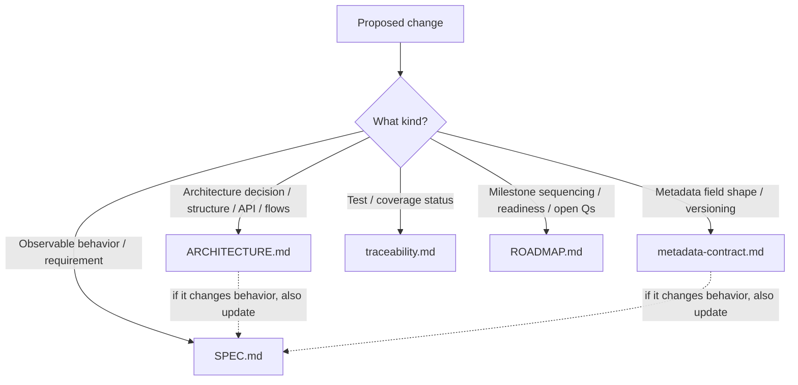
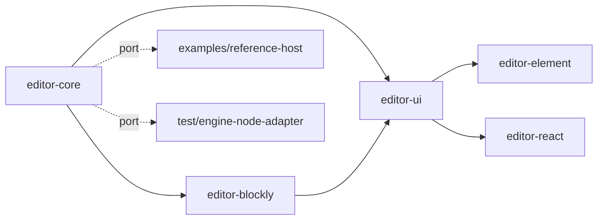
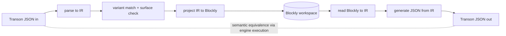
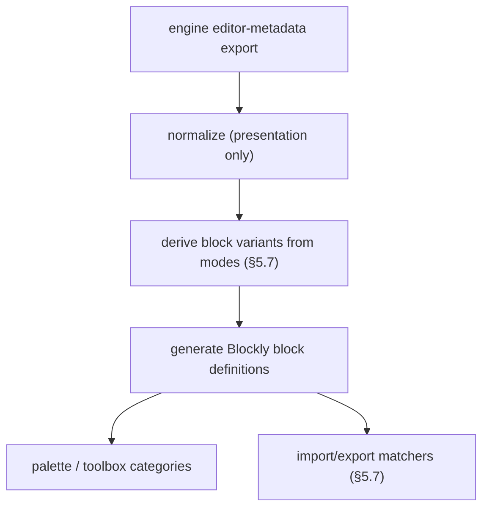
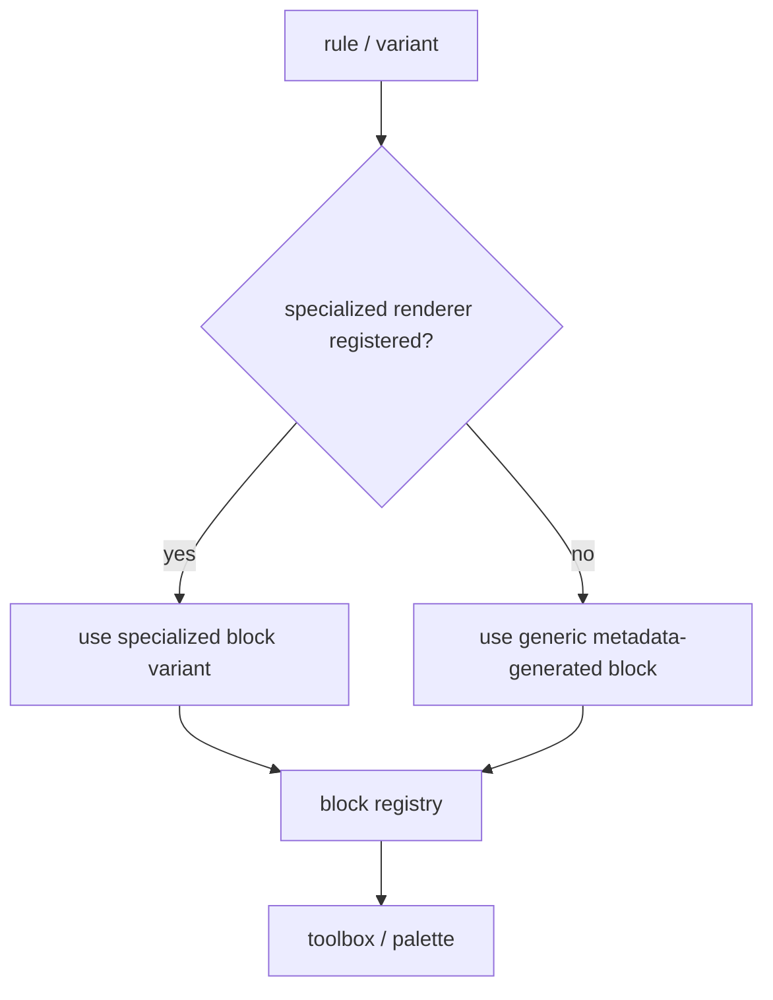
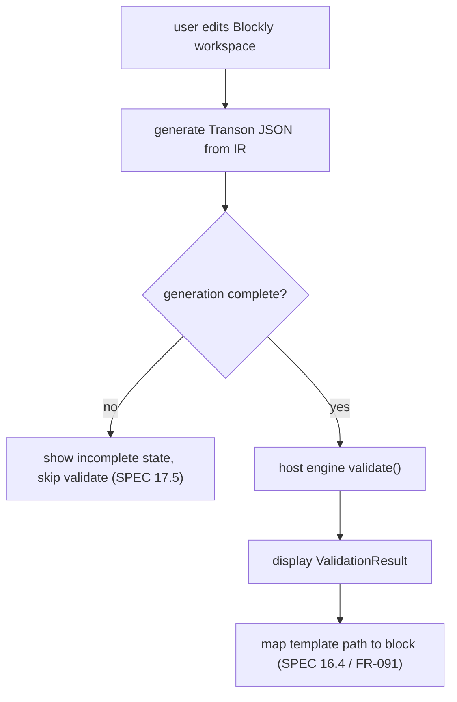
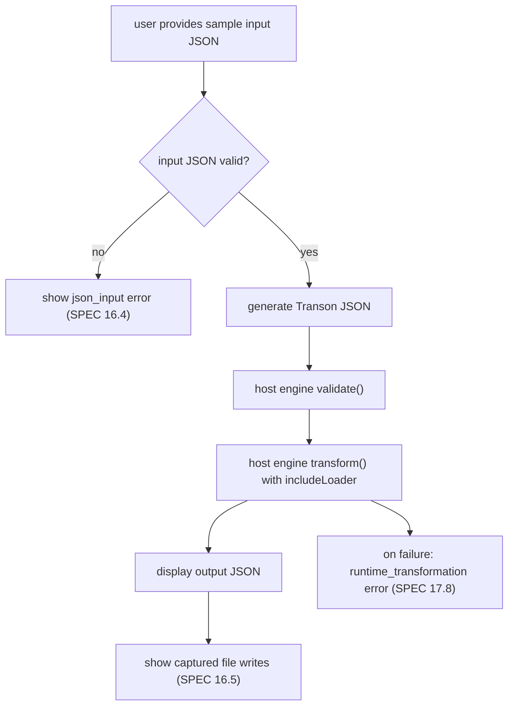
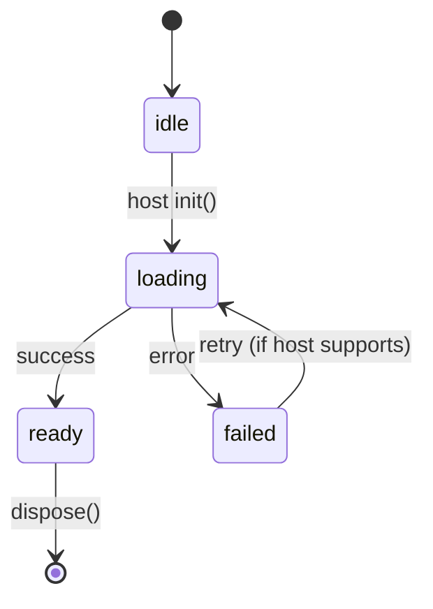

# ARCHITECTURE.md — Transon Visual Editor

> **Version:** 1.0 · **Status:** Pre-implementation baseline · **Last updated:** 2026-06-23

This document is the source of truth for **how** the Transon Visual Editor is built: the
architectural principles, the architecture decision records (`AD-001..AD-023`), the
package/module structure, the host boundary and public API, the intermediate representation (IR)
used for round-trip, the variant-matching and validation/execution flows, distribution, and
build tooling.

It complements — and does not restate — [`SPEC.md`](SPEC.md) (the *what*),
[`metadata-contract.md`](metadata-contract.md) (the metadata *shape*),
[`traceability.md`](traceability.md) (the *verification*), and [`ROADMAP.md`](ROADMAP.md) (the
*sequencing*). SPEC IDs are cited inline as `FR-xxx` / `NFR-xxx` / `AC-xxx` / `UC-xxx`.

> **Governance.** All architecture decisions live here. Per `SPEC.md` §21.2, any decision that
> changes observable behavior must also be reflected in `SPEC.md`.

---

## 1. Document map — what belongs where

| Document | Owns (source of truth for) | Does **not** contain |
|---|---|---|
| [`SPEC.md`](SPEC.md) | Product behavior: use cases, FR/NFR/AC, conceptual domain model, UX model, rule coverage, import/export and round-trip semantics, canonical error taxonomy, governance rules. The **what**. | Architecture decisions, package/module layout, language/tooling choices, public API signatures, build/distribution mechanics, implementation flows. |
| [`ARCHITECTURE.md`](ARCHITECTURE.md) (this doc) | Implementation **how**: architecture decisions (`AD-001..023`), package decomposition, ports & adapters, host boundary & public API, IR design, variant-matching + validation/execution flows, state/error/theming strategy, distribution, build/tooling. | Behavioral requirements (SPEC), metadata field lists (contract), test matrices (traceability), milestone sequencing (roadmap). |
| [`metadata-contract.md`](metadata-contract.md) | The cross-repo **data contract**: metadata field shapes for rules/params/operators/functions, the engine-owned export, schema versioning. The metadata **shape**. | Editor internals, UI, runtime wiring. |
| [`traceability.md`](traceability.md) | **Verification**: requirement→code→test matrix, engine-parity (anti-drift) checks, round-trip corpus coverage, AC coverage. The **is-it-covered**. | Design rationale, behavior definitions. |
| [`ROADMAP.md`](ROADMAP.md) | **Sequencing**: milestones (M0–M5), per-milestone scope/deliverables/Definition of Done, readiness, locked decisions, open questions, future considerations. The **in-what-order**. | Behavior definitions, design rationale, test matrices. |

**Routing rule for future changes**



---

## 2. Architectural principles

1. **JSON is canonical** (AD-003). Transon JSON is the artifact; the Blockly workspace is a
   projection. Round-trip equivalence is *semantic*, proven by execution (§5.4, AD-011).
2. **The editor is engine-free** (AD-008). It ships no engine runtime. All runtime concerns
   (validation, execution, include resolution, `file` capture, the metadata source) cross **one
   host-provided boundary** (§5.2).
3. **Metadata-driven, engine-owned** (AD-012, AD-014). Blocks and palette are generated from
   metadata the engine owns and exports; the editor adds only presentation.
4. **Framework-agnostic on the outside, React on the inside** (AD-019). Usable from pure HTML or
   any framework; React is a bundled implementation detail.
5. **Correctness isolated and tested first.** The semantic core (IR + codec + variant matching +
   surface check) is pure TypeScript with no Blockly/React/engine dependency and is the first
   deliverable (AD-016).
6. **Variants over hidden modes** (AD-015). Mutually exclusive parameter groups become separate
   palette block variants whose matchers derive mechanically from engine modes (§5.7).

---

## 3. Decision records

Architecture decisions are append-only and never renumbered from v1.0 onward (`SPEC.md` §21.1).

### AD-001 — Use Google Blockly for the visual editor
**Decision.** Use Google Blockly as the visual drag-and-drop interface.
**Rationale.** Mature toolkit; interlocking block composition; custom blocks; serialization;
toolboxes/categories; suitable for nested template structures.

### AD-002 — Build an embeddable editor component
**Decision.** The primary deliverable is an embeddable editor component/library; a demo app may
exist but the editor is not designed as a standalone app only.
**Rationale.** Enables embedding into the docs site and internal tools; separates editor logic
from the host application.

### AD-003 — Transon JSON is the canonical artifact
**Decision.** The executable Transon JSON template is the source of truth; the Blockly workspace
is an editable projection plus optional UI-only metadata.
**Rationale.** Templates are JSON data, executable outside the editor, and storable/diffable; the
editor must not create a separate language.

### AD-004 — Support strict semantic round-trip
**Decision.** Support strict semantic round-trip for supported templates.
**Rationale.** Developers must trust the editor; imported templates must not be silently changed;
correctness matters more than preserving visual layout.

### AD-005 — Support all built-in rules in v1
**Decision.** Include visual support for all built-in Transon rules in v1.
**Rationale.** Full coverage supports strict import/round-trip; partial support weakens trust.
**Trade-off.** More complex UX; advanced rules must be progressively disclosed (AD-007).

### AD-006 — No backend persistence in v1
**Decision.** No backend storage in v1; manual import/export only.
**Rationale.** Keeps v1 small; avoids auth/sharing complexity; supports static deployment.

### AD-007 — Sandbox and compact editor modes
**Decision.** Support two UI modes: sandbox/playground and compact embedded.
**Rationale.** Docs/playground needs input/output/template panels; embedding applications may
need only the visual editor.

### AD-008 — Engine is a host-provided port (`EngineProvider`)
**Decision.** The editor owns no engine runtime. It defines a runtime **port**
(`EngineProvider`) and consumes a host-provided object (`TransonEditorHost`, §5.2) for
validation, execution, include resolution, and `file` capture. The editor never bundles or
initializes an engine; the exact runtime mechanism (in-browser, server, or mock) is the host's
responsibility. Concrete adapters are implemented by consumers and tests, not by editor
packages.
**Rationale.** Keeps the editor framework- and runtime-agnostic; lets hosts choose any engine;
validation/execution still use the real engine when a host provides one; authoring,
generation, import/export, and round-trip work with no engine.
**SPEC link.** Underpins `SPEC.md` §10.4, §16, §17.9, NFR-028/031/032.

### AD-009 — `file` writes are captured side effects provided by the host
**Decision.** `file` is representable and executable, but no real filesystem write occurs in
preview. The host engine captures writes (via the engine `write_file` delegate) and returns them
as `ExecutionResult.filesWritten`; the editor shows them in a "files produced" view.
**Rationale.** Supports all built-in rules; avoids unsafe filesystem behavior; makes side effects
visible and testable; keeps capture in the host runtime.

### AD-010 — `include` resolution is provided by the host
**Decision.** `include` is supported; the host engine resolves includes from sources it controls
(loaded examples, embedding configuration, a supplied include map) via the engine
`template_loader` delegate / an `includeLoader` passed across the boundary (§5.2). The editor
reports clearly when the host cannot resolve an include.
**Rationale.** `include` is part of the built-in surface; execution needs an explicit loader,
owned by the host; a missing loader is reported, not guessed.

### AD-011 — Execution-based round-trip verification
**Decision.** Verify round-trip by executing imported and exported templates through an injected
engine and comparing outputs. For corpus entries with no sample input, fall back to
normalized-output + validation-result comparison. CI uses a Node→Python `EngineProvider` adapter;
an in-browser runtime is not required for tests.
**Rationale.** Equivalence is semantic (`SPEC.md` §15.1); execution is the strongest check. A
real engine is needed in the test harness from M0.

### AD-012 — Engine-owned, versioned editor-metadata export
**Decision.** The Transon engine owns a dedicated, versioned editor-metadata export
(`get_editor_metadata()`), independent of the docs API: it serializes `__rule_schema__`
(`required`, `modes`) and emits a structured per-parameter `kind` (`dynamic`/`constant`) at the
source, plus operator/function metadata. The editor consumes this directly and adds only
presentation; it maintains no parallel semantic source of truth.
**Rationale.** Avoids duplicating rule knowledge; lets new rules appear without editor changes;
keeps documentation, validation, examples, and visual editing aligned.
**Trade-off.** Transon must maintain a stable metadata schema. Parity checks
([`traceability.md`](traceability.md)) compare the editor against the engine's own export.
**SPEC/contract link.** [`metadata-contract.md`](metadata-contract.md) §3–§4.

### AD-013 — Hybrid block typing
**Decision.** Use a hybrid typing model: strict structural constraints where the rule contract
is known; advisory runtime-type expectations where values are dynamic.
**Rationale.** Many parameters are templates and runtime type depends on input; overly strict
typing would reject valid templates, loose typing would allow invalid structures.

### AD-014 — Metadata-driven generation with specialized variants
**Decision.** Generic blocks are generated at runtime from metadata (so new/custom rules need no
editor code); specialized blocks are authored TS override modules selected by
`rule_name`/`variant_id`. A registry resolves specialized over generic; both paths must emit
identical JSON per variant.
**Rationale.** New rules appear with minimal code; common rules stay usable for low-code users;
extensibility is preserved; import/export maps parameter shapes to variants.

### AD-015 — Mutually exclusive parameters as block variants
**Decision.** Rules with mutually exclusive parameter groups are represented as separate palette
block variants, not one block with a hidden mode dropdown.
**Rationale.** Visual blocks should expose semantic shape; the UI prevents invalid combinations
before engine validation; import/export maps JSON shapes to variants.
**Trade-off.** A larger palette; naming and organization matter more (`SPEC.md` §12.5).

### AD-016 — Typed IR as the round-trip pivot
**Decision.** A typed intermediate representation sits between Transon JSON and Blockly.
`JSON ⇄ IR` is pure/headless and hosts variant matching (§5.7), surface checks
(`SPEC.md` §15.7), marker escape (`SPEC.md` §11.4), and the `JsonPathBlockMap`
(`SPEC.md` §9.12). `IR ⇄ Blockly` is the only Blockly-coupled mapping.
**Rationale.** Round-trip = `JSON→IR→Blockly→IR→JSON`; correctness is unit-testable without a
browser. Implements AD-003/AD-004.

### AD-017 — Blockly Zelos renderer (Scratch-like), configurable
**Decision.** Default to the Zelos renderer to match `SPEC.md` §1 ("similar to Scratch") and the
low-code audience; expose renderer/theme via the theming hook (FR-108).
**Rationale.** Matches the intended look and audience while staying configurable.

### AD-018 — Light DOM + scoped CSS (shadow optional)
**Decision.** Render in light DOM with scoped/prefixed CSS by default to avoid Blockly's
`document.head` CSS injection and sizing/focus friction; a Shadow-DOM mode is optional, validated
by the M2 spike.
**Rationale.** Avoids known Blockly encapsulation pitfalls while leaving stricter isolation
available.

### AD-019 — Framework-agnostic public surface; React internal
**Decision.** The public surface is a vanilla `createTransonEditor()` primitive + a
`<transon-editor>` web component + an optional native React entry. React is bundled inside the
standalone builds; the React entry treats React as a peer.
**Rationale.** Usable from any framework or pure HTML; React stays an implementation detail.

### AD-020 — Distribution: ESM primary + self-contained IIFE global
**Decision.** Ship ESM (primary, tree-shakeable) plus a self-contained IIFE/UMD global that
auto-registers `<transon-editor>` for zero-build `<script>` usage; `.d.ts` types; CDN-ESM +
importmap documented.
**Rationale.** Serves both bundler and script-tag consumers. The global bundle inlines React +
Blockly and is large; engine adapters are never in this bundle (AD-008).

### AD-021 — Monorepo tooling
**Decision.** pnpm workspaces + Turborepo + Vite (library mode) + Vitest + Changesets, with
independent semver for public packages. Outputs are framework-agnostic; the docs-site stack is a
consumer, not a dependency.
**Rationale.** Standard, cache-friendly multi-package tooling.

### AD-022 — AI development governed by the spec
**Decision.** Behavior-changing implementation must update `SPEC.md`; conflicts are surfaced
before coding.
**Rationale.** Project semantics are subtle; AI-assisted development can otherwise drift.

### AD-023 — JSFiddle-style sharing out of scope for v1
**Decision.** Share links may come later but are not in v1.
**Rationale.** Requires storage, a sharing model, and abuse considerations not needed for initial
correctness.

---

## 4. System overview (ports & adapters)


The dashed edges are the **host boundary**: everything below it is supplied by the embedder
(AD-008).

---

## 5. Components

### 5.1 Package map

| Package | Public | Depends on | Responsibility |
|---|:--:|---|---|
| `@transon/editor-core` | yes | pure TS | IR, `JSON⇄IR` codec, variant matcher (§5.7), surface check (`SPEC.md` §15.7), marker escape (`SPEC.md` §11.4), `JsonPathBlockMap` (`SPEC.md` §9.12), metadata model, `EngineProvider` **port**, error taxonomy (`SPEC.md` §16.4). Engine-free, headless. **Deliverable #1.** |
| `@transon/editor-blockly` | yes | core, blockly | Zelos generic block generation + specialized overrides + `IR⇄Blockly` + toolbox |
| `editor-ui` (internal) | — | core, blockly, react | panels, sandbox/compact modes, `EditorSession` store, theming (light DOM) |
| `@transon/editor-element` | yes | editor-ui (React bundled) | `createTransonEditor()` + `<transon-editor>`; ESM + IIFE global |
| `@transon/editor-react` | yes (opt) | editor-ui (React peer) | native React entry |
| `examples/reference-host` | demo | core port | reference `EngineProvider` (e.g. an in-browser Python runtime such as Pyodide, or a server engine); powers the sandbox/playground |
| `test/engine-node-adapter` | dev | core port | Node→local Python `transon` `EngineProvider` for execution round-trip CI |



### 5.2 The host boundary & contracts (AD-008; `SPEC.md` §10.4)

```ts
interface TransonEditorHost {
  metadata: EditorMetadata;        // host-supplied (engine editor_metadata export)
  marker?: string;                 // default "$"
  engine?: EngineProvider;         // omit -> validate/run disabled; authoring still works
  examples?: ExampleCase[];        // host-supplied corpus
  theme?: ThemeTokens;
}

interface EngineProvider {         // implemented by the HOST, not the editor
  readonly status: 'idle' | 'loading' | 'ready' | 'failed';
  init(): Promise<void>;
  validate(template: Json, o: { marker: string }): Promise<ValidationResult>;
  transform(template: Json, input: Json, o: {
    marker: string;
    includeLoader?(name: string): Json | undefined;   // host owns includes (AD-010)
  }): Promise<ExecutionResult>;    // ExecutionResult.filesWritten = captured `file` writes (AD-009)
  version(): Promise<{ engine: string; metadata: string }>;
  dispose(): void;
}
```

`file` capture and `include` resolution map directly onto the engine's `write_file` and
`template_loader` constructor delegates, so a host adapter wires them without touching engine
internals.

### 5.3 Public surface & distribution (AD-019, AD-020)

```ts
function createTransonEditor(target: HTMLElement, options: TransonEditorHost & {
  mode?: 'sandbox' | 'compact';
  template?: Json; input?: Json;
  readOnly?: boolean;
  onChange?(t: Json): void;
  onValidate?(r: ValidationResult): void;
  onExecute?(r: ExecutionResult): void;
}): TransonEditorHandle;  // { getTemplate, setTemplate, validate, run, destroy }
```

- ESM is primary; the IIFE global auto-registers `<transon-editor>` for `<script>` usage.
- `@transon/editor-react` exposes `<TransonEditor {...options} />` with React as a peer.

### 5.4 Intermediate Representation (IR) & round-trip (AD-016, AD-011)

The IR is a small typed tree:

```text
TemplateNode =
  | Scalar(string | number | boolean | null)
  | ArrayNode(TemplateNode[])
  | LiteralObject(Map<string, TemplateNode>)         // no marker key
  | LiteralMarkerObject(...)                          // emitted via object/fields escape (§11.4)
  | RuleInvocation(rule, variantId, params: Map<string, TemplateNode>)
```



Ordering semantics for `set`/`chain` (`SPEC.md` §13.12, §15.3) are preserved in the IR (ordered
object keys, ordered array items, ordered `chain` steps).

### 5.5 Metadata normalization & generic block generation

Post-AD-012 the normalization layer is **presentation-only** (it owns no semantic fields):

- map rules to canonical palette categories (`SPEC.md` §12.4);
- derive block variants from the engine `modes` (mechanical; §5.7);
- palette ordering, labels/titles, colors;
- select the specialized renderer where one exists (§5.6).



### 5.6 Specialized block override (AD-014)

Generic blocks come from metadata at runtime; specialized blocks are authored TS modules that
override generic rendering for selected rules/variants. A registry resolves specialized over
generic; both paths must emit identical JSON per variant.



### 5.7 Import variant matching

**Variant matcher format.** A variant's `import_matcher` (referenced by `SPEC.md` FR-053/054/055
and the domain model §9.6) is derived mechanically from the engine rule schema (`__rule_schema__`:
`_required` and `_modes`; see [`metadata-contract.md`](metadata-contract.md) §2.1). A matcher is
three sets of parameter names:

- `required_present` — the rule's always-required params (`_required`) plus this variant's mode
  params. All must be present.
- `forbidden` — params that belong only to other modes of the same rule. None may be present.
- `optional` — remaining declared params. May be present or absent.

A rule invocation matches a variant when every `required_present` key is present, no `forbidden`
key is present, and no parameter outside the rule's declared params appears (an undeclared
parameter is out of surface, `SPEC.md` §15.7).

Examples (derived from the engine):

```text
attr  _modes=(('name',),('names',))  optional: default
  variant "name":  required_present={name}   forbidden={names}  optional={default}
  variant "names": required_present={names}  forbidden={name}   optional={default}

expr  _required=('op',)  _modes=((),('value',),('values',))
  variant "current": required_present={op}          forbidden={value,values}
  variant "value":   required_present={op,value}    forbidden={values}
  variant "values":  required_present={op,values}   forbidden={value}
```

The empty mode `()` yields a valid zero-extra-parameter variant whose `required_present` is just
the rule's `_required` and whose `forbidden` is every moded param (covers `expr`/`call` "current
value" forms).

**Algorithm.** When importing a rule invocation: (1) read the rule name from the marker key;
(2) load rule metadata; (3) identify available variants and their matchers; (4) compare present
parameters against each matcher; (5) select exactly one; (6) if zero or multiple match, report
`import_unsupported` (`SPEC.md` §16.4, §17.6); (7) populate required and optional inputs;
(8) validate generated output against the original semantic template.

### 5.8 Engine-side editor-metadata export (transon repo) (AD-012)

A new, versioned export emitting the [`metadata-contract.md`](metadata-contract.md) §2 fields:

- rules: `name`, `description`, `required_params` (from `_required`), `modes` (from `_modes`),
  `params[]` with per-param `kind`, `examples`; optional engine hints (`title`, `category`,
  `advanced`);
- operators, functions per `metadata-contract.md` §2.3/§2.4;
- a standalone `metadata_version`, versioned separately from the engine release (NFR-040).

---

## 6. Cross-cutting concerns

- **State / Blockly↔React** (AD-003): one-way. Blockly owns the canvas; React subscribes to
  change events → debounced codec → derives `{json, validation, execution}` into the
  `EditorSession` store (`SPEC.md` §9.3). React→Blockly only for explicit commands (New / Import
  / Load Example).
- **Error mapping** (`SPEC.md` FR-091..095, §16.4): the `JsonPathBlockMap` is produced by the
  `JSON⇄IR` step; the UI highlights the mapped or nearest-parent block.
- **Theming / encapsulation** (AD-017, AD-018): Zelos default, light DOM + scoped CSS.
- **Diagnostics** (`SPEC.md` FR-080, §18): engine + metadata versions, parity diffs, renderer
  used.

### 6.4 Validation & execution flows

All engine calls go through the host-provided `EngineProvider` (§5.2); the editor owns no runtime
(AD-008).

**Validation flow:**



**Execution flow:**



**Runtime initialization / status.** Engine init and status (`idle`/`loading`/`ready`/`failed`)
are properties of the host-provided runtime, surfaced by the editor per NFR-028 and handled on
failure per `SPEC.md` §17.9. The editor does not initialize any engine runtime.



---

## 7. Testing strategy alignment

Defers to [`traceability.md`](traceability.md) for the matrix. Architecture-specific notes:

- The headless core (`editor-core`) is tested without DOM/engine for codec/matcher/surface.
- **Round-trip is execution-based** (AD-011) via `test/engine-node-adapter`; input-less corpus
  entries use normalized-output + validation comparison.
- Engine-parity checks ([`traceability.md`](traceability.md)) compare the editor against the
  engine's `editor_metadata` export (AD-012), not a hand list.

---

## 8. Build & tooling (AD-021)

pnpm workspaces · Turborepo (task caching) · Vite (library mode) · Vitest · Changesets
(independent semver for public packages). Outputs are framework-agnostic; the docs-site stack is
a consumer, not a dependency.

---

## 9. Milestones, sequencing & readiness

Milestone sequencing (M0–M5), per-milestone scope/deliverables/Definition of Done, the readiness
assessment, and the remaining inputs to define before coding live in [`ROADMAP.md`](ROADMAP.md).
The headless round-trip core (`editor-core`) is the first deliverable; both targets (sandbox +
embeddable) are equal in priority.
