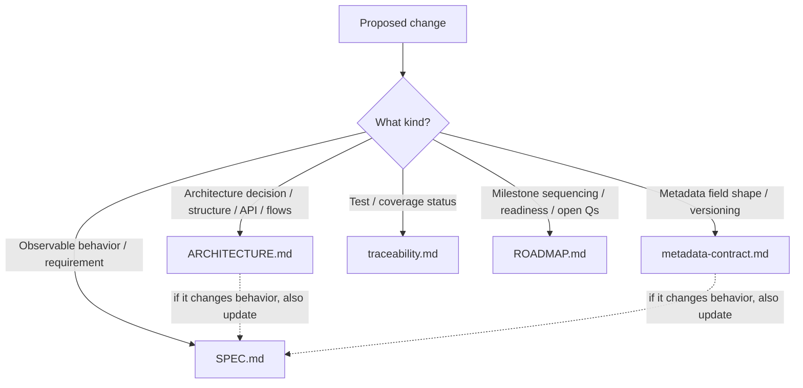
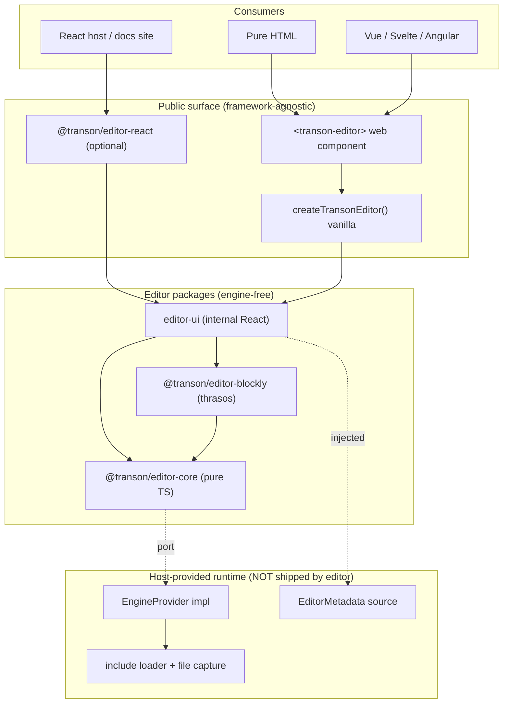
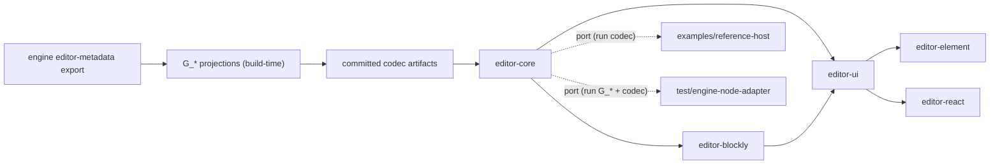
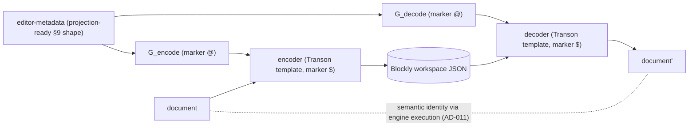
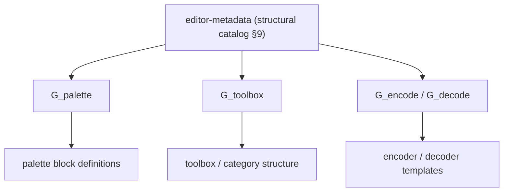
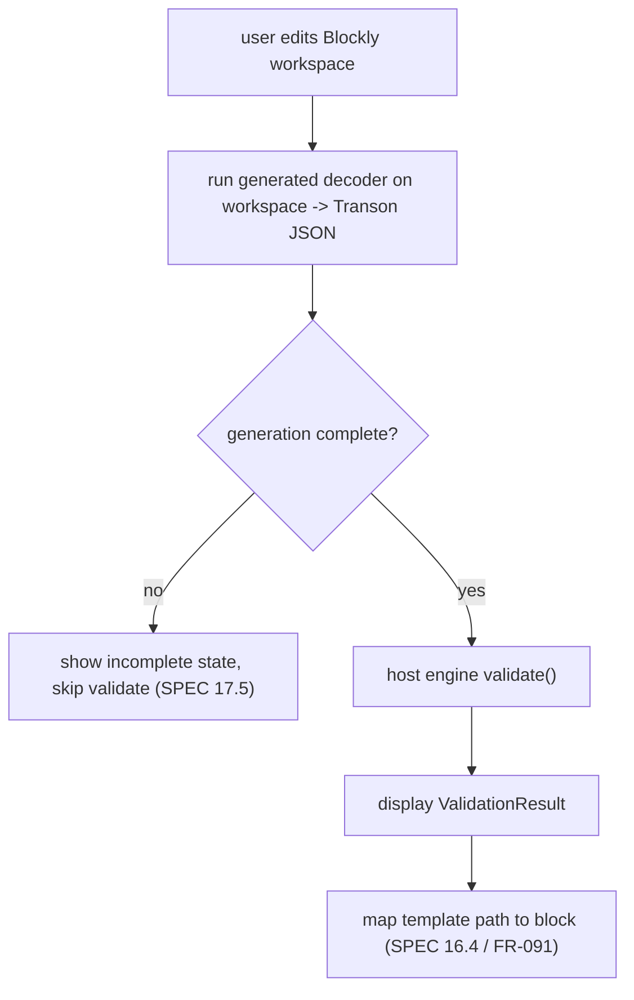
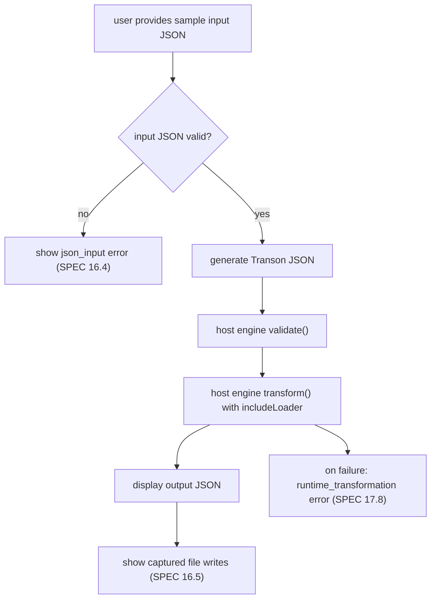
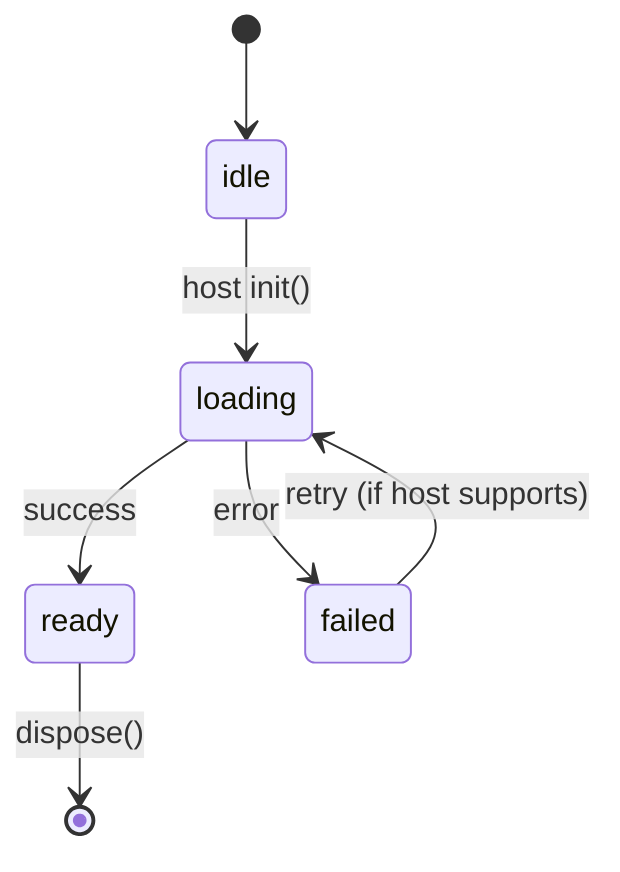

# ARCHITECTURE.md — Transon Visual Editor

> **Version:** 2.1 · **Status:** Pre-implementation baseline · **Last updated:** 2026-07-17

> **v2.1 — opt-in runtime metadata source (RFC-007, AD-036).** The AD-030 two-place projection
> model (build-time codegen → committed artifacts; runtime execution via the host) gains a third,
> **opt-in** execution point: a session may fetch the engine's editor-metadata at init through a
> new **optional** `EngineProvider.getEditorMetadata()` (§5.2) and regenerate its
> palette/toolbox/encoder/decoder from the fetched catalog — same generators, same `transform`
> port, guarded by a same-major `metadata_version` gate with fail-safe fallback to the committed
> snapshot. The snapshot + committed artifacts remain the default and the CI substrate. Post-v2.0
> decisions also recorded since the v2.0 header: AD-032 (no codec↔Blockly mapping layer), AD-033
> (thrasos renderer), AD-035 (codec depth ceiling, RFC-004), AD-036, AD-037 (total-membership codec, RFC-008; AD-034 stays
> reserved by RFC-003 P-E).

> **v2.0 — template-driven projection pivot.** The editor surface (palette, toolbox, encoder,
> decoder) is no longer a hand-written TypeScript mapping layer. It is **derived as Transon-template
> projections of the engine's editor-metadata** (AD-026): metadata is the single source, and the
> projections are data (templates) executed by the host engine, never bundled. Adds AD-026…AD-031
> and **supersedes AD-014** (hand-written hybrid block generation + specialized TS override registry)
> and **AD-016** (typed-IR round-trip pivot). The compiler model is the committed model: generator
> templates `G_*` (run at build time with a meta-level marker) emit specialized codec templates that
> run at runtime via the host engine. No interpreter fallback is shipped (OQ-010 → compiler-only).
> Earlier decisions kept: AD-024 (bidirectional JSON editing, now via the generated decoder) and
> AD-025 (reference host = Pyodide/PyScript in-browser; Node→Python adapter for CI). Decisions are
> append-only and never renumbered (`SPEC.md` §21.1); superseded decisions are marked in place.

This document is the source of truth for **how** the Transon Visual Editor is built: the
architectural principles, the architecture decision records (`AD-001..AD-037`), the
package/module structure, the host boundary and public API, the **template-driven projections**
(generators `G_*` and the generated codec) that replace the former typed IR, the metadata
reshape and dispatch primitives, the validation/execution flows, distribution, and build tooling.

It complements — and does not restate — [`SPEC.md`](SPEC.md) (the *what*),
[`metadata-contract.md`](metadata-contract.md) (the metadata *shape*),
[`traceability.md`](traceability.md) (the *verification*), and [`ROADMAP.md`](ROADMAP.md) (the
*sequencing*). SPEC IDs are cited inline as `FR-xxx` / `NFR-xxx` / `AC-xxx` / `UC-xxx`.

> **Governance.** All architecture decisions live here. Per `SPEC.md` §21.2, any decision that
> changes observable behavior must also be reflected in `SPEC.md`.

---

## 1. Document map — what belongs where

| Document | Owns (source of truth for) | Does **not** contain |
|---|---|---|
| [`SPEC.md`](SPEC.md) | Product behavior: use cases, FR/NFR/AC, conceptual domain model, UX model, rule coverage, import/export and round-trip semantics, canonical error taxonomy, governance rules. The **what**. | Architecture decisions, package/module layout, language/tooling choices, public API signatures, build/distribution mechanics, implementation flows. |
| [`ARCHITECTURE.md`](ARCHITECTURE.md) (this doc) | Implementation **how**: architecture decisions (`AD-001..037`), package decomposition, ports & adapters, host boundary & public API, the template-driven projections (`G_*`) and generated codec, the metadata reshape + dispatch primitives, validation/execution flows, state/error/theming strategy, distribution, build/tooling. | Behavioral requirements (SPEC), metadata field lists (contract), test matrices (traceability), milestone sequencing (roadmap). |
| [`metadata-contract.md`](metadata-contract.md) | The cross-repo **data contract**: metadata field shapes for rules/params/operators/functions, the engine-owned export, schema versioning. The metadata **shape**. | Editor internals, UI, runtime wiring. |
| [`traceability.md`](traceability.md) | **Verification**: requirement→code→test matrix, engine-parity (anti-drift) checks, round-trip corpus coverage, AC coverage. The **is-it-covered**. | Design rationale, behavior definitions. |
| [`ROADMAP.md`](ROADMAP.md) | **Sequencing**: milestones (M0–M5), per-milestone scope/deliverables/Definition of Done, readiness, locked decisions, open questions, future considerations. The **in-what-order**. | Behavior definitions, design rationale, test matrices. |

**Routing rule for future changes**



---

## 2. Architectural principles

1. **JSON is canonical** (AD-003). Transon JSON is the artifact; the Blockly workspace is a
   projection. Round-trip equivalence is *semantic*, proven by execution (§5.4, AD-011).
2. **The editor is engine-free** (AD-008). It ships no engine runtime. All runtime concerns
   (validation, execution, include resolution, `file` capture, the metadata source, **and running
   the projection codecs**) cross **one host-provided boundary** (§5.2). Projection *templates* are
   data; only *executing* them needs an engine, and that execution is the host's (AD-030, §5.4).
3. **Metadata-driven, engine-owned** (AD-012). The catalog of rules/params/operators/functions
   comes from the engine's editor-metadata export; the editor maintains no parallel semantic source.
4. **One source, many projections** (AD-026). Palette, toolbox, encoder, and decoder are all
   JSON→JSON and are therefore expressed as **Transon-template projections** of that metadata.
   Encode and decode derive from the *same* source, so they are inverse by construction (§5.4) —
   eliminating the "two halves drift" risk of a hand-written codec.
5. **Compiler model, committed** (AD-026, AD-030; extended by AD-036). Generator templates `G_*`
   run at build time (meta-level marker `@`) and emit specialized codec templates (object-level
   marker `$`); the emitted codecs run at runtime via the host engine. No interpreter codec is
   shipped. An **opt-in** session may additionally re-run the same generators at session init
   over runtime-fetched engine metadata (AD-036) — the committed artifacts stay the default and
   the fallback.
6. **Codec = skeleton + projected arms** (AD-028). Generic invariants (recursion, literal
   passthrough, marker-escape, ordering, the out-of-surface placeholder) live in a fixed skeleton;
   only the per-rule dispatch arms are projected from metadata.
7. **Behavior that JSON can't express stays as a finite runtime** (AD-031). A small, fixed,
   **rule-agnostic** Blockly behavior runtime handles field widgets, mutators, connection rules, and
   change events; it does **not** grow per rule (NFR-046).
8. **Framework-agnostic on the outside, React on the inside** (AD-019). Usable from pure HTML or
   any framework; React is a bundled implementation detail.
9. **Variants over hidden modes** (AD-015). Mutually exclusive parameter groups become separate
   palette block variants, sourced from the **pre-derived variant signatures** the metadata carries
   (§5.7), not re-derived by editor code.

---

## 3. Decision records

Architecture decisions are append-only and never renumbered from v1.0 onward (`SPEC.md` §21.1).

### AD-001 — Use Google Blockly for the visual editor
**Decision.** Use Google Blockly as the visual drag-and-drop interface.
**Rationale.** Mature toolkit; interlocking block composition; custom blocks; serialization;
toolboxes/categories; suitable for nested template structures.

### AD-002 — Build an embeddable editor component
**Decision.** The primary deliverable is an embeddable editor component/library; a demo app may
exist but the editor is not designed as a standalone app only.
**Rationale.** Enables embedding into the docs site and internal tools; separates editor logic
from the host application.

### AD-003 — Transon JSON is the canonical artifact
**Decision.** The executable Transon JSON template is the source of truth; the Blockly workspace
is an editable projection plus optional UI-only metadata.
**Rationale.** Templates are JSON data, executable outside the editor, and storable/diffable; the
editor must not create a separate language.

### AD-004 — Support strict semantic round-trip
**Decision.** Support strict semantic round-trip for supported templates.
**Rationale.** Developers must trust the editor; imported templates must not be silently changed;
correctness matters more than preserving visual layout.

### AD-005 — Support all built-in rules in v1
**Decision.** Include visual support for all built-in Transon rules in v1.
**Rationale.** Full coverage supports strict import/round-trip; partial support weakens trust.
**Trade-off.** More complex UX; advanced rules must be progressively disclosed (AD-007).

### AD-006 — No backend persistence in v1
**Decision.** No backend storage in v1; manual import/export only.
**Rationale.** Keeps v1 small; avoids auth/sharing complexity; supports static deployment.

### AD-007 — Sandbox and compact editor modes
**Decision.** Support two UI modes: sandbox/playground and compact embedded.
**Rationale.** Docs/playground needs input/output/template panels; embedding applications may
need only the visual editor.

### AD-008 — Engine is a host-provided port (`EngineProvider`)
**Decision.** The editor owns no engine runtime. It defines a runtime **port**
(`EngineProvider`) and consumes a host-provided object (`TransonEditorHost`, §5.2) for
validation, execution, include resolution, and `file` capture. The editor never bundles or
initializes an engine; the exact runtime mechanism (in-browser, server, or mock) is the host's
responsibility. Concrete adapters are implemented by consumers and tests, not by editor
packages.
**Rationale.** Keeps the editor framework- and runtime-agnostic; lets hosts choose any engine;
validation/execution still use the real engine when a host provides one; authoring,
generation, import/export, and round-trip work with no engine.
**SPEC link.** Underpins `SPEC.md` §10.4, §16, §17.9, NFR-028/031/032.

### AD-009 — `file` writes are captured side effects provided by the host
**Decision.** `file` is representable and executable, but no real filesystem write occurs in
preview. The host engine captures writes (via the engine `write_file` delegate) and returns them
as `ExecutionResult.filesWritten`; the editor shows them in a "files produced" view.
**Rationale.** Supports all built-in rules; avoids unsafe filesystem behavior; makes side effects
visible and testable; keeps capture in the host runtime.

### AD-010 — `include` resolution is provided by the host
**Decision.** `include` is supported; the host engine resolves includes from sources it controls
(loaded examples, embedding configuration, a supplied include map) via the engine
`template_loader` delegate / an `includeLoader` passed across the boundary (§5.2). The editor
reports clearly when the host cannot resolve an include.
**Rationale.** `include` is part of the built-in surface; execution needs an explicit loader,
owned by the host; a missing loader is reported, not guessed.

### AD-011 — Execution-based round-trip verification
**Decision.** Verify round-trip by executing imported and exported templates through an injected
engine and comparing outputs. For corpus entries with no sample input, fall back to
normalized-output + validation-result comparison. CI uses a Node→Python `EngineProvider` adapter;
an in-browser runtime is not required for tests.
**Rationale.** Equivalence is semantic (`SPEC.md` §15.1); execution is the strongest check. A
real engine is needed in the test harness from M0.

### AD-012 — Engine-owned, versioned editor-metadata export
**Decision.** The Transon engine owns a dedicated, versioned editor-metadata export
(`get_editor_metadata()`), independent of the docs API: it serializes `__rule_schema__`
(`required`, `modes`) and emits a structured per-parameter `kind` (`dynamic`/`constant`) at the
source, plus operator/function metadata. The editor consumes this directly and adds only
presentation; it maintains no parallel semantic source of truth.
**Rationale.** Avoids duplicating rule knowledge; lets new rules appear without editor changes;
keeps documentation, validation, examples, and visual editing aligned.
**Trade-off.** Transon must maintain a stable metadata schema. Parity checks
([`traceability.md`](traceability.md)) compare the editor against the engine's own export.
**SPEC/contract link.** [`metadata-contract.md`](metadata-contract.md) §3–§4.

### AD-013 — Hybrid block typing
**Decision.** Use a hybrid typing model: strict structural constraints where the rule contract
is known; advisory runtime-type expectations where values are dynamic.
**Rationale.** Many parameters are templates and runtime type depends on input; overly strict
typing would reject valid templates, loose typing would allow invalid structures.

### AD-014 — Metadata-driven generation with specialized variants — **SUPERSEDED by AD-026/AD-031 (v2.0)**
**Status.** Superseded by the template-driven projection model. Retained for ID stability (`SPEC.md`
§21.1); do not implement as written.
**Original decision.** Generic blocks are generated at runtime from metadata (so new/custom rules
need no editor code); specialized blocks are authored TS override modules selected by
`rule_name`/`variant_id`. A registry resolves specialized over generic; both paths must emit
identical JSON per variant.
**Why superseded.** Block *definitions* are now produced by the `G_palette` projection (AD-026),
not generated by hand-written TS, and there is no per-rule specialized TS override registry: the
only code that remains is the finite, rule-agnostic behavior runtime (AD-031). The properties this
decision wanted — new rules with no editor code, one canonical JSON shape per variant — are
preserved and strengthened by the projection model (FR-120, AC-034).

### AD-015 — Mutually exclusive parameters as block variants
**Decision.** Rules with mutually exclusive parameter groups are represented as separate palette
block variants, not one block with a hidden mode dropdown.
**Rationale.** Visual blocks should expose semantic shape; the UI prevents invalid combinations
before engine validation; import/export maps JSON shapes to variants.
**Trade-off.** A larger palette; naming and organization matter more (`SPEC.md` §12.5).

### AD-016 — Typed IR as the round-trip pivot — **SUPERSEDED by AD-026/AD-030 (v2.0)**
**Status.** Superseded by the generated codec. Retained for ID stability (`SPEC.md` §21.1); do not
implement as written.
**Original decision.** A typed intermediate representation sits between Transon JSON and Blockly.
`JSON ⇄ IR` is pure/headless and hosts variant matching, surface checks, marker escape, and the
`JsonPathBlockMap`. `IR ⇄ Blockly` is the only Blockly-coupled mapping.
**Why superseded.** The hand-written `JSON⇄IR` codec is replaced by the **generated encoder/decoder
templates** (`G_encode`/`G_decode`, AD-026): a document is the *data* moved between a JSON template
and a Blockly workspace, and the codec is itself a Transon template run by the host (AD-030). The
codec skeleton (AD-028) still owns the surface check (`SPEC.md` §15.7), marker escape (§11.4),
ordering (§15.3), the out-of-surface placeholder (§13.11), and the `JsonPathBlockMap` (§9.12) — but
as fixed skeleton scaffolding around metadata-projected arms, not as TypeScript. Round-trip is now
`document → encoder → workspace → decoder → document`, inverse by construction (§5.4).
**Note (AD-024).** Bidirectional JSON editing now runs the generated **decoder** (then re-runs the
encoder for the gate); the direct edit is still gated by the surface check before it reaches the
workspace (§6, `SPEC.md` §7.15).

### AD-017 — Blockly renderer, configurable
**Decision.** Default to the Zelos renderer to match `SPEC.md` §1 ("similar to Scratch") and the
low-code audience; expose renderer/theme via the theming hook (FR-108).
**Rationale.** Matches the intended look and audience while staying configurable.
**Updated (AD-033).** The default renderer is now **thrasos** (conventional puzzle-tab connections),
not Zelos: UAT showed the Zelos "Scratch pill" look was unwanted and structurally un-tunable for the
data/developer audience. AD-017's *configurable renderer/theme* principle stands; only the default moved.

### AD-018 — Light DOM + scoped CSS (shadow not viable)
**Decision.** Render in light DOM with a scoped CSS class prefix (e.g. a `transon-editor` root) to
avoid Blockly's `document.head` CSS injection and sizing/focus friction.
**Rationale.** Avoids known Blockly encapsulation pitfalls.
**Encapsulation finding (M3 spike).** **Shadow DOM is not viable**: Blockly works in light DOM and
injects its own CSS into `document.head` under its `.blockly*` namespace, which does **not** pierce a
shadow boundary. Use the scoped light-DOM prefix; do not attempt shadow DOM. This resolves the
formerly-optional Shadow-DOM mode against adoption.

### AD-019 — Framework-agnostic public surface; React internal
**Decision.** The public surface is a vanilla `createTransonEditor()` primitive + a
`<transon-editor>` web component + an optional native React entry. React is bundled inside the
standalone builds; the React entry treats React as a peer.
**Rationale.** Usable from any framework or pure HTML; React stays an implementation detail.

### AD-020 — Distribution: ESM primary + self-contained IIFE global
**Decision.** Ship ESM (primary, tree-shakeable) plus a self-contained IIFE/UMD global that
auto-registers `<transon-editor>` for zero-build `<script>` usage; `.d.ts` types; CDN-ESM +
importmap documented.
**Rationale.** Serves both bundler and script-tag consumers. The global bundle inlines React +
Blockly and is large; engine adapters are never in this bundle (AD-008).

### AD-021 — Monorepo tooling
**Decision.** pnpm workspaces + Turborepo + Vite (library mode) + Vitest + Changesets, with
independent semver for public packages. Outputs are framework-agnostic; the docs-site stack is a
consumer, not a dependency.
**Rationale.** Standard, cache-friendly multi-package tooling.

### AD-022 — AI development governed by the spec
**Decision.** Behavior-changing implementation must update `SPEC.md`; conflicts are surfaced
before coding.
**Rationale.** Project semantics are subtle; AI-assisted development can otherwise drift.

### AD-023 — JSFiddle-style sharing out of scope for v1
**Decision.** Share links may come later but are not in v1.
**Rationale.** Requires storage, a sharing model, and abuse considerations not needed for initial
correctness.

### AD-024 — Bidirectional JSON editing with strict in-surface sync
**Decision.** The generated-JSON panel is editable in v1 (reversing the OQ-001 v1.0 draft). A
direct edit is run through the generated **decoder** (`G_decode` output) and applied to the
workspace **only** when it is valid JSON and in surface (`SPEC.md` §15.7); otherwise the editor
reports `json_template` / `import_unsupported` (`SPEC.md` §16.4) and leaves the last valid workspace
untouched (`SPEC.md` §7.15, FR-111…FR-113). The edit reuses the same generated codec (decoder for
parse, encoder for the round-trip gate) and surface check (AD-026/AD-028); no new semantic path is
introduced.
**Rationale.** Power users asked for hand-editing; reusing the headless codec keeps the canonical
JSON the source of truth (AD-003) and preserves strict round-trip (AD-004). The strict gate is
what makes the reverse direction safe — partial/forgiving application is explicitly disallowed.
**Trade-off.** The state flow is no longer one-way (§6); the JSON editor needs an "out of sync"
state and debounced parsing. **SPEC link.** `SPEC.md` §7.15, §12.7, FR-005, FR-111…FR-113, AC-033.

### AD-025 — Reference host runtime: in-browser Pyodide/PyScript + Node adapter for CI
**Decision.** The shipped sandbox/playground `examples/reference-host` implements `EngineProvider`
with an **in-browser Python `transon` via Pyodide/PyScript**, mirroring how the Transon docs site
runs the engine (it loads `transon`, exposes a `transform` global, and feeds engine-generated
metadata to JS). Round-trip CI continues to use the separate Node→Python `transon` adapter
(`test/engine-node-adapter`, AD-011). This is a reference implementation only; production embedders
remain free to supply any `EngineProvider` (AD-008).
**Rationale.** Matches the proven docs-site approach, keeps the demo a zero-backend static artifact
(NFR-042), and runs the real engine in the browser so validation/execution/`file`/`include` are
genuine. **Trade-off.** A multi-MB Pyodide download with a ~10–15s first-load (covered by a splash),
as the docs site already accepts. **SPEC link.** `SPEC.md` §10.4, §16, NFR-028/042; ROADMAP M4.

### AD-026 — Editor surface is Transon-template projections of engine metadata (compiler model, compiler-only)
**Decision.** The palette, toolbox, encoder, and decoder are **not** hand-written. They are
produced by four **Transon-template projections** of the engine editor-metadata
(`SPEC.md` §7.16, FR-114):

```
G_palette(metadata) → palette block definitions      G_encode(metadata) → encoder (a Transon template)
G_toolbox(metadata) → toolbox / category structure    G_decode(metadata) → decoder (a Transon template)
```

The committed model is the **compiler**: each `G_*` is itself a Transon template whose *output is
another template* (homoiconicity — Transon templates are JSON and Transon output is JSON). The
generated encoder/decoder then run on instances: `encoder(document) → workspace`,
`decoder(workspace) → document`. **No interpreter codec is shipped** (OQ-010 → compiler-only); a
single rule-agnostic codec that consults metadata at runtime is explicitly out of the normative
surface.
**Rationale.** Metadata is the single source; encode and decode derive from it, so they are inverse
by construction (§5.4, `SPEC.md` AC-035). A new rule flows to every surface from one place with no
editor code and no projection-template change (FR-120, AC-034). The visual layer becomes
retargetable and self-describing — the projection templates are themselves Transon templates,
openable in the editor they configure (FR-121, UC-016, AC-036).
**Trade-off.** Two-level metaprogramming in a non-macro language; mitigated by the de-risk
prototype (ROADMAP M1) and by keeping generators small via `include` (AD-027). **SPEC link.**
`SPEC.md` §7.16 (FR-114, FR-115, FR-120, FR-121), §15; supersedes AD-014, AD-016.

### AD-027 — Distinct markers per evaluation phase for staging/quoting; no `eval`
**Decision.** Generator templates are **staged with a distinct meta-level marker** (`@`) and emit
object-level (`$`) codecs. In a generator: `@`-keyed dicts are generator rules evaluated *now* (the
"unquotes"); `$`-keyed dicts are inert literal data, deep-copied verbatim into the emitted codec
(the "quoted" structure). N evaluation levels = N distinct markers. This reuses v0.1.0's configurable
marker — **no new engine feature** for quoting. Generators are factored with `include` to stay small
(`SPEC.md` §7.16, FR-116); because `include` passes only the context value, every fragment is
designed as a pure function of `this`. To keep the marker consistent across staged includes, the
**`include` rule inherits the parent's default marker** when the loader does not specify one
(OQ-014; a small, SPEC-first engine change tracked in the engine repo,
[`metadata-contract.md`](metadata-contract.md) §6). The engine adds **no `eval`/`apply`**: running a
freshly synthesized template from data is a real security surface, and the two-pass
generate-then-run model (AD-030) avoids it entirely.
**Rationale.** Lets the codec be written mostly literally (real `$` markers survive) with `@`-holes
only where metadata fills something in; keeps the security surface closed (`SPEC.md` §21.11).
**SPEC link.** `SPEC.md` §7.16 (FR-116), §11.4; metadata-contract §6.

### AD-028 — Codec = fixed generic skeleton + metadata-projected per-rule arms
**Decision.** A generated codec is **not** 100% projected. It is a **fixed generic skeleton**
wrapping **metadata-projected per-rule arms**:
- **Projected (the holes):** per-rule dispatch arms — "rule `attr` ↔ this block", param↔input
  wiring, variant selection.
- **Fixed scaffolding (not derivable from metadata):** recursion over nested nodes, literal
  passthrough of non-rule JSON, the **marker-escape** rule (`SPEC.md` §11.4), **ordering
  preservation** (object keys, `chain` steps, `set`-before-`get`, `SPEC.md` §15.3), and the
  out-of-surface / exact-preserving placeholder path (`SPEC.md` §13.11). `G_*` wraps these fixed
  pieces around the projected arms.
**Rationale.** Concentrates the round-trip invariants in one reviewable place and makes the
projection a pure map over the catalog. **SPEC link.** `SPEC.md` §7.16 (FR-117), §11.4, §13.11,
§15.3, §15.7.

### AD-029 — Engine `switch` and `cond` are the runtime dispatch primitives
**Decision.** The generated codec dispatches per node using a **lazy multi-way dispatch** rule added
to the engine (OQ-012 → **both** `switch` and `cond`): `switch` (equality on a key, cases as a JSON
object) for the common rule-name/block-type dispatch, and `cond` (Lisp-style `{when,then}` list +
`default`, subsuming `if`) for predicate dispatch (e.g. deriving the input-widget from `kind` +
presence of `options`). **Lazy branch evaluation is the hard requirement**: only the selected case
is walked, so dead branches raise no errors and cause no side effects — what an `object`+`attr`
table lookup cannot provide. Both honor `NO_CONTENT` discipline, `DefinitionError`/`TransformationError`,
stdlib-only, Python 3.9+, and no input/template mutation. These are ordinary JSON rules — no new
transformation language (`SPEC.md` §21.8). The rules live in the engine repo
([`metadata-contract.md`](metadata-contract.md) §6).
**Rationale.** Runtime dispatch on rule name (encode) / block type (decode) is the core mechanism of
the generated codec, and the widget decision is derived in-template from engine facts (AD-012, §5.5).
**SPEC link.** `SPEC.md` §7.16 (FR-118); engine contract metadata-contract §6.

### AD-030 — Build-time codegen of committed codec artifacts; runtime execution via the host
**Decision.** Projections run in **two places**: (1) at **build time**, the generators `G_*` are run
to produce **committed codec artifacts** (the encoder/decoder templates and palette/toolbox
definitions), checked in and diffable; (2) at **runtime**, those artifacts are executed via the
host-provided `EngineProvider` (the same port used for validation/execution, OQ-016) using the
**two-pass generate-then-run** model — the codec is data, the host runs it. The editor bundles no
engine (AD-008). Re-running the generators is a build/CI step, so a new engine rule produces new
committed artifacts deterministically, which the parity + round-trip gates verify
([`traceability.md`](traceability.md)).
**Rationale.** Deterministic, reviewable artifacts; keeps the "new rule, no editor code change"
guarantee (FR-120, AC-034) objectively testable; preserves engine-free distribution. **Trade-off.**
A codegen step in CI and a regeneration discipline when metadata changes. **Strict regeneration
gate.** The committed artifacts are the source the editor ships; the regen check **compares only**
(fails on drift) and writes solely under an explicit opt-in flag (e.g. `UPDATE_ARTIFACTS=1`). A
self-writing gate would rubber-stamp a wrong artifact, so it must never write during a normal check.
**SPEC link.** `SPEC.md` §7.16 (FR-119), §10.4; ROADMAP M1.

### AD-031 — A finite, rule-agnostic Blockly behavior runtime (replaces per-rule specialized code)
**Decision.** Templates define block **structure**; a small, fixed, **rule-agnostic** runtime
handles Blockly **behavior** that JSON cannot express — field validators, custom field widgets,
mutator interaction UI, drag/connection rules, change events. The crucial property: this runtime is
**finite and does not grow per rule** (NFR-046). New rules ride entirely on metadata + projections;
only a brand-new *interaction primitive* touches this code. This replaces AD-014's per-rule
specialized TS override registry.
**Rationale.** Mirrors the engine boundary "JSON can't express behavior": everything expressible as
data is data; only genuine interaction primitives are code. **SPEC link.** `SPEC.md` §7.16 (FR-120),
§13 (structure/behavior boundary), NFR-046.

### AD-032 — No hand-written mapping layer between the codec and Blockly
**Decision.** The editor ships zero TypeScript that translates codec output into Blockly workspace
JSON or back: the generated encoder/decoder emit/consume Blockly workspace-serialization JSON
**directly** (FR-126), realizing FR-114/FR-117/§5.4/AD-026. Block *structure* — the definitions and
the workspace JSON the codec produces — is **projected from metadata**; the only code is the finite,
rule-agnostic behavior runtime (AD-031). **Rationale.** Encode/decode derive from one metadata source
and are inverse by construction; the field-vs-input disposition is computed once (in `G_encode`) and
read structurally on decode, so there is a single derivation in either direction. **Trade-off.** The
codec output target is pinned to Blockly's workspace serialization, so a Blockly serialization change
is a regeneration concern; enforced by the FR-124 shape validator, the FR-126 headless-load and
repo-scan gates. **SPEC link.** `SPEC.md` FR-124, FR-126, FR-127, §5.4, §21.15.

---

### AD-033 — Conventional renderer (thrasos) + external puzzle inputs + committed theme
**Decision.** Render with the **thrasos** built-in renderer (conventional puzzle-tab connections),
updating AD-017's Zelos default. Every projected rule block is a **value/output block**; all value
parameters are **external inputs** (`inputsInline: false`) that connect from the side via puzzle
sockets. The block body carries only **fields** (dropdowns for constant params, FR-058) and the
**mutator +/- controls** — every sub-expression plugs in externally, never inline-embedded. Ship a
committed `Blockly.Theme` (system font + workspace/flyout surface aligned to the chrome tokens) with
**no** `blockStyles`/`categoryStyles`, so block/category colours stay data-driven (FR-127, §21.12);
it is the SVG-canvas counterpart to the chrome CSS vars (FR-128).
**Rationale.** The Zelos "Scratch" look (rounded pills, corner radius ≈ half the block height,
inline full-block fields) proved unlike conventional Blockly and could **not** be tuned into it —
Zelos does not use `CORNER_RADIUS` for its outlines (browser-verified: 20–48px pills despite a 3px
constant). thrasos gives the tight puzzle-connection look the audience expects. External inputs make
composition explicit ("connect from the side") and fit the functional value model: a value block
plugs into a value input; Transon has no imperative statements, so there is no statement
stacking or statement-input "brackets".
**Trade-off.** External inputs make deeply nested templates grow on-canvas — accepted for clarity.
Renderer stays configurable (AD-017); geras is a drop-in alternative. Font/surface/layout are pure UI
(§21.12): the `inputsInline` flag is a block-definition display default, so the codec, workspace JSON,
and round-trip are unchanged (only `palette.json` regenerates).
**SPEC link.** `SPEC.md` FR-129, AC-040, §13.10; AD-017 (renderer), FR-127 (data-driven colours), FR-128 (chrome CSS vars).

> *AD-034 is reserved by RFC-003 P-E (balanced adaptive layout, not landed) and intentionally
> skipped here (§21.1 append-only).*

### AD-035 — Codec depth ceiling 55 + host recursion budget 1400, gated on the engine recursion budget (RFC-004)
**Decision.** Raise the codec's `include`-recursion ceiling (`CODEC_MAX_INCLUDE_DEPTH`,
`editor-core` codec runtime) from 25 to **55**, require **engine ≥ 0.1.7** (engine Roadmap R-32:
bounded per-level recursion budget — the `walk`/`_walk` frame doubling removed), and set a **host
recursion budget of 1400 frames** in both reference hosts (`sys.setrecursionlimit(max(cur, 1400))`
in the Node adapter's `runner.py` and the Pyodide glue). The engine floor is enforced as data, not
runtime branching: the committed `metadata-snapshot.json` pins `engine_version ≥ 0.1.7`, the
engine-parity gate fails on drift, and the reference host's `PINNED_ENGINE_VERSION` tracks the
snapshot (smoke-tested against it). Why all three knobs: opening the deepest committed file
(`G_encode`, structural depth 41) through the marker-substituted codec walk needs include depth
**52** and peaks at **~1113 Python frames** — above CPython's default 1000 limit — so no include
cap alone suffices (structural depth is only a *lower bound*: rule-dense nodes cost ~2 include
levels each). At the 1400 budget the walk has ~290 frames of headroom and the literal-nesting
wall (~68) stays **above** the 55 ceiling, so ordinary deep nesting still trips the engine's
clean depth-limit guard first. Result: **every** committed projection generator and artifact
opens and round-trips (SPEC AC-042, closing FR-121's D5 gap).
**Error contract.** The §6.5 clean-failure property: guard-first is preserved for literal
nesting; a pathological rule-per-level document (~36+ at the 1400 budget) can still overflow the
host stack inside the engine call. Both reference hosts (Node runner bridge guard; Pyodide glue
handlers) catch the raw `RecursionError` at the `EngineProvider` boundary and return it as an
error result, and the editor maps **both** failure paths — guard `"depth limit"` *and* caught
recursion overflow — to `runtime_transformation` (SPEC §16.4, extending the D5 `1cf0be6` fix).
No committed codec file has the pathological shape.
**Trade-off.** A host-side prerequisite (the recursion budget) joins the engine floor — accepted
because it is bounded, host-owned, additive (`max()`, never lowers), and the only alternative
reaching the AC-042 goal was restructuring `G_encode` (kept as the RFC-004 fallback). "Guard
always trips first" is given up only for inputs no real template exhibits; the property that
mattered — *no uncaught crash, no mislabel* — is preserved everywhere.
**Alternatives.** Cap-only raise — measured insufficient (the `G_encode` walk exceeds the default
interpreter limit at any cap). Runtime engine-version gating (cap 25 on older engines) —
deferred; the pin + parity gate covers the shipped hosts, and NFR-040 already surfaces version
mismatch to embedders. Engine-side `RecursionError`→`TransformationError` catching (would-be
engine R-33) — the designated follow-up if a host is ever found that cannot contain the overflow
at the provider boundary.
**SPEC link.** `SPEC.md` AC-042, §16.4; `metadata-contract.md` §6.5; FR-121/UC-016/AC-036;
[RFC-004](proposals/rfc-004-codec-depth-ceiling-raise.md); engine R-32
(`../transon/docs/proposals/transformer-recursion-depth-budget.md`).

### AD-036 — Opt-in runtime metadata source: fetch + regenerate at session init, snapshot as default and fallback (RFC-007)
**Decision.** Extend AD-030's two-place projection model with a third, **opt-in** execution point:
a session configured with `metadataSource: 'engine'` fetches the engine's editor-metadata at
runtime through a new **optional** `EngineProvider.getEditorMetadata()` port method
(`metadata-contract.md` §3) and runs the committed FR-114 generators over the **fetched** catalog
— through the same engine, once, on the engine-ready transition — producing the session's
palette/toolbox/encoder/decoder/blockmap. The committed snapshot + artifacts remain the default
source, the deterministic CI/gate substrate (the AD-030 strict-regeneration gate is untouched),
and the **fail-safe fallback**: a same-major `metadata_version` gate (SPEC FR-140, contract §5)
guards the fetched payload, and any runtime-path failure falls back to the snapshot surface with
a `metadata_fallback` diagnostic (SPEC §16.4) — never a mixed catalog, never a broken session.
Presentation for rules the committed data does not know comes from a **data-declared fallback**
(SPEC FR-141; FR-127's no-TS-literals rule preserved).
**Rationale.** FR-120's "new rule, no editor code change" previously held only through a snapshot
re-pin + editor release; a host already running a newer engine saw the newer surface as
`transon_unsupported` (correct per AD-004, but avoidable version lag). The generators were
already pure and catalog-parameterized, and the codec already executes through the host engine —
so the runtime path is orchestration, not new machinery, and is *more* faithful to AD-012
(engine-owned metadata, consumed directly) at the same trust boundary the host already owns
(AD-008: the host supplies the engine that executes everything; NFR-004 keeps the engine
authoritative regardless of what the projection shows).
**Trade-off.** Opted-in hosts run engine×editor pairings CI never proved — bounded by the version
gate, the fallback, and the engine's runtime authority; init cost grows by one metadata fetch +
three generator runs (measured acceptable in the Pyodide reference host). Blockly's block
registry is global: dynamic definitions re-register by block type, so two same-page sessions with
different catalogs share the last-registered definitions (documented limitation; one session per
page is the supported embed shape).
**Alternatives.** Full-dynamic (drop the snapshot) — rejected: loses the deterministic CI anchor
and the no-engine palette render. Auto-detect (method presence ⇒ dynamic) — rejected: presence
alone must not change behavior; the host opts in explicitly. Per-version committed artifacts —
rejected: reintroduces the release coupling being removed.
**SPEC link.** `SPEC.md` §7.18 (FR-139…FR-141), AC-043, §16.4 `metadata_fallback`;
`metadata-contract.md` §3/§5; [RFC-007](proposals/rfc-007-dynamic-engine-metadata.md).

### AD-037 — Codec structural predicates use total membership primitives; value sentinels retired; engine floor declared once (RFC-008)
**Decision.** Every structural predicate in the projection codec — parameter/key presence,
foreign-key detection, key-set/list emptiness, marker presence — is expressed with the engine's
**total** primitives: the `in` membership operator and the `length` function (engine ≥ 0.1.8),
negated only via the chained unary `!` form (`chain: [<total expr>, expr !]` — ratified RFC-008
OQ2). The historical **value-sentinel idiom** (map keys → filter → `join` with a reserved
`default` string → compare) is retired everywhere: generators, artifacts, and the driver's
`@`-time predicates (`transon::absent-key`, `transon::absent-key@gen`, `@noopt`,
`__transon_no_marker__` all deleted, not merely bypassed). The minimum engine the codec's
primitives require is declared in **one exported constant** (the SPEC §7.19 codec engine floor)
and surfaced at session init by the FR-142 check.
**Rationale.** The sentinel idiom rested on the assumption "a real key never equals the
sentinel" — false for user documents, and **reproduced** as an AD-004 violation: a rule node
whose only foreign key was literally `transon::absent-key` matched the variant and the key was
silently dropped through the round-trip. Totality is the property that makes a predicate safe
in `switch`/`cond` keys (the same reasoning that introduced `type`, R-26); `in`/`length` return
booleans/ints no document value can forge, cost O(1)/O(n) engine-side instead of a
map+filter+join walk per param per variant per node, and shrink the committed artifacts (the
idiom was ~150 expanded sites). **Alternatives.** Harden the sentinel (second guard round) —
rejected: compounds the forgeable construct (ratified OQ3). Version-conditional generators
(emit sentinel codecs for pre-0.1.8 hosts) — rejected: doubles the artifact matrix the AD-030
gate must hold byte-stable, for hosts the floor check now names explicitly.
**SPEC link.** `SPEC.md` §7.19 (FR-142), NFR-051, AC-044, §16.4 `engine_floor`;
[RFC-008](proposals/rfc-008-generator-shrink-via-in.md).

---

## 4. System overview (ports & adapters)



The dashed edges are the **host boundary**: everything below it is supplied by the embedder
(AD-008).

---

## 5. Components

### 5.1 Package map

| Package | Public | Depends on | Responsibility |
|---|:--:|---|---|
| `@transon/editor-core` | yes | pure TS | The **projection templates** `G_*` (data), the **committed codec artifacts** (encoder/decoder + palette/toolbox, regenerated at build time, AD-030), the **runtime metadata source** (`fetchRuntimeSurface` — gate + session-init regeneration, AD-036), the codec-skeleton invariants (`SPEC.md` §11.4/§13.11/§15.3), surface check (`SPEC.md` §15.7), `JsonPathBlockMap` (`SPEC.md` §9.12), metadata model, `EngineProvider` **port** (used to *run* the codec, §5.4), error taxonomy (`SPEC.md` §16.4). Engine-free, headless. **Deliverable #1.** |
| `@transon/editor-blockly` | yes | core, blockly | Renders the projected palette/toolbox through the configured Blockly renderer (thrasos default, AD-033); the finite **rule-agnostic behavior runtime** (AD-031); wires `workspace ⇄ blocks` so the generated encoder/decoder can read/write workspace JSON |
| `editor-ui` (internal) | — | core, blockly, react | panels, sandbox/compact modes, `EditorSession` store, theming (light DOM) |
| `@transon/editor-element` | yes | editor-ui (React bundled) | `createTransonEditor()` + `<transon-editor>`; ESM + IIFE global |
| `@transon/editor-react` | yes (opt) | editor-ui (React peer) | native React entry |
| `examples/reference-host` | demo | core port | reference `EngineProvider` using **in-browser Python `transon` via Pyodide/PyScript** (AD-025, mirrors the docs site); runs both the user template *and* the projection codecs (AD-030); powers the sandbox/playground |
| `test/engine-node-adapter` | dev | core port | Node→local Python `transon` `EngineProvider`; runs the generators at build/CI time and the codecs for execution round-trip CI |



### 5.2 The host boundary & contracts (AD-008; `SPEC.md` §10.4)

```ts
interface TransonEditorHost {
  metadata: EditorMetadata;        // host-supplied (engine editor_metadata export)
  marker?: string;                 // default "$"
  engine?: EngineProvider;         // omit -> validate/run disabled; authoring still works
  examples?: ExampleCase[];        // host-supplied corpus
  theme?: ThemeTokens;
}

interface EngineProvider {         // implemented by the HOST, not the editor
  readonly status: 'idle' | 'loading' | 'ready' | 'failed';
  init(): Promise<void>;
  validate(template: Json, o: { marker: string }): Promise<ValidationResult>;
  transform(template: Json, input: Json, o: {
    marker: string;
    includeLoader?(name: string): Json | undefined;   // host owns includes (AD-010)
  }): Promise<ExecutionResult>;    // ExecutionResult.filesWritten = captured `file` writes (AD-009)
  version(): Promise<{ engine: string; metadata: string }>;
  // OPTIONAL (AD-036, RFC-007): proxy the engine's get_editor_metadata() export, verbatim
  // (metadata-contract §3 runtime delivery). Only a session opted into the runtime metadata
  // source (SPEC FR-139) calls it; implementing it alone changes nothing.
  getEditorMetadata?(): Promise<Json>;
  dispose(): void;
}
```

`file` capture and `include` resolution map directly onto the engine's `write_file` and
`template_loader` constructor delegates, so a host adapter wires them without touching engine
internals.

**Running projections through the same port (AD-030, OQ-016; extended by AD-036).** A projection
is just a template run with a chosen marker, so no new execution method is required — `transform`
is reused, parameterized by `marker`:

- **build time** (CI codegen): `transform(G_encode, metadata, { marker: "@" }) → encoder` (and
  likewise `G_decode`/`G_palette`/`G_toolbox`); the outputs are committed as artifacts.
- **runtime**: `transform(encoder, document, { marker: "$" }) → workspace` and
  `transform(decoder, workspace, { marker: "$" }) → document`.
- **session init, opt-in** (AD-036, SPEC §7.18): a session configured `metadataSource: 'engine'`
  first calls `getEditorMetadata()` (the one addition to the port, optional), gates the payload
  (same-major `metadata_version`, SPEC FR-140), then runs the *same build-time generator step
  through the same `transform`* over the **fetched** catalog — producing that session's
  palette/toolbox/encoder/decoder in the browser instead of in CI. Any failure falls back to the
  committed snapshot artifacts (never a mixed catalog); the default session never fetches.

This is the **two-pass generate-then-run** model: the editor never asks the host to `eval` a value
as a template (AD-027); it hands the host a finished codec template plus its input data. The split
metadata payload (`SPEC.md` NFR-047) means generators consume the lean structural catalog;
examples/docs travel separately.

### 5.3 Public surface & distribution (AD-019, AD-020)

```ts
function createTransonEditor(target: HTMLElement, options: TransonEditorHost & {
  mode?: 'sandbox' | 'compact';
  template?: Json; input?: Json;
  readOnly?: boolean;
  onChange?(t: Json): void;
  onValidate?(r: ValidationResult): void;
  onExecute?(r: ExecutionResult): void;
}): TransonEditorHandle;  // { getTemplate, setTemplate, validate, run, destroy }
```

- ESM is primary; the IIFE global auto-registers `<transon-editor>` for `<script>` usage.
- `@transon/editor-react` exposes `<TransonEditor {...options} />` with React as a peer.

### 5.4 Generated codec & round-trip (AD-026, AD-028, AD-030, AD-011)

There is no typed IR. The **document** (the user's Transon template) is the data; the **codec**
(generated encoder/decoder templates) is the program that moves it between a JSON template and a
Blockly workspace. Both directions are emitted by the generators from the same metadata, so they are
inverse by construction.



The encoder/decoder are committed artifacts (build-time codegen, AD-030) — or, for a session
opted into the runtime metadata source, the same generators' output over the fetched catalog at
session init (AD-036) — and run at runtime via the host engine (§5.2). The codec **skeleton**
(AD-028) owns the fixed invariants: recursion over nested
nodes, literal passthrough, marker escape (`SPEC.md` §11.4), ordering preservation for `set`/`chain`
and object keys (`SPEC.md` §13.12, §15.3), the surface check (`SPEC.md` §15.7), and the
out-of-surface placeholder (`SPEC.md` §13.11). The `JsonPathBlockMap` (`SPEC.md` §9.12) is produced
as the codec walks; it is skeleton output, not a separate TS pass.

Each per-rule arm emits the Blockly workspace block shape directly — the fixed block vocabulary is
defined normatively in `SPEC.md` FR-124 — with each declared param placed as a field or value input
per the FR-118 disposition, computed inside the arm during projection. There is no intermediate
representation between the codec and the workspace (AD-032).

### 5.5 The generators `G_*` (projections)

Each generator is a Transon template run with the meta-level marker `@` (AD-027). `@`-keyed dicts
evaluate now (reading the metadata); `$`-keyed structure is emitted verbatim into the codec. The
generators are thin drivers that map over `metadata.rules` and `include` small per-rule fragments,
each a pure function of `this` (AD-027). Illustrative `G_encode` fragment (meta marker `@`, emitting
object-level `$`):

```json
{
  "@": "map",
  "items": { "@": "attr", "name": "rules" },
  "key":   { "@": "attr", "name": "name" },
  "value": {
    "$": "object",
    "key":   { "@": "format", "pattern": "transon_rule_{}", "value": { "@": "attr", "name": "name" } },
    "value": { "$": "this" }
  }
}
```



The **input-widget decision** (`input`/`dropdown`/`field`) is derived *in the projection* via
`cond`/`switch` from the metadata facts (`kind` + presence of `options`), not baked into the engine
(AD-012, AD-029). The toolbox/category structure is projected from the metadata categories by
`G_toolbox` (OQ-017), not a separate presentation template.

### 5.6 Per-rule arms & the behavior runtime (AD-028, AD-031)

The projected portion of a codec is the **per-rule arm**: a `switch` case keyed by rule name (encode)
or block type (decode) whose body emits that rule's block/JSON shape and wires params↔inputs and
variant selection. Adding a rule adds an arm via metadata; it does **not** add code.

Each per-rule arm emits the Blockly workspace block shape directly — the fixed block vocabulary is
defined normatively in `SPEC.md` FR-124 — with each declared param placed as a field or value input
per the FR-118 disposition, computed inside the arm during projection. There is no intermediate
representation between the codec and the workspace (AD-032). The decoder reads the rule/variant
structurally from the block type and reconstructs params from fields ∪ inputs without re-deriving the
disposition.

Blockly **behavior** that JSON cannot express (field validators, custom field widgets, mutator UI,
connection rules, change events) lives in the finite, **rule-agnostic** behavior runtime (AD-031).
This runtime does not grow per rule (NFR-046); only a brand-new interaction primitive touches it.

### 5.7 Variant signatures (pre-derived in metadata; consumed by the projections)

Variant derivation is **not** editor code. The projection-ready metadata carries **pre-derived
variant signatures** per rule (`SPEC.md` FR-116; [`metadata-contract.md`](metadata-contract.md) §2.5):
each variant lists its ordered visible params, each flagged `required`. The set algebra over
`_modes`/`_required` that the former TS matcher performed is done **once, in Python**, where it is
trivial, and emitted as data — so encode, decode, the surface check, and the docs all read the same
signatures (AD-015, `SPEC.md` §15.6).

```json
"variants": [
  { "id": "name",  "params": [ { "name": "name",  "required": true }, { "name": "default", "required": false } ] },
  { "id": "names", "params": [ { "name": "names", "required": true }, { "name": "default", "required": false } ] }
]
```

**Matching at decode/import.** A rule invocation matches the variant whose required params are all
present, whose other-variant-only params are all absent, and where no parameter outside the rule's
declared params appears (an undeclared parameter is out of surface, `SPEC.md` §15.7). Exactly one
variant must match; zero/multiple/partial → `import_unsupported` (`SPEC.md` §16.4, §17.6). The
matcher is part of the generated decoder skeleton+arms, not a hand-written algorithm.

### 5.8 Engine-side projection-ready metadata export (engine repo) (AD-012, AD-026)

The export is **greenfield at v0.1.0** (the engine has no editor-metadata export yet) and is
co-designed with the projections to be **projection-ready** (`SPEC.md` §9, FR-116/FR-117;
[`metadata-contract.md`](metadata-contract.md) §2). It is split (NFR-047) into:

- a **structural catalog** consumed by the generators: per-rule `name`, `kind`-tagged `params`,
  **pre-derived variant signatures** (§5.7), **resolved enum domains** on constant params (e.g.
  `expr.op` → operator names + aliases, `call.name` → function names), and a standalone
  `metadata_version` (NFR-040). Presentation — `title`, `category`, `advanced` — is **editor-owned**
  for built-in rules and is **not** emitted by the engine ([`metadata-contract.md`](metadata-contract.md)
  §2.7/§2.8); the editor joins it into the catalog by `name`;
- a separate **examples/docs payload** (rule/param `description`, `examples` from the tagged corpus).

The engine stays Blockly-agnostic (AD-016 line not crossed): **no** Blockly shapes in the export
(colours, `message0`, field types, placeholder indexing) — those live in the projection template.
The export, the `switch`/`cond` rules (AD-029), and `include` default-marker inheritance (AD-027) are
engine work tracked in the engine repo; this editor consumes the contract in
[`metadata-contract.md`](metadata-contract.md). Parity checks
([`traceability.md`](traceability.md)) guard export↔editor agreement.

### 5.9 Reference host: gluing the engine via Pyodide/PyScript (the docs-site pattern) (AD-025)

The reference `EngineProvider` (`examples/reference-host`, AD-025) can reuse the **proven recipe the
Transon docs site already uses** to run the engine in the browser (provenance:
`transon-org.github.io` — `public/index.html`, `public/config.toml`, `public/script.py`,
`src/index.tsx`). The mechanics worth carrying over:

- **Engine installed, not bundled.** PyScript bootstraps Pyodide and a `py-config`
  `packages = ["transon"]` pulls the engine from PyPI at load time — the editor ships no engine
  (AD-008). Pin the engine version to the metadata snapshot the build was generated against.
- **A small Python glue module exposes the port.** The docs site's `script.py` imports the engine,
  wires a `template_loader`, defines a `transform(template, data)` global, and pushes generated
  metadata to JS once (`js.init(json.dumps(get_all_docs()))`). The editor's glue is the same shape:
  expose `get_editor_metadata()` (catalog push, analogous to `get_all_docs`), `validate`, `execute`,
  and — for the compiler model — **run a projection/codec template** against input (the two-pass
  *generate-then-run*, AD-030). `template_loader` / `file_writer` are wired in Python so `include`
  and captured `file` writes cross the boundary (`SPEC.md` §10.4, §16.5).
- **JSON-string boundary.** Every value crosses JS↔Python as a **serialized JSON string**
  (`json.dumps` ↔ `JSON.parse`), not as live Python proxies — JS→Python calls
  `pyscript.interpreter.globals.get('<fn>')(...)`, Python→JS calls a JS global. This keeps the
  `EngineProvider` a pure data-in/data-out port (consistent with "the codec is data", AD-030) and
  sidesteps proxy-lifetime pitfalls.
- **Async loading state.** A static placeholder is shown during the multi-MB, ~10–15s first load and
  replaced when Python signals readiness — exactly the host-runtime loading state the editor must
  surface (`SPEC.md` AC-023, §10.4; the splash trade-off is already accepted in AD-025).

This is reference-only: production embedders may supply any `EngineProvider` (AD-008), and round-trip
CI uses the Node→Python adapter (`test/engine-node-adapter`, AD-011) rather than Pyodide.

---

## 6. Cross-cutting concerns

- **State / Blockly↔React** (AD-003): primarily one-way. Blockly owns the canvas; React subscribes
  to change events → debounced **decoder run** (workspace → Transon JSON, host engine, §5.2; the
  decoder is the workspace→document direction per §5.4) → derives `{json, validation, execution}`
  into the `EditorSession` store (`SPEC.md` §9.3). React→Blockly is reserved for explicit commands
  (New / Import / Load Example) **and** for accepted bidirectional JSON edits (AD-024): a debounced
  **encoder run** (document → workspace) whose output passes the surface check projects back into
  Blockly; a failed parse/out-of-surface result leaves the workspace untouched and marks the JSON out
  of sync (`SPEC.md` §7.15, FR-111…FR-113). *(Naming: `encode` = document→workspace, `decode` =
  workspace→document, matching §5.2/§5.4 and `editor-core`'s `run.ts`.)*
- **Error mapping** (`SPEC.md` FR-091..095, §16.4): the `JsonPathBlockMap` is produced by the codec
  skeleton as it walks (§5.4); the UI highlights the mapped or nearest-parent block.
- **Theming / encapsulation** (AD-017, AD-018, AD-033): thrasos default, light DOM + scoped CSS.
- **Diagnostics** (`SPEC.md` FR-080, §18): engine + metadata versions, parity diffs, renderer
  used.

### 6.4 Validation & execution flows

All engine calls go through the host-provided `EngineProvider` (§5.2); the editor owns no runtime
(AD-008).

**Validation flow:**



**Execution flow:**



**Runtime initialization / status.** Engine init and status (`idle`/`loading`/`ready`/`failed`)
are properties of the host-provided runtime, surfaced by the editor per NFR-028 and handled on
failure per `SPEC.md` §17.9. The editor does not initialize any engine runtime.



---

## 7. Testing strategy alignment

Defers to [`traceability.md`](traceability.md) for the matrix. Architecture-specific notes:

- The headless core (`editor-core`) is tested without DOM: the **generators** are run on metadata
  to produce codec artifacts, and the **generated codec** is exercised per rule via the host engine
  for surface/round-trip (the generators and codecs are templates, run through `test/engine-node-adapter`).
- **Round-trip is execution-based and by construction** (AD-011, AD-026) via `test/engine-node-adapter`;
  encoder and decoder come from one metadata source, so the per-rule round-trip identity check
  (`SPEC.md` AC-035) is the primary correctness gate; input-less corpus entries use normalized-output
  + validation comparison.
- Engine-parity checks ([`traceability.md`](traceability.md)) compare the editor against the
  engine's `editor_metadata` export (AD-012), not a hand list, and verify the **regenerated** codec
  artifacts are up to date (AD-030).

---

## 8. Build & tooling (AD-021)

pnpm workspaces · Turborepo (task caching) · Vite (library mode) · Vitest · Changesets
(independent semver for public packages). Outputs are framework-agnostic; the docs-site stack is
a consumer, not a dependency.

---

## 9. Milestones, sequencing & readiness

Milestone sequencing (M0–M5), per-milestone scope/deliverables/Definition of Done, the readiness
assessment, and the remaining inputs to define before coding live in [`ROADMAP.md`](ROADMAP.md).
The headless round-trip core (`editor-core`) is the first deliverable; both targets (sandbox +
embeddable) are equal in priority.
