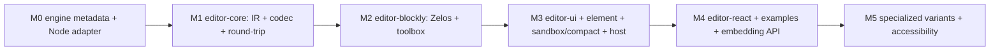

# ROADMAP.md — Implementation Roadmap

> **Version:** 1.1 · **Status:** Pre-implementation baseline · **Last updated:** 2026-06-24

> **v1.1.** OQ-001…OQ-009 are ratified (see §"Open questions"). Project-bootstrap decisions are
> now locked (license, npm scope, reference runtime, bidirectional editing). M0 is expanded to
> emit `title`/`category`/`advanced`/`examples` alongside the metadata contract.

The ordered plan for building the Transon Visual Editor. This is the **sequencing + task layer**
between the contract docs ([`SPEC.md`](SPEC.md) — the *what*, [`ARCHITECTURE.md`](ARCHITECTURE.md)
— the *how*, [`metadata-contract.md`](metadata-contract.md) — the metadata *shape*) and the code.
It introduces no new requirements — every item references a SPEC/AD ID. If a slice would change
behavior, update `SPEC.md` first (§21.2) and never renumber IDs (§21.1).

> **Status legend:** ☐ pending · ◐ in progress · ☑ done.
> Track granular requirement → code → test coverage in [`traceability.md`](traceability.md);
> this file tracks **milestone-level** progress.

## How to use this file

1. Work milestones top-to-bottom; each is a **vertical slice** that ends green. The headless
   round-trip core (`editor-core`) is the first deliverable.
2. Per requirement: write the test (citing the ID, e.g. `// FR-035`) → implement → update the
   matching row in `traceability.md` in the same change.
3. Keep the engine-parity (anti-drift) checks green: the editor's rule/operator/function and
   variant sets are derived from the engine `editor_metadata` export, never hand-maintained
   (`traceability.md`, AD-012).
4. A milestone is **done** only when its Definition of Done (below) is fully met.

## Locked decisions

These are settled ([`ARCHITECTURE.md`](ARCHITECTURE.md) §3). Do not relitigate without a
SPEC/ARCHITECTURE change.

- **Editor owns no runtime** (AD-008). All runtime concerns — validation, execution, `include`
  resolution, `file` capture — cross one host-provided `EngineProvider` boundary (`SPEC.md`
  §10.4). The exact runtime mechanism is the host's responsibility.
- **Engine-owned, versioned metadata** (AD-012). Rules/params/operators/functions metadata is
  exported by the engine (`get_editor_metadata()`); the editor adds only presentation.
- **Framework-agnostic surface** (AD-019). Vanilla `createTransonEditor()` + `<transon-editor>`
  web component + optional native React entry; React is internal.
- **Distribution** (AD-020). ESM primary (tree-shakeable) + self-contained IIFE global that
  auto-registers the web component; `.d.ts` types; CDN-ESM + importmap documented.
- **Typed IR pivot** (AD-016). `JSON ⇄ IR ⇄ Blockly`; the `JSON ⇄ IR` half is pure/headless.
- **Hybrid block generation** (AD-014). Generic blocks generated at runtime from metadata;
  specialized TS overrides selected by `rule_name`/`variant_id`; both emit identical JSON.
- **Execution-based round-trip** (AD-011). Verify by executing imported/exported templates
  through an injected engine; input-less corpus entries fall back to normalized-output +
  validation comparison. A real engine is needed in the test harness from M0.
- **Blockly Zelos renderer**, configurable (AD-017); **light DOM + scoped CSS** (AD-018).
- **Monorepo tooling** (AD-021): pnpm workspaces · Turborepo · Vite (library mode) · Vitest ·
  Changesets. Version pins are chosen at **M0** and reused by later milestones.
- **Reference host runtime** (AD-025). The shipped sandbox uses **in-browser Python `transon` via
  Pyodide/PyScript** (mirrors the docs site); round-trip CI uses the Node→Python adapter (AD-011).
  Production embedders may still supply any `EngineProvider` (AD-008).
- **Bidirectional JSON editing** is in v1 (AD-024), with strict in-surface sync (`SPEC.md` §7.15,
  FR-111…FR-113). This reverses the OQ-001 v1.0 draft.

### Project bootstrap (locked at v1.1)

- **License: MIT** — matches the `transon` engine (MIT, © Eugene Chernyshov).
- **npm scope: `@transon`** — verified available; packages follow the `@transon/editor-*` names in
  [`ARCHITECTURE.md`](ARCHITECTURE.md) §5.1.
- **Repo:** this `transon-blockly` repository hosts the pnpm/Turborepo monorepo.
- **Version pins (recorded at M0, AD-021):** Node `>=20` (engines), pnpm `10.27.0`
  (`packageManager`), TypeScript `5.9.3`, Vite `6.4.3`, Vitest `2.1.9`, Turborepo `2.10.0`,
  `@changesets/cli` `2.31.0`. Blockly `13.0.0` is introduced at **M2** (`@transon/editor-blockly`,
  default Zelos renderer). React `18.3.1` (internal UI dep) + jsdom/happy-dom test envs are
  introduced at **M3** (`editor-ui`, `@transon/editor-element`). Exact resolutions are locked in
  `pnpm-lock.yaml`.
- **Examples:** bundled at build time in v1; dynamic loading is future work (OQ-003).

## Definition of Done (every milestone)

- [ ] Each implemented FR has a test that cites its ID (`SPEC.md` §21.13, AC-027).
- [ ] `traceability.md` rows updated (status + test reference) in the same change.
- [ ] Engine-parity checks pass; the round-trip corpus is green for every rule/variant the slice
      touches (`SPEC.md` §15.8, §19.2).
- [ ] No UI-only Blockly metadata stored in the executable template (`SPEC.md` §21.12).
- [ ] No scope creep: still a visual Transon template editor, not a workflow platform
      (`SPEC.md` §4).

## Milestone overview

---

## M0 — Engine metadata export & test harness

**Goal:** the engine emits the full editor-metadata contract, and a Node engine adapter is
available for tests. Owner-controlled, lives mostly in the Transon repo.

- Scope (requirements): **FR-047**, **FR-081**; **AD-008**, **AD-012**;
  [`metadata-contract.md`](metadata-contract.md) §2–§3.
- Deliverables:
  - `transon/editor_metadata.py::get_editor_metadata()`: serialize `__rule_schema__` `required`
    (→ `required_params`) and `modes`; emit per-parameter `kind` (`dynamic`/`constant`) authored
    at the rule source; emit `title`/`category`/`advanced` and rule/parameter `examples` (from the
    tagged corpus) so the custom-rule minimum (OQ-004, `metadata-contract.md` §2.1) is expressible;
    emit operator/function metadata (`metadata-contract.md` §2.3/§2.4); carry a standalone
    `metadata_version`. Tracked as a proposal in the `transon` repository
    (`docs/proposals/editor-metadata-export.md`).
  - A Node→Python `transon` `EngineProvider` test adapter (`test/engine-node-adapter`) so M1's
    execution-based round-trip can run without an in-browser runtime.
  - Monorepo scaffolding + version pins recorded (AD-021); a metadata snapshot for M1.
- DoD additions: metadata-export-parity and variant/mode-parity checks exist and pass against the
  engine export.

## M1 — `editor-core` (IR, codec, round-trip)

**Goal:** the headless semantic core — pure TypeScript, no Blockly/React/engine dependency.

- Scope: **FR-019 … FR-039** (generation, import, round-trip), **FR-059 … FR-063** (literal /
  marker-key objects + custom marker — codec-level here; block/UI facets land in M2), **§15.7**
  (supported surface), **FR-091** + **FR-094** (`JsonPathBlockMap` data structure; the highlighting
  + taxonomy-display FRs **FR-092 / FR-093 / FR-095** land in M3), **§16.4** (error taxonomy);
  **AC-009 … AC-011**; **AD-016**, **AD-011**.
- Deliverables: typed IR (`ARCHITECTURE.md` §5.4), `JSON ⇄ IR` codec, variant matcher
  (`ARCHITECTURE.md` §5.7), surface check (§15.7), marker escape (§11.4), `EngineProvider` port +
  error taxonomy, the execution-based round-trip corpus (`SPEC.md` §15.8) run via the M0 Node
  adapter.
- DoD additions: round-trip corpus covers every built-in rule and variant; ambiguous/partial
  variant matches reported as `import_unsupported`.

## M2 — `editor-blockly` (Zelos blocks, toolbox)

**Goal:** project the IR to/from Blockly with metadata-generated blocks.

- Scope: **FR-012 … FR-018** (workspace/literals), **FR-040 … FR-044** (rule coverage),
  **FR-045 … FR-058** (parameter handling + variant model & import matching), **FR-084**,
  **FR-088 … FR-090** (metadata-driven generic blocks); **AC-006 … AC-008**, **AC-028**,
  **AC-029**, **AC-030**; **AD-014**, **AD-017**, **AD-018**.
- Deliverables: Zelos generic block generation from metadata, specialized override registry,
  `IR ⇄ Blockly` mapping, toolbox/palette built from the canonical categories (`SPEC.md` §12.4),
  light-DOM encapsulation spike (AD-018).
- DoD additions: a new rule with complete metadata appears as a generic block with no editor code
  change (AC-028).

## M3 — `editor-ui` + `editor-element` (sandbox/compact, host wiring)

**Goal:** the runnable editor in both UI modes, wired to a host engine across the boundary.

- Scope: **FR-001 … FR-011** (shell + modes), **FR-064 … FR-076** (validation/execution via the
  host), **FR-091 … FR-095** (error highlighting UI), **FR-005** + **FR-111 … FR-113**
  (bidirectional JSON editing — folded into M3 at v1.1, see note), **§10.4** (host boundary);
  **AC-001**, **AC-012 … AC-017**, **AC-023 … AC-025**, **AC-031**, **AC-032**, **AC-033**;
  **NFR-028**, **AD-019**, **AD-020**, **AD-024**, **AD-025**.
  > **Fold note (v1.1).** OQ-001 ratified bidirectional editing into v1 (FR-005, FR-111…FR-113,
  > AC-033, AD-024). These normative IDs were unassigned to a milestone; they are implemented in
  > M3 because they ride the same `EditorSession` ⇄ Blockly sync surface (§7.15). No IDs renumbered
  > (§21.1).
- Deliverables: panels + sandbox/compact modes + `EditorSession` store (`ARCHITECTURE.md` §6),
  generation-side `JsonPathBlockMap` (`pathsFromIR` / `readWorkspaceWithPaths`) + error→block
  highlighting, strict bidirectional JSON editing (valid in-surface edit syncs back; otherwise
  error + workspace unchanged — AD-024, §7.15), `createTransonEditor()` + `<transon-editor>`
  (ESM + IIFE, `@transon/editor-element`), a **reference** host engine adapter (in-browser Python
  `transon` via Pyodide, `examples/reference-host`, AD-025) that powers the sandbox/playground,
  captured `file` writes view (§17.11), include loader wiring (§17.10).
- DoD additions: with no host engine, authoring/generation/import/export still work and
  validate/run are disabled (§10.4); engine runtime status (idle/loading/ready/failed) is
  surfaced (NFR-028, AC-023).

## M4 — React entry, examples & embedding API

**Goal:** complete the consumer-facing surface and example-driven learning.

- Scope: **FR-077 … FR-082** (docs/editor metadata, diagnostics), **FR-096 … FR-101**
  (import/export UX), **FR-102 … FR-110** (component embedding); **AC-018 … AC-022**, **AC-026**;
  **AD-019**.
- Deliverables: `@transon/editor-react` (`<TransonEditor>` with React as a peer), example loading
  from the corpus with expected-vs-actual output, embedding callbacks
  (`onChange`/`onValidate`/`onExecute`), read-only/theming/marker configuration.

## M5 — Specialized variants & accessibility

**Goal:** polish UX for common rules and meet baseline accessibility.

- Scope: **FR-088** (specialized renderer override path), **FR-058** (constant-choice dropdowns),
  **NFR-045**, **§19.5**; **AC-029**, **AC-030**; **AD-014**.
- Deliverables: specialized block variants for `attr`/`object`/`map`/`expr`/`call`, progressive
  disclosure (`SPEC.md` §12.6), keyboard navigation/contrast/focus/screen-reader labels and the
  accessibility test suite.

---

## Milestone tracker

| Milestone | Focus | Key IDs | Status |
|-----------|-------|---------|:------:|
| M0 | Engine metadata export + Node adapter | FR-047, FR-081, AD-008/012/021 | ☐ |
| M1 | `editor-core`: IR + codec + round-trip | FR-019…039, 059…063, 091/094, §15.7, AD-016/011 | ☐ |
| M2 | `editor-blockly`: Zelos + toolbox | FR-012…018, 040…058, 084/088…090 | ☐ |
| M3 | UI + element + sandbox/compact + host | FR-001…011, 005, 064…076, 091…095, 111…113; AC-033; NFR-028; AD-019/020/024/025 | ☐ |
| M4 | React + examples + embedding API | FR-077…082, 096…110 | ☐ |
| M5 | Specialized variants + accessibility | FR-088, NFR-045 | ☐ |

## Readiness assessment

The specification set is unusually complete for pre-implementation: behavior (`FR/NFR/AC/UC`),
domain model, error taxonomy, supported surface (§15.7), the variant matcher
(`ARCHITECTURE.md` §5.7), the metadata contract, and the traceability scaffold are all defined.
With engine-ownership, the host boundary, and the engine-owned metadata export settled, there is
no blocking conflict. M0/M1 are ready now; later milestones depend only on their predecessors.

| Milestone | Ready? | Prerequisites / notes |
|---|:--:|---|
| M0 (engine metadata) | 🟢 ready | Author per-parameter `kind` values; implement `editor_metadata` export (AD-012) + Node engine adapter (AD-008). Owner-controlled. |
| M1 (core IR + round-trip) | 🟢 ready after M0 | Needs the metadata export + Node engine adapter (both M0). Behavior fully specified. |
| M2 (Blockly) | 🟡 mostly | Needs M0/M1; encapsulation spike (AD-018); palette presentation metadata (editor-owned, low risk). |
| M3 (UI + runtime) | 🟢 after M2 | Host boundary specified (`SPEC.md` §10.4, AD-008). Needs M2 + a reference host adapter. |
| M4–M5 | 🟢 after M3 | Inherit M3. |

### Remaining inputs to define before coding starts

1. **Per-parameter `kind` values.** The dynamic/constant classification per rule parameter must
   be authored at the engine source for the `editor_metadata` export (FR-047,
   `metadata-contract.md` §2.2). Small, owner-controlled.
2. **Built-in `title`/`category`/`advanced` + `examples` wiring.** The export must carry these so
   the custom-rule minimum is expressible (OQ-004); for built-ins they are editor-owned/sourced
   from the corpus. Authored alongside item 1 (see the transon proposal).
3. **`editor_metadata` export shape sign-off.** Confirm the exact JSON shape against
   `metadata-contract.md` §2 before M1 consumes a snapshot.
4. **Node engine adapter contract.** The test `EngineProvider` (Node→Python `transon`) must be
   stood up in M0 so M1's execution-based round-trip can run.

> **Verdict: green-light M0 + M1 now.** They depend only on owner-controlled inputs above.
> Recommended first step is **M0** (engine `editor_metadata` export + per-parameter `kind` +
> Node engine adapter), since M1 depends on it.

## Open questions

These were ratified at v1.1 and folded into the relevant requirements. Earlier-resolved questions
had already become architecture decisions: two metadata-ownership questions → AD-012, two
generic/specialized questions → AD-014, equivalence-testing → AD-011, framework choice → AD-019.

| ID | Question | Ratified decision | Status | Folded into |
|----|----------|-------------------|:------:|-------------|
| OQ-001 | Direct JSON editing with sync back to Blockly? | **In v1**, with strict in-surface sync: a valid in-surface edit syncs back, otherwise error + workspace unchanged. | ☑ | SPEC §7.15, FR-005/111–113, AC-033; AD-024 |
| OQ-002 | Export a bundle (Transon JSON + workspace metadata)? | Export canonical Transon JSON only in v1; bundle is future work. | ☑ | SPEC §11.6 |
| OQ-003 | Bundle examples at build time or load dynamically? | Bundle at build time first; dynamic loading later. | ☑ | ROADMAP locked decisions |
| OQ-004 | Exact metadata required to render custom rules safely? | name, docs, params, required, modes/variants, parameter `kind`, **plus `title`, `category`, `examples`** for custom rules. | ☑ | metadata-contract §2.1; SPEC §10.3 |
| OQ-005 | Max template size / block count supported comfortably? | Defer; set targets after M2 Zelos-prototype benchmarks (NFR-025/029). | ☑ | this file (M2) |
| OQ-006 | How do users provide include-able templates in v1? | Host-provided include resolution (examples + embedding config, AD-010); full manager later. | ☑ | SPEC §16.6; AD-010 |
| OQ-007 | How to display captured `file` writes? | Separate "Files produced" panel with name + content preview. | ☑ | SPEC §12.11, §17.11 |
| OQ-008 | Rule names vs friendly labels on blocks? | Show both, e.g. "Get attribute (`attr`)". | ☑ | SPEC §12.5 |
| OQ-009 | Palette size management with per-shape variants? | Categories + search + advanced toggle + clear labels; prefer a clearer palette over hidden modes. | ☑ | SPEC §12.6 |

## Future considerations

Not v1 requirements. Any future feature must be evaluated against the project goal: keep the
product a visual editor for Transon templates, not a general workflow automation platform.

- JSFiddle-style share links (AD-023); backend persistence; user accounts; saved template
  library; Git-backed template storage; collaborative editing;
- direct JSON editing with sync back to Blockly; side-by-side visual diff; template versioning;
  approval workflow;
- custom rule authoring UI; custom rule plugin packs; generated block packs from extension
  metadata;
- **richer block-composition UX (extends M5 specialized variants, AD-014)** — explorations from
  the M3 review of "blocks look basic / only slots":
  - *Adaptive (shadow-block) dynamic params*: give dynamic value inputs a default **shadow** literal
    (`transon_string`/`number`/`boolean`) so a constant shows as an inline editable field and Blockly
    auto-swaps it for a real connection when a rule is dropped in (restoring it on disconnect). The
    codec already reads `connection.targetBlock()`, which includes shadows, so this round-trips for
    free. Open decisions before adopting: shadows on **optional** params would erase the "absent"
    (`NO_CONTENT`) case; "missing required" readiness (`exportReadiness`) would stop flagging empty
    inputs and instead emit a default; and the default scalar type isn't in metadata today (`kind`
    is only dynamic/constant) — likely string-default or per-rule specialized knowledge. Touches
    behavior, so SPEC-first (§21.2).
  - *Array/Object add/remove slots*: `transon_array`/`transon_object` blocks have no on-canvas way to
    grow — item/entry inputs are only materialized from imported JSON by the codec (`buildArray`/
    `buildObject`). Add a Blockly **mutator** (gear/⊕/⊖) or dynamic-input extension so items can be
    added/removed visually (currently only possible via bidirectional JSON editing).
  - *Per-rule inline layout*: `blockDefinitionFor` hardcodes `inputsInline: false` (external/stacked
    rows). Thread an `inputsInline` hint through `VariantDescriptor` (or a specialized override) so
    expression-like rules (e.g. `expr`) can render side-by-side. Layout only — no semantic change.
- **runtime metadata-source policy**: let an embedder override the committed snapshot with metadata
  pulled live from a specific (possibly extended) Transon engine build. Already partially enabled —
  every catalog consumer is parameterized by `EditorMetadata` (`createBlockRegistry`, `describeAll`,
  `buildToolbox`, `parse`/`importJsonToWorkspace`) and the host carries `TransonEditorHost.metadata`
  (AD-012); the snapshot is only the default. Gaps to evaluate: add an optional
  `EngineProvider.getEditorMetadata()` pull channel (the Node adapter already does this for tests),
  a `metadata_version` compatibility guard (NFR-040) before trusting injected metadata, an atomic
  rebuild (`defineTransonBlocks` + `buildToolbox` + re-`import` the canonical JSON under the new
  catalog, AD-003), and an explicit `metadataSource: 'snapshot' | 'host' | 'engine'` policy that
  keeps `'snapshot'` as the deterministic default so `check_metadata_parity` and reproducibility stay
  intact. Caveat: hardcoded couplings (`CANONICAL_CATEGORY_ORDER`/`CATEGORY_COLOURS`,
  `enumOptionsFor`) won't auto-adapt to brand-new categories/enum-bound params and would surface them
  via `Custom`/text-field fallbacks until moved into the contract;
- natural-language-to-template assistance; AI-assisted block construction; template linting;
  style-guide enforcement;
- larger include-template manager; multi-template projects;
- visual debugger / step-through execution; runtime value tracing per block; block-level coverage
  using examples;
- advanced performance optimization for large templates; standalone hosted playground; docs-site
  embedded playground; export as image/documentation;
- package as npm library; framework-agnostic web component wrapper; accessibility improvements
  beyond Blockly defaults.

## Out of scope (do not build without a SPEC change first)

Backend accounts/persistence, collaborative/real-time editing, template/plugin marketplaces, a
visual workflow builder unrelated to Transon, multi-step orchestration outside Transon semantics,
scheduled execution, arbitrary Python authoring in the UI, a production execution service,
RBAC/approval workflows, Git-backed storage, public sharing links, or hiding the generated JSON
(`SPEC.md` §4).
