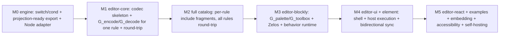

# ROADMAP.md — Implementation Roadmap

> **Version:** 2.0 · **Status:** Pre-implementation baseline · **Last updated:** 2026-06-27

> **v2.0 — template-driven projection pivot.** Milestones are resequenced around the projection
> model (`SPEC.md` §7.16, `ARCHITECTURE.md` AD-026…AD-031): (M0) engine `switch`/`cond` +
> projection-ready split metadata export; (M1) the codec skeleton + `G_encode`/`G_decode` for **one
> rule** end-to-end with round-trip identity (the de-risk prototype); (M2) the full catalog folded in
> via per-rule `include` fragments; (M3) `G_palette`/`G_toolbox` + Blockly Zelos + the finite
> behavior runtime; (M4) UI shell + host execution wiring + bidirectional sync; (M5) embedding,
> examples, accessibility, self-hosting demo. OQ-010…OQ-017 are ratified (see §"Open questions").
> The prior hand-written codec/IR/block-generation plan (the superseded AD-014/AD-016 model) is
> scrapped; only `docs/` carry forward (RFC migration plan).

> **v1.1.** OQ-001…OQ-009 are ratified (see §"Open questions"). Project-bootstrap decisions are
> now locked (license, npm scope, reference runtime, bidirectional editing). M0 is expanded to
> emit `title`/`category`/`advanced`/`examples` alongside the metadata contract.

The ordered plan for building the Transon Visual Editor. This is the **sequencing + task layer**
between the contract docs ([`SPEC.md`](SPEC.md) — the *what*, [`ARCHITECTURE.md`](ARCHITECTURE.md)
— the *how*, [`metadata-contract.md`](metadata-contract.md) — the metadata *shape*) and the code.
It introduces no new requirements — every item references a SPEC/AD ID. If a slice would change
behavior, update `SPEC.md` first (§21.2) and never renumber IDs (§21.1).

> **Status legend:** ☐ pending · ◐ in progress · ☑ done.
> Track granular requirement → code → test coverage in [`traceability.md`](traceability.md);
> this file tracks **milestone-level** progress.

## How to use this file

1. Work milestones top-to-bottom; each is a **vertical slice** that ends green. The headless
   round-trip core (`editor-core`) is the first deliverable.
2. Per requirement: write the test (citing the ID, e.g. `// FR-035`) → implement → update the
   matching row in `traceability.md` in the same change.
3. Keep the engine-parity (anti-drift) checks green: the editor's rule/operator/function and
   variant sets are derived from the engine `editor_metadata` export, never hand-maintained
   (`traceability.md`, AD-012); and the committed codec artifacts must match a fresh re-run of the
   `G_*` projections on the current metadata (codec-regeneration check, AD-030).
4. A milestone is **done** only when its Definition of Done (below) is fully met.

## Locked decisions

These are settled ([`ARCHITECTURE.md`](ARCHITECTURE.md) §3). Do not relitigate without a
SPEC/ARCHITECTURE change.

- **Editor owns no runtime** (AD-008). All runtime concerns — validation, execution, `include`
  resolution, `file` capture — cross one host-provided `EngineProvider` boundary (`SPEC.md`
  §10.4). The exact runtime mechanism is the host's responsibility.
- **Engine-owned, versioned, projection-ready metadata** (AD-012, AD-026). Rules/params/operators/
  functions metadata is exported by the engine (`get_editor_metadata()`) in the projection-ready
  shape — pre-derived variant signatures + resolved enum domains, split into a structural catalog and
  an examples/docs payload (`metadata-contract.md` §2). The editor consumes it via the `G_*`
  projections and maintains no parallel catalog.
- **Editor surface = projections of metadata** (AD-026, compiler-only). Palette, toolbox, encoder,
  and decoder are Transon-template projections of the metadata; encode/decode derive from one source
  and are inverse by construction. **No interpreter codec, no typed IR, no hand-written per-rule block
  code** (supersedes the AD-014/AD-016 model).
- **Distinct-marker staging; no `eval`** (AD-027). Generators run with the meta-marker `@` and emit
  `$` codecs; `include` inherits the parent's default marker; the engine adds no `eval`/`apply` and
  no `quote`/`raw`.
- **`switch`/`cond` dispatch** (AD-029). Both lazy-dispatch rules are added to the engine and used at
  runtime inside the generated codec.
- **Build-time codegen, runtime execution** (AD-030). `G_*` run at build time into committed codec
  artifacts; the host engine runs those artifacts at runtime (two-pass generate-then-run).
- **Finite, rule-agnostic behavior runtime** (AD-031). Block behavior that JSON can't express is a
  fixed runtime that does not grow per rule (NFR-046).
- **Framework-agnostic surface** (AD-019). Vanilla `createTransonEditor()` + `<transon-editor>`
  web component + optional native React entry; React is internal.
- **Distribution** (AD-020). ESM primary (tree-shakeable) + self-contained IIFE global that
  auto-registers the web component; `.d.ts` types; CDN-ESM + importmap documented.
- **Execution-based round-trip, by construction** (AD-011, AD-026). Verify by executing the
  generated encoder/decoder (from one metadata source) through an injected engine; input-less corpus
  entries fall back to normalized-output + validation comparison. A real engine is needed in the test
  harness from M0.
- **Blockly Zelos renderer**, configurable (AD-017); **light DOM + scoped CSS** (AD-018).
- **Monorepo tooling** (AD-021): pnpm workspaces · Turborepo · Vite (library mode) · Vitest ·
  Changesets. Version pins are chosen at **M0** and reused by later milestones.
- **Reference host runtime** (AD-025). The shipped sandbox uses **in-browser Python `transon` via
  Pyodide/PyScript** (mirrors the docs site); round-trip CI uses the Node→Python adapter (AD-011).
  Production embedders may still supply any `EngineProvider` (AD-008).
- **Bidirectional JSON editing** is in v1 (AD-024), with strict in-surface sync (`SPEC.md` §7.15,
  FR-111…FR-113). This reverses the OQ-001 v1.0 draft.

### Project bootstrap (locked at v1.1)

- **License: MIT** — matches the `transon` engine (MIT, © Eugene Chernyshov).
- **npm scope: `@transon`** — verified available; packages follow the `@transon/editor-*` names in
  [`ARCHITECTURE.md`](ARCHITECTURE.md) §5.1.
- **Repo:** this `transon-blockly` repository hosts the pnpm/Turborepo monorepo.
- **Version pins (recorded at M0, AD-021):** Node `>=20` (engines), pnpm `10.27.0`
  (`packageManager`), TypeScript `5.9.3`, Vite `6.4.3`, Vitest `2.1.9`, Turborepo `2.10.0`,
  `@changesets/cli` `2.31.0`. Blockly `13.0.0` is introduced at **M3** (`@transon/editor-blockly`,
  default Zelos renderer + behavior runtime). React `18.3.1` (internal UI dep) + jsdom/happy-dom test
  envs are introduced at **M4** (`editor-ui`, `@transon/editor-element`). Exact resolutions are locked
  in `pnpm-lock.yaml`.
- **Examples:** bundled at build time in v1; dynamic loading is future work (OQ-003).

## Definition of Done (every milestone)

- [ ] Each implemented FR has a test that cites its ID (`SPEC.md` §21.13, AC-027).
- [ ] `traceability.md` rows updated (status + test reference) in the same change.
- [ ] Engine-parity checks pass; the round-trip corpus is green for every rule/variant the slice
      touches (`SPEC.md` §15.8, §19.2); the codec-regeneration check passes (committed artifacts ==
      fresh `G_*` run, AD-030).
- [ ] No UI-only Blockly metadata stored in the executable template (`SPEC.md` §21.12).
- [ ] No hand-written codec/IR/per-rule block code reintroduced; new rule support is metadata +
      projection only (`SPEC.md` §21.15, NFR-046).
- [ ] No scope creep: still a visual Transon template editor, not a workflow platform
      (`SPEC.md` §4).

## Milestone overview

---

## M0 — Engine `switch`/`cond` + projection-ready export + test harness

**Goal:** the engine gains the two dispatch rules and emits the projection-ready, split
editor-metadata; a Node engine adapter is available for tests. Owner-controlled, lives mostly in the
Transon repo (this editor repo consumes the contract; see `metadata-contract.md` §6).

- Scope (requirements): **FR-047**, **FR-081**, **FR-116**, **FR-117**, **FR-118**; **AD-008**,
  **AD-012**, **AD-027**, **AD-029**; [`metadata-contract.md`](metadata-contract.md) §2, §6.
- Deliverables:
  - **Engine (transon repo):** `switch` and `cond` lazy-dispatch rules (`metadata-contract.md` §6.1);
    `include` default-marker inheritance (§6.3); `get_editor_metadata()` in the projection-ready
    shape — **pre-derived variant signatures** (§2.5), **resolved enum domains** (§2.6), per-param
    `kind`, `title`/`category`/`advanced`, **split** structural/examples payload (§2.7), and a
    standalone `metadata_version`.
  - **Editor repo:** a Node→Python `transon` `EngineProvider` test adapter
    (`test/engine-node-adapter`) able to **run generators and codecs** (parameterized by marker,
    `ARCHITECTURE.md` §5.2) for M1's build-time codegen + execution round-trip; monorepo scaffolding
    + version pins recorded (AD-021); a metadata snapshot for M1.
- DoD additions: metadata-export-parity, variant-signature-parity, and resolved-enum-parity checks
  exist and pass against the engine export (`traceability.md`); the adapter can execute a template
  with markers `@` and `$`.
- **Status (☑ done; CI pin flip deferred to M-09).** The **engine half has landed** in the sibling `transon` repo: the
  `switch`/`cond` rules and the projection-ready `get_editor_metadata()` export exist and are pinned
  in [`docs/metadata-snapshot.json`](metadata-snapshot.json) (engine `v0.1.1-1-g5812b63`,
  `metadata_version 2.0`, see [`metadata-snapshot.md`](metadata-snapshot.md)); the export/variant/enum
  parity checks run against it. **Editor side (landed, reviewed):** the monorepo scaffolding
  + pinned tooling (AD-021), the engine-free `EngineProvider` port (`@transon/editor-core`, AD-008),
  the typed metadata-snapshot loader (AD-012/NFR-047), and the Node→Python `EngineProvider` test
  adapter (`test/engine-node-adapter`, AD-011) — `version()`/`validate()` round-trip and the `@`/`$`
  two-pass staging proof (FR-116/FR-119/AD-027/AD-030) both pass, signed off by an independent
  `round-trip-reviewer`. The M0 DoD additions (export/variant/enum parity + adapter runs `@`/`$`) are
  met. **Only deferred item:** the hard-fail CI engine-pin flip (`--require-engine`, M-09) waits on
  `transon` being pip-installable in CI. Living status: [`docs/current-state.md`](current-state.md).

## M1 — `editor-core`: codec skeleton + `G_encode`/`G_decode` for one rule (de-risk prototype)

**Goal:** close the smallest end-to-end loop — generate a codec for **one rule** (e.g. `attr`) and
prove round-trip identity — before folding over the catalog. Pure data + host execution; no Blockly.

- Scope: **FR-114 … FR-119** (projections, generated codec, skeleton, dispatch, build-time codegen),
  **FR-124**, **FR-126** (codec output = Blockly workspace JSON directly; no mapping layer),
  **FR-019 … FR-039** (generation, import, round-trip semantics), **FR-059 … FR-063** + **FR-123**
  (literal / marker-key objects + custom marker — codec-level; skeleton-owned escape precedence),
  **§15.7** (supported surface), **FR-091** + **FR-094** + **FR-122** (`JsonPathBlockMap` produced by
  the skeleton as it walks; highlighting FRs **FR-092/093/095** land in M4), **§16.4** (error
  taxonomy); **AC-009 … AC-011**, **AC-035**; **AD-026**, **AD-028**, **AD-030**, **AD-032**, **AD-011**.
- **Engine prerequisite:** pin the metadata snapshot to an engine build (**v0.1.3+**) that provides
  the `type` function and the `include` `IncludeContext` loader the codec dispatch relies on
  ([`metadata-contract.md`](metadata-contract.md) §6.4/§6.5) before building the codec.
- Deliverables: the codec **skeleton** (recursion, literal passthrough, marker escape §11.4, ordering
  §15.3, surface check §15.7, out-of-surface placeholder §13.11); `G_encode`/`G_decode` (marker `@`)
  with the per-rule body factored into an `include`d fragment; build-time codegen producing committed
  encoder/decoder artifacts for the prototype rule; the `EngineProvider` port + error taxonomy; the
  execution-based round-trip check run via the M0 adapter.
- Pass criteria (RFC de-risk): `$`-structure emits verbatim under marker `@`; `@`-holes splice
  correctly; `include` carries everything via `this`; self-`include` recursion terminates within
  `max_include_depth`; **round-trip identity holds** for the prototype rule (AC-035).
- DoD additions (codec milestone): the **FR-124 workspace-shape validator** passes (encoder output is
  valid Blockly workspace-serialization JSON over the fixed vocabulary); the **FR-126 repo-scan**
  passes (no module under `packages/*/src` maps codec artifacts to/from a `{type, inputs, fields}`
  structure); encode/decode round-trip on the workspace shape (`decode(encode(T)) == T`); committed
  codec artifacts are **byte-equal** to a fresh `G_*` generation (compare-only regen gate, AD-030).
  (The FR-126 headless Blockly-load gate lands with Blockly in M3.)
- Implementation notes (codec/projection metaprogramming, carried from the de-risk prototype):
  - **Dispatch on node type** via a `switch` keyed by `{ call: type }` (not a structural heuristic):
    literal arrays recurse; literal marker-looking strings are scalars
    ([`metadata-contract.md`](metadata-contract.md) §6.4).
  - **`set`/`get` do NOT cross an `include` boundary** — a fragment receives its context as the `this`
    value passed into the include; reading a parent-scope variable across the include yields
    `NoContent` ([`metadata-contract.md`](metadata-contract.md) §6.5).
  - **Strict regeneration gate** — the regen check compares only (fails on drift) and writes solely
    under an explicit opt-in flag (e.g. `UPDATE_ARTIFACTS=1`); a self-writing gate rubber-stamps a
    wrong artifact ([`ARCHITECTURE.md`](ARCHITECTURE.md) AD-030).
  - **Host recursion ceiling** — codec recursion is host-stack-bound (~25 levels), below the engine's
    `max_include_depth` (50); deeper nesting should fail cleanly with an `include_loader` error, not a
    raw stack overflow ([`metadata-contract.md`](metadata-contract.md) §6.5).

## M2 — Full catalog: fold every rule into the generated codec

**Goal:** extend the codec to the whole built-in catalog by **adding per-rule `include` fragments**,
not by growing one template; every rule and variant round-trips by construction.

- Scope: **FR-040 … FR-058** (rule coverage + pre-derived variant model & matching), **FR-120**
  (new rule across all surfaces from metadata), **FR-124** (workspace-shape invariant over the full
  corpus), **§15.6**, **§15.8** (corpus); **AC-006 … AC-008**, **AC-028**, **AC-029**, **AC-030**,
  **AC-034**, **AC-035**; **AD-026**, **AD-028**, **AD-029**, **AD-032**.
- Deliverables: per-rule encode/decode fragments for all 20 built-in rules (+ operators/functions via
  resolved enums), variant matching from the pre-derived signatures, the full execution-based
  round-trip corpus (`SPEC.md` §15.8) including custom marker and import-failure cases.
- DoD additions: round-trip corpus covers every built-in rule and variant; the **FR-124
  workspace-shape validator** runs over the full §15.8 corpus; ambiguous/partial variant matches
  reported as `import_unsupported`; adding a rule to the metadata snapshot makes it
  encode/decode/round-trip with **no projection-template change** (AC-034).

## M3 — `editor-blockly`: `G_palette`/`G_toolbox` + Zelos + behavior runtime

**Goal:** project the catalog to Blockly — palette/toolbox from metadata — and add the finite,
rule-agnostic behavior runtime; the generated codec reads/writes the Blockly workspace JSON.

- Scope: **FR-012 … FR-018** (workspace/literals), **FR-043 … FR-044** (categories), **FR-084**,
  **FR-088 … FR-090** (metadata-projected blocks), **FR-121** (projection templates are valid
  templates), **FR-125** (loadable palette block definitions), **FR-126** (headless Blockly-load of
  encoder output), **FR-127** + **NFR-048** (presentation/category/colour from data, single source);
  **NFR-046**; **AC-036**, **AC-037**; **AD-017**, **AD-018**, **AD-026**, **AD-031**, **AD-032**.
- Deliverables: `G_palette` (block definitions) + `G_toolbox` (categories from `SPEC.md` §12.4)
  projections rendered to Zelos; the committed **projection-data file** for editor-owned presentation
  (title/category/advanced + category order + category→colour, `metadata-contract.md` §2.9); the
  finite **behavior runtime** (field validators, widgets, mutator UI, connection rules, change events)
  that does not grow per rule; workspace⇄blocks wiring so the generated encoder/decoder operate on
  real workspace JSON; light-DOM scoped-prefix encapsulation (AD-018; shadow DOM is not viable).
- DoD additions (projection/editor milestone): the **FR-125 headless palette-load gate** (every
  complete-metadata rule yields a loadable Zelos definition); the **FR-126 headless gate** that the
  encoder output loads via Blockly's workspace deserialization; the **FR-127 + NFR-048 source-scan**
  (no category/colour/presentation TypeScript literals under `packages/*/src`) and the
  presentation-completeness check; the **AC-037 synthetic-rule test** driving presentation from the
  data file; a new rule with complete metadata appears as a projected block with no editor code
  change (AC-034); the behavior-runtime-size check shows no per-rule growth (NFR-046).

## M4 — `editor-ui` + `editor-element`: shell, host execution, bidirectional sync

**Goal:** the runnable editor in both UI modes, wired to a host engine that runs both user templates
and the projection codecs across the boundary.

- Scope: **FR-001 … FR-011** (shell + modes), **FR-064 … FR-076** (validation/execution via the
  host), **FR-091 … FR-095** (error highlighting UI), **FR-005** + **FR-111 … FR-113**
  (bidirectional JSON editing, now via the generated decoder/encoder), **§10.4** (host boundary);
  **AC-001**, **AC-012 … AC-017**, **AC-023 … AC-025**, **AC-031**, **AC-032**, **AC-033**;
  **NFR-028**, **AD-019**, **AD-020**, **AD-024**, **AD-025**, **AD-030**.
- Deliverables: panels + sandbox/compact modes + `EditorSession` store (`ARCHITECTURE.md` §6);
  error→block highlighting from the skeleton-produced `JsonPathBlockMap`; strict bidirectional JSON
  editing (valid in-surface edit syncs back via the decoder; otherwise error + workspace unchanged —
  AD-024, §7.15); `createTransonEditor()` + `<transon-editor>` (ESM + IIFE, `@transon/editor-element`);
  the **reference** host engine adapter (in-browser Python `transon` via Pyodide,
  `examples/reference-host`, AD-025) that runs user templates **and** the codecs; captured `file`
  writes view (§17.11); include loader wiring (§17.10).
- DoD additions: with no host engine, authoring/generation/import/export still work and validate/run
  are disabled (§10.4); engine runtime status (idle/loading/ready/failed) is surfaced (NFR-028,
  AC-023).

## M5 — React entry, examples, embedding, accessibility & self-hosting

**Goal:** complete the consumer-facing surface, example-driven learning, accessibility, and the
self-hosting demonstration.

- Scope: **FR-077 … FR-082** (docs/editor metadata, diagnostics), **FR-096 … FR-101** (import/export
  UX), **FR-102 … FR-110** (component embedding), **FR-058** (constant-choice dropdowns from resolved
  enums), **FR-121** (self-hosting); **NFR-045**, **§19.5**; **AC-018 … AC-022**, **AC-026**,
  **AC-036**; **AD-019**.
- Deliverables: `@transon/editor-react` (`<TransonEditor>` with React as a peer); example loading from
  the corpus with expected-vs-actual output; embedding callbacks (`onChange`/`onValidate`/`onExecute`);
  read-only/theming/marker configuration; progressive disclosure (`SPEC.md` §12.6); the self-hosting
  demo/test (open a `G_*`/codec template in the editor, AC-036, UC-016); keyboard
  navigation/contrast/focus/screen-reader labels and the accessibility test suite.

---

## Milestone tracker

| Milestone | Focus | Key IDs | Status |
|-----------|-------|---------|:------:|
| M0 | Engine `switch`/`cond` + projection-ready export + Node adapter | FR-047/081/116/117/118, AD-008/012/027/029/021 | ☑ |
| M1 | `editor-core`: codec skeleton + `G_encode`/`G_decode` for one rule | FR-114…119, 122/123/124/126, 019…039, 059…063, 091/094, §15.7, AC-035, AD-026/028/030/032/011 | ☐ |
| M2 | Full catalog: per-rule `include` fragments, all rules round-trip | FR-040…058, 120, 124, §15.6/§15.8, AC-028/029/030/034/035, AD-032 | ☐ |
| M3 | `editor-blockly`: `G_palette`/`G_toolbox` + Zelos + behavior runtime | FR-012…018, 084/088…090, 121, 125/126/127, NFR-046/048, AC-036/037, AD-017/018/026/031/032 | ☐ |
| M4 | UI + element: shell + host execution + bidirectional sync | FR-001…011, 005, 064…076, 091…095, 111…113; AC-033; NFR-028; AD-019/020/024/025/030 | ☐ |
| M5 | React + examples + embedding + accessibility + self-hosting | FR-077…082, 096…110, 058, 121, NFR-045, AC-036 | ☐ |

## Readiness assessment

The specification set is complete for pre-implementation: behavior (`FR/NFR/AC/UC`), domain model,
error taxonomy, supported surface (§15.7), the projection model + generated codec
(`ARCHITECTURE.md` §5.4–§5.8), the projection-ready metadata contract, and the traceability scaffold
are all defined. The main risk is now the **two-level metaprogramming** of the compiler model, which
M1 deliberately de-risks on one rule before the catalog is folded in (RFC validation strategy). With
engine-ownership, the host boundary, and the projection-ready export settled, there is no blocking
conflict.

| Milestone | Ready? | Prerequisites / notes |
|---|:--:|---|
| M0 (engine rules + export) | 🟢 ready | Owner-controlled: `switch`/`cond` rules, `include` marker inheritance, projection-ready split export (AD-012/027/029), Node adapter able to run markers `@`/`$` (AD-008). |
| M1 (codec skeleton + one-rule codec) | 🟢 ready after M0 | The de-risk prototype; needs M0's export + adapter. Pass criteria gate the rest of the plan. |
| M2 (full catalog) | 🟢 after M1 | Fold per-rule `include` fragments once M1's loop closes; no new mechanism. |
| M3 (Blockly projections + behavior runtime) | 🟡 mostly | Needs M0–M2; `G_palette`/`G_toolbox`; encapsulation spike (AD-018); the finite behavior runtime (AD-031). |
| M4 (UI + runtime) | 🟢 after M3 | Host boundary specified (`SPEC.md` §10.4, AD-008); reference host runs codecs (AD-025/030). |
| M5 | 🟢 after M4 | Inherits M4; adds embedding, examples, accessibility, self-hosting. |

### Remaining inputs to define before coding starts

1. **Engine `switch`/`cond` + `include` marker inheritance.** The dispatch rules and the
   default-marker inheritance must land in the engine repo (`metadata-contract.md` §6); the generated
   codec depends on them. Owner-controlled.
2. **Projection-ready export shape sign-off.** Confirm the exact JSON shape — pre-derived variant
   signatures, resolved enum domains, per-param `kind`, split structural/examples payload — against
   `metadata-contract.md` §2 before M1 consumes a snapshot. Includes per-parameter `kind` values and
   built-in `title`/`category`/`advanced` + `examples` wiring.
3. **Node engine adapter contract.** The test `EngineProvider` (Node→Python `transon`) must be stood
   up in M0 and be able to run generators (`@`) and codecs (`$`) so M1's build-time codegen +
   execution round-trip can run.
4. **Prototype rule choice.** Pick the M1 prototype rule (RFC suggests `attr`) and author its
   projection-ready metadata + the `G_encode`/`G_decode` per-rule fragment first.

> **Verdict: green-light M0 + M1 now.** They depend only on owner-controlled inputs above.
> Recommended first step is **M0** (engine `switch`/`cond` + projection-ready export + Node adapter
> that can run both markers), since M1's de-risk prototype depends on it.

## Open questions

OQ-001…OQ-009 were ratified at v1.1 and OQ-010…OQ-017 at v2.0; all are folded into requirements.
Earlier-resolved questions had already become architecture decisions: two metadata-ownership
questions → AD-012, equivalence-testing → AD-011, framework choice → AD-019. (The former
generic/specialized questions resolved into the now-superseded AD-014, and are re-expressed by the
projection model AD-026/AD-031.)

| ID | Question | Ratified decision | Status | Folded into |
|----|----------|-------------------|:------:|-------------|
| OQ-001 | Direct JSON editing with sync back to Blockly? | **In v1**, with strict in-surface sync: a valid in-surface edit syncs back, otherwise error + workspace unchanged. | ☑ | SPEC §7.15, FR-005/111–113, AC-033; AD-024 |
| OQ-002 | Export a bundle (Transon JSON + workspace metadata)? | Export canonical Transon JSON only in v1; bundle is future work. | ☑ | SPEC §11.6 |
| OQ-003 | Bundle examples at build time or load dynamically? | Bundle at build time first; dynamic loading later. | ☑ | ROADMAP locked decisions |
| OQ-004 | Exact metadata required to render custom rules safely? | name, docs, params, required, modes/variants, parameter `kind`, **plus `title`, `category`, `examples`** for custom rules. | ☑ | metadata-contract §2.1; SPEC §10.3 |
| OQ-005 | Max template size / block count supported comfortably? | Defer; set targets after the M3 Zelos-rendering benchmarks (NFR-025/029). | ☑ | this file (M3) |
| OQ-006 | How do users provide include-able templates in v1? | Host-provided include resolution (examples + embedding config, AD-010); full manager later. | ☑ | SPEC §16.6; AD-010 |
| OQ-007 | How to display captured `file` writes? | Separate "Files produced" panel with name + content preview. | ☑ | SPEC §12.11, §17.11 |
| OQ-008 | Rule names vs friendly labels on blocks? | Show both, e.g. "Get attribute (`attr`)". | ☑ | SPEC §12.5 |
| OQ-009 | Palette size management with per-shape variants? | Categories + search + advanced toggle + clear labels; prefer a clearer palette over hidden modes. | ☑ | SPEC §12.6 |
| OQ-010 | Compiler vs interpreter as the shipped model? | **Compiler only** — generators `G_*` emit specialized codecs; no interpreter codec ships. | ☑ | SPEC §7.16 FR-115; AD-026 |
| OQ-011 | Where do projections run — build-time, runtime, or both? | **Both**: build-time codegen of committed codec artifacts + runtime execution via the host. | ☑ | SPEC §7.16 FR-119; AD-030 |
| OQ-012 | `switch` vs `cond` as the dispatch primitive? | **Both** lazy-dispatch rules added to the engine. | ☑ | SPEC §7.16 FR-118; AD-029; metadata-contract §6.1 |
| OQ-013 | Add `quote`/`raw`? | **No** — two-marker staging (`@`/`$`) covers literal-`$` emission. | ☑ | AD-027; metadata-contract §6 |
| OQ-014 | `include` marker handling? | **Default-marker inheritance** from the parent; no free per-call `marker` param, no `eval`. | ☑ | SPEC §7.16 FR-116; AD-027; metadata-contract §6.3 |
| OQ-015 | Metadata leanness — split structural vs examples? | **Split**: lean structural catalog + separate examples/docs payload. | ☑ | SPEC NFR-047; metadata-contract §2.7 |
| OQ-016 | How does the host run projections? | Same `EngineProvider` as validate/execute, via the **two-pass generate-then-run** model. | ☑ | SPEC §7.16 FR-119, §10.4; AD-030; ARCH §5.2 |
| OQ-017 | Toolbox/category source? | **Projected from metadata categories** by `G_toolbox`. | ☑ | SPEC §7.16 FR-114; ARCH §5.5 |

## Future considerations

Not v1 requirements. Any future feature must be evaluated against the project goal: keep the
product a visual editor for Transon templates, not a general workflow automation platform.

- JSFiddle-style share links (AD-023); backend persistence; user accounts; saved template
  library; Git-backed template storage; collaborative editing;
- direct JSON editing with sync back to Blockly; side-by-side visual diff; template versioning;
  approval workflow;
- custom rule authoring UI; custom rule plugin packs; generated block packs from extension
  metadata;
- **richer block-composition UX (post-M3, projection-driven)** — ideas to improve "blocks look
  basic / only slots", all expressible through metadata + the `G_palette`/codec projections and the
  finite behavior runtime (AD-026/AD-031), **not** per-rule code:
  - *Adaptive (shadow-block) dynamic params*: give dynamic value inputs a default **shadow** literal
    so a constant shows as an inline editable field and Blockly swaps it for a real connection when a
    rule is dropped in. The encoder reads connected blocks (shadows included), so this round-trips
    naturally. Open decisions before adopting: shadows on **optional** params would erase the
    "absent" (`NO_CONTENT`) case; missing-required readiness would stop flagging empty inputs; and a
    default scalar type isn't in metadata today (`kind` is only dynamic/constant) — likely a
    metadata addition consumed by the projection. Touches behavior, so SPEC-first (§21.2).
  - *Array/Object add/remove slots*: literal array/object blocks have no on-canvas way to grow.
    Add a Blockly **mutator** (gear/⊕/⊖) in the behavior runtime (AD-031) so items can be added/
    removed visually (currently only via bidirectional JSON editing).
  - *Per-rule inline layout*: thread an `inputsInline` presentation hint through the metadata/
    projection so expression-like rules (e.g. `expr`) can render side-by-side. Layout only — no
    semantic change; lives in the projection template, not code.
- **runtime metadata-source policy**: let an embedder override the committed metadata snapshot with
  metadata pulled live from a specific (possibly extended) Transon engine build, then **regenerate
  the codec/palette/toolbox** from it. Because the whole surface is `projection(metadata)` (AD-026),
  this is a re-run of the generators, not a code change. Gaps to evaluate: an optional
  `EngineProvider.getEditorMetadata()` pull channel (the Node adapter already does this for tests); a
  `metadata_version` compatibility guard (NFR-040) before trusting injected metadata; an atomic
  rebuild (re-run `G_*`, re-import the canonical JSON under the new catalog, AD-003); and an explicit
  `metadataSource: 'snapshot' | 'host' | 'engine'` policy keeping `'snapshot'` as the deterministic
  default so the parity + codec-regeneration checks and reproducibility stay intact (AD-030). New
  categories/enum-bound params flow through automatically because the toolbox and widgets are
  projected from the metadata, not hardcoded;
- natural-language-to-template assistance; AI-assisted block construction; template linting;
  style-guide enforcement;
- larger include-template manager; multi-template projects;
- visual debugger / step-through execution; runtime value tracing per block; block-level coverage
  using examples;
- advanced performance optimization for large templates; standalone hosted playground; docs-site
  embedded playground; export as image/documentation;
- package as npm library; framework-agnostic web component wrapper; accessibility improvements
  beyond Blockly defaults.

## Out of scope (do not build without a SPEC change first)

Backend accounts/persistence, collaborative/real-time editing, template/plugin marketplaces, a
visual workflow builder unrelated to Transon, multi-step orchestration outside Transon semantics,
scheduled execution, arbitrary Python authoring in the UI, a production execution service,
RBAC/approval workflows, Git-backed storage, public sharing links, or hiding the generated JSON
(`SPEC.md` §4).
