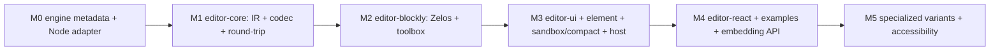

# Implementation Roadmap

The ordered plan for building the Transon Visual Editor. This is the **sequencing + task
layer** between the contract docs ([`SPEC.md`](SPEC.md) — the *what*,
[`ARCHITECTURE.md`](ARCHITECTURE.md) — the *how*, [`metadata-contract.md`](metadata-contract.md)
— the metadata *shape*) and the code. It introduces no new requirements — every item
references a SPEC/AD ID. If a slice would change behavior, update `SPEC.md` first (§22.1) and
never renumber IDs (§22.2).

> **Status legend:** ☐ pending · ◐ in progress · ☑ done.
> Track granular requirement → code → test coverage in [`traceability.md`](traceability.md);
> this file tracks **milestone-level** progress.

## How to use this file

1. Work milestones top-to-bottom; each is a **vertical slice** that ends green. The headless
   round-trip core (`editor-core`) is the first deliverable.
2. Per requirement: write the test (citing the ID, e.g. `// FR-037`) → implement → update the
   matching row in `traceability.md` in the same change.
3. Keep the engine-parity (anti-drift) checks green: the editor's rule/operator/function and
   variant sets are derived from the engine `editor_metadata` export, never hand-maintained
   (`traceability.md`, AD-022).
4. A milestone is **done** only when its Definition of Done (below) is fully met.

## Locked decisions

These are settled (`ARCHITECTURE.md` §3). Do not relitigate without a SPEC/ARCHITECTURE change.

- **Editor owns no runtime** (AD-018, AD-021). All runtime concerns — validation, execution,
  `include` resolution, `file` capture — cross one host-provided `EngineProvider` boundary
  (`SPEC.md` §11.9). The exact runtime mechanism is the host's responsibility.
- **Engine-owned, versioned metadata** (AD-022). Rules/params/operators/functions metadata is
  exported by the engine (`get_editor_metadata()`); the editor adds only presentation.
- **Framework-agnostic surface** (AD-019). Vanilla `createTransonEditor()` +
  `<transon-editor>` web component + optional native React entry; React is internal.
- **Distribution** (AD-020). ESM primary (tree-shakeable) + self-contained IIFE global that
  auto-registers the web component; `.d.ts` types; CDN-ESM + importmap documented.
- **Typed IR pivot** (AD-023). `JSON ⇄ IR ⇄ Blockly`; the `JSON ⇄ IR` half is pure/headless.
- **Hybrid block generation** (AD-024). Generic blocks generated at runtime from metadata;
  specialized TS overrides selected by `rule_name`/`variant_id`; both emit identical JSON.
- **Execution-based round-trip** (AD-025). Verify by executing imported/exported templates
  through an injected engine; input-less corpus entries fall back to normalized-output +
  validation comparison. A real engine is needed in the test harness from M0.
- **Blockly Zelos renderer**, configurable (AD-026); **light DOM + scoped CSS** (AD-027).
- **Monorepo tooling** (AD-028): pnpm workspaces · Turborepo · Vite (library mode) · Vitest ·
  Changesets. Version pins are chosen at **M0** and reused by later milestones.

## Definition of Done (every milestone)

- [ ] Each implemented FR has a test that cites its ID (`SPEC.md` §22.14, AC-027).
- [ ] `traceability.md` rows updated (status + test reference) in the same change.
- [ ] Engine-parity checks pass; the round-trip corpus is green for every rule/variant the
      slice touches (`SPEC.md` §16.8, §21.2).
- [ ] No UI-only Blockly metadata stored in the executable template (`SPEC.md` §22.13).
- [ ] No scope creep: still a visual Transon template editor, not a workflow platform
      (`SPEC.md` §4).

## Milestone overview

---

## M0 — Engine metadata export & test harness

**Goal:** the engine emits the full editor-metadata contract, and a Node engine adapter is
available for tests. Owner-controlled, lives mostly in the Transon repo.

- Scope (requirements): **FR-056**, **FR-130**, **FR-132**; **AD-021**, **AD-022**;
  [`metadata-contract.md`](metadata-contract.md) §2–§3.
- Deliverables:
  - `transon/editor_metadata.py::get_editor_metadata()`: serialize `__rule_schema__`
    `required` (→ `required_params`) and `modes`; emit per-parameter `kind`
    (`dynamic`/`constant`) authored at the rule source; emit operator/function metadata
    (`metadata-contract.md` §2.3/§2.4); carry a standalone `metadata_version`.
  - A Node→Python `transon` `EngineProvider` test adapter (`test/engine-node-adapter`) so M1's
    execution-based round-trip can run without an in-browser runtime.
  - Monorepo scaffolding + version pins recorded (AD-028); a metadata snapshot for M1.
- DoD additions: metadata-export-parity and variant/mode-parity checks exist and pass against
  the engine export.

## M1 — `editor-core` (IR, codec, round-trip)

**Goal:** the headless semantic core — pure TypeScript, no Blockly/React/engine dependency.

- Scope: **FR-020 … FR-041** (generation, import, round-trip), **§16.10** (supported surface),
  **FR-094 … FR-098** (`JsonPathBlockMap`), **§17.6** (error taxonomy); **AC-009 … AC-011**;
  **AD-023**, **AD-025**.
- Deliverables: typed IR (`ARCHITECTURE.md` §5.4), `JSON ⇄ IR` codec, variant matcher
  (`ARCHITECTURE.md` §5.7), surface check (§16.10), marker escape (§12.4), `EngineProvider`
  port + error taxonomy, the execution-based round-trip corpus (`SPEC.md` §16.8) run via the
  M0 Node adapter.
- DoD additions: round-trip corpus covers every built-in rule and variant; ambiguous/partial
  variant matches reported as `import_unsupported`.

## M2 — `editor-blockly` (Zelos blocks, toolbox)

**Goal:** project the IR to/from Blockly with metadata-generated blocks.

- Scope: **FR-011 … FR-019** (workspace/literals), **FR-042 … FR-051** (rule coverage),
  **FR-052 … FR-060** (parameter handling), **FR-133 … FR-138** (metadata-driven generic
  blocks); **AC-006 … AC-008**, **AC-028**, **AC-029**; **AD-024**, **AD-026**, **AD-027**.
- Deliverables: Zelos generic block generation from metadata, specialized override registry,
  `IR ⇄ Blockly` mapping, toolbox/palette built from the canonical categories (`SPEC.md`
  §13.4), light-DOM encapsulation spike (AD-027).
- DoD additions: a new rule with complete metadata appears as a generic block with no editor
  code change (AC-028).

## M3 — `editor-ui` + `editor-element` (sandbox/compact, host wiring)

**Goal:** the runnable editor in both UI modes, wired to a host engine across the boundary.

- Scope: **FR-001 … FR-010**, **FR-115 … FR-118** (shell + modes), **FR-066 … FR-081**
  (validation/execution via the host), **FR-094 … FR-098** (error highlighting UI), **§11.9**
  (host boundary); **AC-001**, **AC-012 … AC-017**, **AC-023 … AC-025**, **AC-031**, **AC-032**;
  **AD-020**.
- Deliverables: panels + sandbox/compact modes + `EditorSession` store (`ARCHITECTURE.md` §6),
  `createTransonEditor()` + `<transon-editor>` (ESM + IIFE), a **reference** host engine
  adapter that powers the sandbox/playground, captured `file` writes view (§17.7), include
  loader wiring (§17.8).
- DoD additions: with no host engine, authoring/generation/import/export still work and
  validate/run are disabled (§11.9); engine runtime status (idle/loading/ready/failed) is
  surfaced (NFR-025, AC-023).

## M4 — React entry, examples & embedding API

**Goal:** complete the consumer-facing surface and example-driven learning.

- Scope: **FR-082 … FR-088** (docs/editor metadata, diagnostics), **FR-099 … FR-104**
  (import/export UX), **FR-105 … FR-114** (component embedding); **AC-018 … AC-022**,
  **AC-026**; **AD-019**.
- Deliverables: `@transon/editor-react` (`<TransonEditor>` with React as a peer), example
  loading from the corpus with expected-vs-actual output, embedding callbacks
  (`onChange`/`onValidate`/`onExecute`), read-only/theming/marker configuration.

## M5 — Specialized variants & accessibility

**Goal:** polish UX for common rules and meet baseline accessibility.

- Scope: **FR-119 … FR-129** (specialized mutually-exclusive variants), **NFR-045**,
  **§21.5**; **AC-029**, **AC-030**; **AD-024**.
- Deliverables: specialized block variants for `attr`/`object`/`map`/`expr`/`call`, progressive
  disclosure (`SPEC.md` §13.6), keyboard navigation/contrast/focus/screen-reader labels and
  the accessibility test suite.

---

## Milestone tracker

| Milestone | Focus | Key IDs | Status |
|-----------|-------|---------|:------:|
| M0 | Engine metadata export + Node adapter | FR-056, FR-130/132, AD-021/022 | ☐ |
| M1 | `editor-core`: IR + codec + round-trip | FR-020…041, §16.10, AD-023/025 | ☐ |
| M2 | `editor-blockly`: Zelos + toolbox | FR-011…019, 042…060, 133…138 | ☐ |
| M3 | UI + element + sandbox/compact + host | FR-001…010, 066…081, 115…118 | ☐ |
| M4 | React + examples + embedding API | FR-082…088, 099…114 | ☐ |
| M5 | Specialized variants + accessibility | FR-119…129, NFR-045 | ☐ |

## Readiness assessment

The specification set is unusually complete for pre-implementation: behavior (`FR/NFR/AC/UC`),
domain model, error taxonomy, supported surface (§16.10), the variant matcher
(`ARCHITECTURE.md` §5.7), the metadata contract, and the traceability scaffold are all
defined. With engine-ownership, the host boundary, and the engine-owned metadata export
settled, there is no blocking conflict. M0/M1 are ready now; later milestones depend only on
their predecessors.

| Milestone | Ready? | Prerequisites / notes |
|---|:--:|---|
| M0 (engine metadata) | 🟢 ready | Author per-parameter `kind` values; implement `editor_metadata` export (AD-022) + Node engine adapter (AD-021). Owner-controlled. |
| M1 (core IR + round-trip) | 🟢 ready after M0 | Needs the metadata export + Node engine adapter (both M0). Behavior fully specified. |
| M2 (Blockly) | 🟡 mostly | Needs M0/M1; encapsulation spike (AD-027); palette presentation metadata (editor-owned, low risk). |
| M3 (UI + runtime) | 🟢 after M2 | Host boundary specified (`SPEC.md` §11.9, AD-018/AD-021). Needs M2 + a reference host adapter. |
| M4–M5 | 🟢 after M3 | Inherit M3. |

### Remaining inputs to define before coding starts

1. **Per-parameter `kind` values.** The dynamic/constant classification per rule parameter
   must be authored at the engine source for the `editor_metadata` export (FR-056,
   `metadata-contract.md` §2.2). Small, owner-controlled.
2. **`editor_metadata` export shape sign-off.** Confirm the exact JSON shape against
   `metadata-contract.md` §2 before M1 consumes a snapshot.
3. **Node engine adapter contract.** The test `EngineProvider` (Node→Python `transon`) must be
   stood up in M0 so M1's execution-based round-trip can run.

> **Verdict: green-light M0 + M1 now.** They depend only on owner-controlled inputs above.
> Recommended first step is **M0** (engine `editor_metadata` export + per-parameter `kind` +
> Node engine adapter), since M1 depends on it.

## Open questions

These carry draft decisions but are not yet ratified. They do not block early implementation,
but each should be closed (and its decision folded into the relevant requirement) before v1
acceptance. Resolved questions have already been folded into architecture decisions: OQ-001
and OQ-013 → AD-022, OQ-002 and OQ-014 → AD-024, OQ-010 → AD-025, OQ-012 → AD-019.

| ID | Question | Draft decision | Status |
|----|----------|----------------|:------:|
| OQ-003 | Direct JSON editing with sync back to Blockly? | Not in v1; generated JSON is visible/copyable, bidirectional editing is future work. | ☐ |
| OQ-004 | Export a bundle (Transon JSON + workspace metadata)? | Not required in v1; export canonical Transon JSON only. | ☐ |
| OQ-005 | Bundle examples at build time or load dynamically? | Bundle first for reliability; dynamic loading later. | ☐ |
| OQ-006 | Exact metadata required to render custom rules safely? | At least name, docs, parameters, required params, variants, parameter `kind`. | ☐ |
| OQ-007 | Max template size / block count supported comfortably? | Define performance targets after prototype benchmarks (NFR-022/026). | ☐ |
| OQ-008 | How do users provide include-able templates in v1? | Host-provided include resolution (examples + embedding config, AD-018); full manager later. | ☐ |
| OQ-009 | How to display captured `file` writes? | A separate "Files produced" panel with name + content preview (§13.9, §17.7). | ☐ |
| OQ-011 | Rule names vs friendly labels on blocks? | Show both where practical, e.g. "Get attribute (`attr`)". | ☐ |
| OQ-015 | Palette size management with per-shape variants? | Categories, search, advanced toggle, clear labels; prefer a clearer palette over hidden modes. | ☐ |

## Future considerations

Not v1 requirements. Any future feature must be evaluated against the project goal: keep the
product a visual editor for Transon templates, not a general workflow automation platform.

- JSFiddle-style share links (AD-010); backend persistence; user accounts; saved template
  library; Git-backed template storage; collaborative editing;
- direct JSON editing with sync back to Blockly; side-by-side visual diff; template
  versioning; approval workflow;
- custom rule authoring UI; custom rule plugin packs; generated block packs from extension
  metadata;
- natural-language-to-template assistance; AI-assisted block construction; template linting;
  style-guide enforcement;
- larger include-template manager; multi-template projects;
- visual debugger / step-through execution; runtime value tracing per block; block-level
  coverage using examples;
- advanced performance optimization for large templates; standalone hosted playground;
  docs-site embedded playground; export as image/documentation;
- package as npm library; framework-agnostic web component wrapper; accessibility improvements
  beyond Blockly defaults.

## Out of scope (do not build without a SPEC change first)

Backend accounts/persistence, collaborative/real-time editing, template/plugin marketplaces, a
visual workflow builder unrelated to Transon, multi-step orchestration outside Transon
semantics, scheduled execution, arbitrary Python authoring in the UI, a production execution
service, RBAC/approval workflows, Git-backed storage, public sharing links, or hiding the
generated JSON (`SPEC.md` §4).
