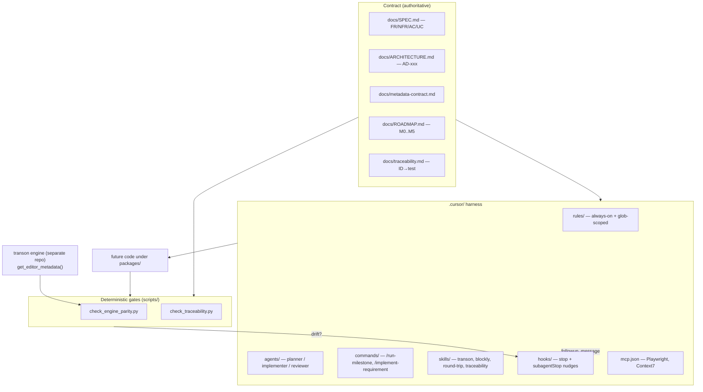
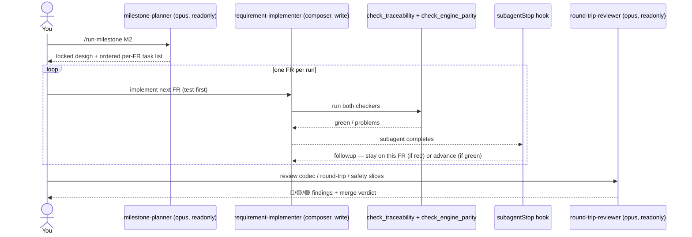
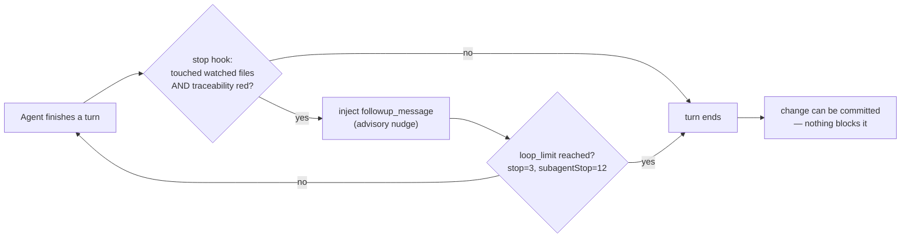

# Agentic development harness — a user guide

> **Status: non-authoritative.** This is a *user guide / field manual*, not part of the contract.
> It introduces **no** requirements and is **not** checked by any gate. The authoritative documents
> remain `docs/SPEC.md` (the *what*), `docs/ARCHITECTURE.md` (the *how*), `docs/metadata-contract.md`
> (the metadata *shape*), `docs/ROADMAP.md` (sequencing), `docs/traceability.md` (coverage), and
> `AGENTS.md` / `.cursor/rules/` (always-on agent rules). Where this guide and those disagree, **they
> win**. This file describes the harness *as it exists today* and grills it for gaps; treat the
> "Gaps" section as a backlog of opinions, not as decisions.

This repo (`transon-blockly`) is, at the time of writing, a **docs + AI-harness repository**: there
is no `packages/`, no `package.json`, no `pnpm-workspace.yaml`, and no `.github/` CI yet (M0 hasn't
landed). That makes the harness unusually important — for now it is most of what governs how code
*will* arrive. This guide explains what the harness is, how to drive it, why it is shaped the way it
is, and where it is thin.

---

## 1. What the harness is

The harness lives entirely under `.cursor/` plus two `scripts/` checkers. It is built around one
idea: **the contract docs are the source of truth, and every layer of automation exists to keep
generated code pinned to that contract.**



### Component inventory

| Layer | Files | Role |
|-------|-------|------|
| **Rules** (always) | `rules/project-overview.mdc`, `rules/spec-discipline.mdc` | Injected into every turn: invariants (JSON canonical, engine-free, strict round-trip, variants-over-modes, metadata-driven, UI≠semantics) + SPEC-first / ID-stability / engine-authority discipline. |
| **Rules** (glob) | `rules/editor-core.mdc`, `rules/editor-blockly.mdc`, `rules/testing.mdc`, `rules/monorepo-build.mdc` | Activate only when matching files are touched (`packages/editor-core/**`, `packages/editor-blockly/**`, test globs, build configs). Keep context lean until relevant. |
| **Subagents** | `agents/milestone-planner.md` (opus, readonly), `agents/requirement-implementer.md` (composer, write), `agents/round-trip-reviewer.md` (opus, readonly) | A **plan → implement → review** division of labour with deliberately different models. |
| **Commands** | `commands/run-milestone.md`, `commands/implement-requirement.md` | Human-invoked entry points (`/run-milestone M2`, `/implement-requirement FR-035`). |
| **Skills** | `skills/transon-authoring`, `skills/blockly-authoring`, `skills/round-trip-review`, `skills/spec-traceability` | On-demand deep procedures. All are `disable-model-invocation: true` (explicit-call only). |
| **Hooks** | `hooks.json` + `hooks/check-docs-consistency.py` (`stop`) + `hooks/advance-requirement-loop.py` (`subagentStop`) | Post-turn nudges: re-prompt on traceability drift; self-advance the per-requirement loop. |
| **MCP** | `mcp.json` | Playwright (UI/accessibility testing, SPEC §19.4/§19.5) + Context7 (current Blockly/React/Vite/Vitest API docs — **not** Transon). |
| **Gates** | `scripts/check_engine_parity.py`, `scripts/check_traceability.py` | The only *deterministic, model-independent* truth checks. |

---

## 2. How to use it

### 2.1 The two entry points

Everything funnels through two `/`-commands, sized to two different scopes:

- **`/run-milestone M2`** — drives a whole roadmap milestone end-to-end in one focused pass.
- **`/implement-requirement FR-035`** — implements exactly one requirement, test-first.

The intended subagent topology (the commands and `AGENTS.md` describe it; the planner/implementer/
reviewer subagents make it concrete):



### 2.2 The per-requirement loop (the contract every executor follows)

Both commands and the implementer subagent enforce the same recipe (`commands/implement-requirement.md`):

1. Read the requirement in `SPEC.md` + cited `ARCHITECTURE.md`/metadata sections; confirm it belongs
   to the active milestone.
2. **Write the Vitest test first**, citing the ID in the name/comment (`// FR-035`).
3. Implement the **minimal** code in the right package (semantic core → `@transon/editor-core`, no
   Blockly/React/engine deps).
4. Run Vitest until green.
5. Update the matching `docs/traceability.md` row **in the same change**.
6. Run `python scripts/check_traceability.py` and `python scripts/check_engine_parity.py`; both green.

**Hard stops** (do not improvise): one requirement per run; if the SPEC is ambiguous or needs new
behavior, STOP and propose a spec change (next free ID, never renumber); never report a template
valid when the engine would reject it; keep UI-only metadata out of the executable template; flag
codec/round-trip/marker/variant changes for a `round-trip-reviewer` pass.

### 2.3 Bootstrapping the gates (do this first)

The parity gate needs the engine. Today `transon` is **not** importable in this environment; the
check only passes because a sibling checkout happens to exist at `../transon` (its
`get_editor_metadata()` export is used). Before relying on the gate:

```bash
pip install transon            # or: export TRANSON_REPO=/path/to/transon
python scripts/check_engine_parity.py
python scripts/check_traceability.py
```

If neither the package nor `TRANSON_REPO`/sibling is present, the parity check **skips with exit 0** —
it does not fail, it simply does nothing. See Gap **G-02**.

### 2.4 Which tool for which job

| You want to… | Use |
|---|---|
| Start a milestone (design only) | `milestone-planner` subagent / `/run-milestone` then plan mode |
| Implement one well-specified FR | `requirement-implementer` / `/implement-requirement` |
| Author/verify a Transon template | `skills/transon-authoring` (authority = a **running engine**, never memory/web/Context7) |
| Define Blockly blocks/toolbox/serialization | `skills/blockly-authoring` (Context7 OK for Blockly API only) |
| Review a codec/round-trip/safety change | `round-trip-reviewer` + `skills/round-trip-review` |
| Add/edit/deprecate a requirement | `skills/spec-traceability` |
| Test UI / accessibility | Playwright MCP |
| Look up current Blockly/React/Vite API | Context7 MCP |

---

## 3. How it helps (why it is shaped this way)

- **A cost-tiered division of labour.** Expensive, *read-only* models do the judgement-heavy,
  irreversible-in-spirit work (planning a milestone, reviewing round-trip safety); a cheap, *write*
  model does the bounded, well-specified implementation. The expensive models can't accidentally
  mangle the tree (readonly); the cheap model can't drift far because the task is one FR with a
  test-first recipe and objective gates.
- **Determinism where it matters.** The two checkers are pure-stdlib Python with no model in the
  loop. They answer two yes/no questions a model cannot rationalize away: *does the editor's catalog
  match the engine?* and *is every cited/"done" requirement ID real and tested?*
- **Context economy.** Always-on rules carry only the invariants; everything deeper (Blockly API,
  round-trip checklist, engine-query procedure) is a glob-scoped rule or an explicitly-invoked skill,
  so the model isn't drowning in context it doesn't need this turn.
- **Single source of truth, enforced by citation.** Requirement IDs (`FR/NFR/AC/UC/AD/OQ`) are the
  spine. Tests cite them, traceability rows track them, the checker rejects dead/deprecated IDs. The
  catalog is *derived from the engine export*, never hand-listed, so it can't quietly diverge.
- **Small tasks a weaker executor can't get lost in.** The whole harness is explicitly designed (see
  `AGENTS.md`) so a less-capable executor model can work safely: per-ID tasks, test-first, and gates
  it cannot bypass.

---

## 4. Stable development & drift mitigation

"Drift" has several distinct flavours. The harness has a specific control for most of them — and a
visible hole for a couple. This table is the heart of the guide.

| Drift type | What it looks like here | Control in the harness | Strength |
|---|---|---|---|
| **Engine/spec drift** | Editor supports a rule/operator/function the engine doesn't (or vice-versa); variant signatures or enum domains diverge | `check_engine_parity.py` compares `SPEC.md` §14 + the editor's derived catalog against the engine `get_editor_metadata()` export (names, variant signatures, resolved enums, export shape) | **Strong — when the engine is present** (see G-02) |
| **Intent / requirement drift** | Code does something the SPEC never sanctioned; a "done" feature has no test; tests cite IDs that don't exist | SPEC-first rule (§21.2), ID-stability rule (§21.1), `check_traceability.py` (no dead/deprecated IDs; "done" FR/AC must have a citing test), STOP-and-escalate hard rules | **Medium** — citation is a proxy for coverage, not proof (G-04) |
| **Semantic / round-trip drift** | Import→export silently changes meaning; a variant matches zero/many; ordering or marker-escape regresses | `round-trip-review` skill + `round-trip-reviewer` subagent; execution-based round-trip corpus (AD-011); editor-core invariants rule | **Design-strong, enforcement-weak** — nothing *forces* a review pass (G-05) |
| **Tech-debt drift** | Hand-written per-rule codec/IR/block code creeps back; UI metadata leaks into templates; core grows engine/DOM deps | "Projections, not hand-written mappings" (§21.15, AD-026), UI≠semantics (§21.12), one-way package dependency rule, ROADMAP DoD line "no hand-written codec/IR/per-rule block code reintroduced" | **Medium** — these are prose rules + review, not automated checks yet |
| **Continuity drift** (context/session) | A new chat forgets the locked decisions; an executor re-litigates settled ADs; status trackers lag reality | Always-on rules re-inject invariants every turn; "locked decisions / do not relitigate" lists in ROADMAP and skills; transcripts archived under `agent-transcripts/` | **Medium** — depends on the human re-pointing at the contract; status fields are hand-maintained (G-06) |
| **Catalog drift** | A parallel hand-maintained rule list grows beside the engine | "metadata-driven, no parallel hand-list" rule + parity check | **Strong** |
| **Toolchain drift** | Versions float; "works on my machine" | Version pins recorded in ROADMAP (AD-021); `monorepo-build.mdc` stub to be filled at M0 | **Pending** — no `package.json`/lockfile exists yet |

### The single most important caveat



**The hooks nudge; they do not block.** A `stop`/`subagentStop` hook can only inject a follow-up
message, and only up to `loop_limit` times. After that, a change with drift can still be committed.
There is currently **no CI and no pre-commit hook**, so the deterministic gates run only when the
agent (or a human) chooses to run them. In other words: *the objective gates exist, but today nothing
mandatory actually gates on them.* This is the harness's defining limitation right now, and it shapes
most of the recommendations below.

---

## 5. Other modern-agentic-engineering aspects

A checklist of practices a mature agent harness tends to have, scored against this repo.

| Aspect | Present? | Notes |
|---|---|---|
| Layered, scoped context (rules vs skills) | ✅ | Always-on invariants + glob rules + explicit skills. Clean separation. |
| Multi-agent role separation | ✅ | Planner / implementer / reviewer, registered as selectable subagent types. |
| Cost-aware model routing | ✅ (verify slugs) | opus for judgement, composer for execution. Slugs need confirming (G-03). |
| Test-first, ID-cited workflow | ✅ | Enforced by command + rules. |
| Deterministic, model-independent gates | ✅ | Two stdlib checkers. |
| Gates wired into CI / pre-commit | ❌ | No `.github/`, no husky/pre-commit (G-01). |
| Mandatory review for risky changes | ❌ | Review is prose-recommended, not enforced (G-05). |
| Tool/version pinning + lockfile | ◑ | Pins listed in ROADMAP; no lockfile/`package.json` yet (M0). |
| Authoritative-source discipline (anti-hallucination) | ✅ | "Authority = running engine, never memory/web/Context7" is explicit and repeated. |
| MCP for live docs + UI testing | ✅ | Context7 + Playwright. |
| Secret handling / sandbox policy for agents | ◑ | Engine-free + no-arbitrary-Python invariants exist; no explicit agent-secret policy doc. |
| Observability of agent runs | ◑ | Transcripts archived; no metrics/eval harness for agent quality. |
| Rollback / change isolation (one PR per unit) | ✅ | "One branch/PR per milestone", "one requirement per run". |
| Eval/regression suite for the agents themselves | ❌ | No fixtures that test "does the planner produce a valid task list", etc. |
| Reproducible engine snapshot | ◑ | `metadata_version` contract exists; no committed snapshot or pinned engine version yet (G-07). |

---

## 6. Gaps, discrepancies, and issues (grilled)

Each item is grounded in a file or an observed fact. Severity: 🔴 structural · 🟡 should-fix ·
🟢 polish. None of these are blocking *spec* problems — they're harness-quality problems.

### 🔴 G-01 — The gates gate nothing (no CI / pre-commit)
`.github/` and any pre-commit/husky config are absent; there is no `package.json`. The deterministic
checkers are only ever run by the agent voluntarily or surfaced by an advisory hook. `AGENTS.md` and
the ROADMAP DoD both say "run the checks before finishing" and "make required in CI once the engine
is available" — i.e. this is acknowledged TODO, but until it lands, drift can ship. **Fix:** add a CI
workflow that runs both checkers (and Vitest, once it exists) on PRs, and optionally a pre-commit
hook for the traceability checker. This is the highest-leverage change.

### 🔴 G-02 — Engine-parity fails open and rides on an unpinned local layout
`check_engine_parity.py` **skips with exit 0** when `transon` can't be imported. In this environment
the package is not installed; the check passes only because `../transon` exists as a sibling. On a
fresh clone or a CI runner without that sibling, the "primary defense against spec/engine drift"
silently becomes a no-op. **Fix:** pin and `pip install` a specific `transon` version in dev/CI (or
set `TRANSON_REPO`), and once M0 lands, make the check **required** (fail, not skip, when the engine
is missing) — the script's own docstring already says to.

### 🟡 G-03 — Subagent model slugs are unverified / non-canonical
`milestone-planner.md` and `round-trip-reviewer.md` pin `model: claude-4.8-opus-high-thinking`;
`requirement-implementer.md` pins `model: composer-2.5-fast`. The exact opus slug does not match the
canonical-looking form seen elsewhere (e.g. `claude-opus-4-8-thinking-high`). If a slug doesn't
resolve, Cursor may silently fall back to a default model, quietly collapsing the cost-tiered design.
**Fix:** confirm both slugs resolve in the Models/Hooks UI; correct them if not.

### 🟡 G-04 — "Tested" is proxied by an ID string, not by real coverage
`check_traceability.py` only verifies that a *file under the code dirs contains the ID string* for any
FR/AC marked `[x]`. A bare `// FR-035` comment satisfies it. It also doesn't flag the reverse
(code/behavior that ships with the row left `[ ]`), and it can't tell whether the test actually
exercises the requirement. It's a useful liveness check, not a coverage proof. **Fix:** pair it with
real Vitest coverage and treat the ID-citation as a *necessary, not sufficient* signal in review.

### 🟡 G-05 — Round-trip review is recommended, never enforced
The riskiest changes (codec, variant matcher, surface check, marker escape, ordering, engine/`file`/
`include`/remote-example surfaces) are exactly where meaning can silently change. The harness handles
this with a *prose* "note that a round-trip-reviewer pass is required before merge" — nothing detects
a codec-touching diff and demands the review. **Fix:** add a CI label/check (or a `postToolUse`/PR
template) that trips when trust-critical paths change and requires the reviewer verdict.

### 🟡 G-06 — Hand-maintained status can drift from reality
The ROADMAP milestone tracker shows **M0 ☐ pending**, yet the engine already exports
`get_editor_metadata()` (the parity run reports `source: export`), so engine-side M0 work is at least
partly done. Milestone/`[ ]` status fields are human-maintained and reconciled by nothing. This is
itself a small instance of intent/status drift. **Fix:** derive what status you can (e.g. "export
exists") and review the trackers each milestone.

### 🟡 G-07 — No committed metadata snapshot or pinned engine version
M1 is meant to consume a metadata snapshot, and `metadata-contract.md` defines `metadata_version` +
NFR-040 mismatch detection — but no snapshot is committed and the editor repo pins no engine version.
Parity therefore validates against whatever `../transon` currently is. "Metadata-driven" floats on an
unpinned engine. **Fix:** commit the snapshot and record the exact engine commit/version it came from.

### 🟢 G-08 — `stop`-hook `followup_message` support is unverified
The Cursor hooks output cheat sheet documents `followup_message` for **`subagentStop`**; the `stop`
event's documented outputs don't explicitly include it. `check-docs-consistency.py` returns
`followup_message` on `stop`. It may work, but it's worth confirming in the **Hooks** output channel
that the message is actually injected and not ignored.

### 🟢 G-09 — `subagentStop` identity detection is hand-rolled
`advance-requirement-loop.py` sniffs seven possible payload keys (`subagent_type`, `subagentType`,
`agent_type`, `name`, `type`, …) plus `status == "completed"` to recognize the implementer — all
assumptions about an undocumented payload shape. The documented mechanism is a `matcher` on subagent
type in `hooks.json`. **Fix:** add `"matcher": "requirement-implementer"` to the hook entry and
confirm the payload schema from the Hooks channel; keep the key-sniffing only as a fallback. Also
note the auto-advance loop only fires for the *subagent-driven* flow — a milestone driven directly in
the main agent won't self-advance.

### 🟢 G-10 — Skills are explicit-invocation only
All four skills set `disable-model-invocation: true`, so they won't auto-trigger; they're pulled in by
the commands/agents that reference them by path. That's a deliberate determinism choice, but a
free-form chat that bypasses the commands gets no skill guidance automatically. Worth knowing so you
remember to invoke them.

### 🟢 G-11 — Watched-path lists are duplicated and must stay in sync
`check-docs-consistency.py` (`WATCHED_PREFIXES`) and `check_traceability.py` (`CODE_DIRS`) hard-code
overlapping-but-not-identical directory lists (`packages/ src/ test/ tests/ examples/ apps/`). If the
M0 monorepo layout differs (the AD-019 names are `@transon/editor-*` under `packages/`), these lists
must be updated or the gates silently skip files. **Fix:** centralize the path list, or assert it
against the real workspace layout once it exists.

### 🟢 G-12 — No eval/regression harness for the agents themselves
There are no fixtures that check the *harness* behaves (e.g. "the planner emits one task per FR",
"the implementer refuses an ambiguous SPEC"). For a harness this central, a few golden-path agent
evals would catch regressions in the prompts/agents over time.

---

## 7. Recommended next steps (opinion, not contract)

Ordered by leverage:

1. **G-01 + G-02 together:** stand up a CI workflow that `pip install`s a pinned `transon`, then runs
   both checkers (required, not skipped) and Vitest. This converts the gates from advisory to binding.
2. **G-05:** make round-trip review a binding step for trust-critical diffs (CI label or PR check).
3. **G-03:** verify the subagent model slugs resolve.
4. **G-07:** commit a metadata snapshot + record the engine version.
5. **G-09 / G-08:** tighten the hooks with a `matcher` and confirm `stop` output behavior.
6. **G-12:** add a couple of golden-path agent evals.

None of these require a SPEC change; they harden the harness, not the product. Anything that *would*
change product behavior must still go through SPEC-first (§21.2) with a new ID (§21.1).

---

## 8. Quick reference

```text
.cursor/
  rules/        project-overview*, spec-discipline*  (always)   + editor-core, editor-blockly, testing, monorepo-build (glob)
  agents/       milestone-planner (opus, ro) · requirement-implementer (composer, rw) · round-trip-reviewer (opus, ro)
  commands/     /run-milestone · /implement-requirement
  skills/       transon-authoring · blockly-authoring · round-trip-review · spec-traceability   (all explicit-invocation)
  hooks/        check-docs-consistency.py (stop) · advance-requirement-loop.py (subagentStop)
  mcp.json      playwright · context7
scripts/
  check_engine_parity.py     SPEC §14 + derived catalog  ==  engine get_editor_metadata()
  check_traceability.py      no dead/deprecated IDs; every "done" FR/AC has a citing test
```

Run before finishing any change that touches `docs/`, code, or tests:

```bash
python scripts/check_traceability.py
python scripts/check_engine_parity.py   # needs transon installed or TRANSON_REPO set
```
