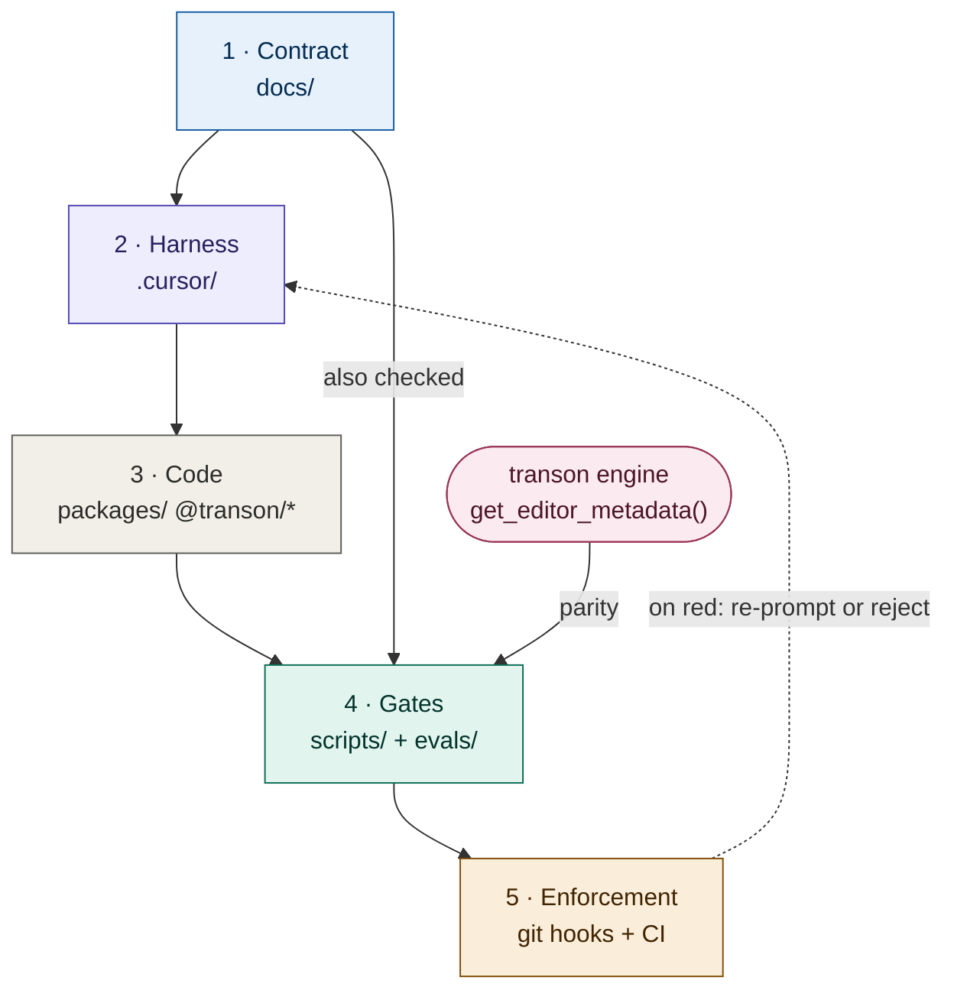
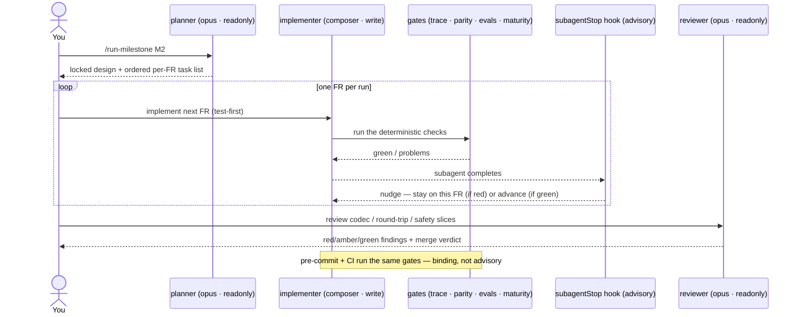
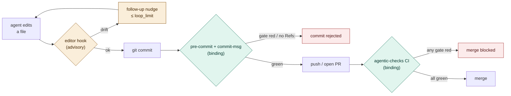

# Agentic development harness — a user guide

> **Status: non-authoritative.** This is a *user guide / field manual*, not part of the contract.
> It introduces **no** requirements and is **not** checked by any gate. The authoritative documents
> remain `docs/SPEC.md` (the *what*), `docs/ARCHITECTURE.md` (the *how*), `docs/metadata-contract.md`
> (the metadata *shape*), `docs/ROADMAP.md` (sequencing), `docs/traceability.md` (coverage), and
> `AGENTS.md` / `.cursor/rules/` (always-on agent rules). Where this guide and those disagree, **they
> win**. This file describes the harness *as it exists today*; the gap backlog and improvement
> tracking live in [maturity-plan.md](maturity-plan.md) (see §5).

This repo (`transon-blockly`) is, at the time of writing, a **docs + AI-harness repository**: there
is no `packages/`, no `package.json`, and no `pnpm-workspace.yaml` yet (M0 hasn't landed). What it
*does* have is two enforcement layers around the contract: **advisory** editor hooks that nudge, and
**binding** git hooks + a CI workflow that block. That makes the harness unusually important — for now
it is most of what governs how code *will* arrive. This guide explains what the harness is, how to
drive it, why it is shaped the way it is, and where it is thin. Its companion,
[maturity-plan.md](maturity-plan.md), scores the harness and tracks what is left to harden.

---

## 1. What the harness is

The harness lives under `.cursor/` (context + advisory hooks), the `scripts/` checkers and `evals/`,
and a **binding** enforcement layer — git hooks plus a CI workflow. It is built around one idea: **the
contract docs are the source of truth, and every layer of automation exists to keep generated code
pinned to that contract.** The diagram reads top-to-bottom — contract feeds the harness, the harness
produces code, and the deterministic gates check code (and the contract) before two enforcement tiers
decide what may land.



Each numbered stage expands in the table below.

### What each stage contains

| Stage | Component | Files | Role |
|---|---|---|---|
| **1 · Contract** | Contract docs | `SPEC.md` · `ARCHITECTURE.md` · `metadata-contract.md` · `ROADMAP.md` · `traceability.md` | Authoritative source of truth: the *what* (FR/NFR/AC/UC), *how* (AD-xxx), metadata shape, sequencing (M0–M5), ID→test coverage. |
| **2 · Harness** | Rules — always-on | `rules/project-overview.mdc` · `spec-discipline.mdc` | Invariants injected every turn: JSON-canonical, engine-free, strict round-trip, variants-over-modes, metadata-driven, UI≠semantics + SPEC-first / ID-stability. |
| | Rules — glob | `rules/editor-core.mdc` · `editor-blockly.mdc` · `testing.mdc` · `monorepo-build.mdc` | Activate only when matching files are touched — context stays lean until relevant. |
| | Subagents | `agents/milestone-planner` (opus, ro) · `requirement-implementer` (composer, rw) · `round-trip-reviewer` (opus, ro) | plan → implement → review, deliberately cost-tiered; only the implementer can write. |
| | Commands | `commands/run-milestone` · `implement-requirement` | Human entry points (`/run-milestone M2`, `/implement-requirement FR-035`). |
| | Skills | `skills/transon-authoring` · `blockly-authoring` · `round-trip-review` · `spec-traceability` | On-demand procedures; all explicit-invocation (`disable-model-invocation: true`). |
| | MCP | `mcp.json` | Playwright (UI / a11y) + Context7 (live Blockly/React/Vite docs — **not** Transon). |
| **3 · Code** | Editor packages | `packages/@transon/*` *(future)* | What the harness produces, pinned to the contract; semantic core in `editor-core` (no Blockly/React/engine deps). |
| **4 · Gates** | Deterministic checks | `scripts/check_traceability` · `check_engine_parity` · `check_maturity` · `evals/run_evals` | Model-independent truth checks: ID consistency, editor↔engine parity, harness maturity (+ratchet), agent golden-paths. |
| **5 · Enforcement** | Advisory | `.cursor/hooks.json` → `check-docs-consistency` (stop) · `advance-requirement-loop` (subagentStop) | Nudge mid-session (re-prompt on drift, self-advance the loop); **never block**. |
| | Binding | `.githooks/pre-commit` · `commit-msg` · `.github/workflows/agentic-checks.yml` | Make the gates **mandatory**: red blocks the commit (pre-commit) or merge (CI); `Refs:`/`Slice:` trailer required on code commits. |

Stages 1–2 are model-facing context; stages 4–5 are the model-independent backstop. The detail of the
advisory-vs-binding split in stage 5 is in [§4](#two-enforcement-layers-advisory-and-binding).

---

## 2. How to use it

### 2.1 The two entry points

Everything funnels through two `/`-commands, sized to two different scopes:

- **`/run-milestone M2`** — drives a whole roadmap milestone end-to-end in one focused pass.
- **`/implement-requirement FR-035`** — implements exactly one requirement, test-first.

The intended subagent topology (the commands and `AGENTS.md` describe it; the planner/implementer/
reviewer subagents make it concrete):



### 2.2 The per-requirement loop (the contract every executor follows)

Both commands and the implementer subagent enforce the same recipe (`commands/implement-requirement.md`):

1. Read the requirement in `SPEC.md` + cited `ARCHITECTURE.md`/metadata sections; confirm it belongs
   to the active milestone.
2. **Write the Vitest test first**, citing the ID in the name/comment (`// FR-035`).
3. Implement the **minimal** code in the right package (semantic core → `@transon/editor-core`, no
   Blockly/React/engine deps).
4. Run Vitest until green.
5. Update the matching `docs/traceability.md` row **in the same change**.
6. Run the gates — `check_traceability.py`, `check_engine_parity.py`, `evals/run_evals.py`,
   `check_maturity.py --check`; all green.
7. Commit with a `Refs: FR-035` (or `Slice:`) trailer — the `commit-msg` hook **requires** it on any
   code-touching commit, so `git log --grep FR-035` stays a complete audit.

The agent does not have to *remember* steps 6–7: the `pre-commit` hook re-runs the gates and the
`commit-msg` hook checks the trailer, so a drifting change is rejected at commit time, and CI re-checks
on the PR. The recipe is the happy path; the hooks are the backstop.

**Hard stops** (do not improvise): one requirement per run; if the SPEC is ambiguous or needs new
behavior, STOP and propose a spec change (next free ID, never renumber); never report a template
valid when the engine would reject it; keep UI-only metadata out of the executable template; flag
codec/round-trip/marker/variant changes for a `round-trip-reviewer` pass.

### 2.3 Bootstrapping (do this first)

**Enable the binding git hooks** — they are committed under `.githooks/` but git only runs them once
you point it there (one command per clone):

```bash
git config core.hooksPath .githooks
```

After this, `pre-commit` runs the gates and `commit-msg` requires a `Refs:`/`Slice:` trailer on
code-touching commits. Bypass in an emergency with `git commit --no-verify` (CI still enforces them).

**Wire the engine** so parity actually checks something. Today `transon` is not pip-installed here; the
parity check only passes because a sibling checkout exists at `../transon` (its `get_editor_metadata()`
export is used). To make it deterministic:

```bash
pip install transon                 # or: export TRANSON_REPO=/path/to/transon
python scripts/check_traceability.py
python scripts/check_engine_parity.py   # add --require-engine to fail (not skip) if absent
python evals/run_evals.py
python scripts/check_maturity.py         # see the per-dimension maturity levels
```

If neither the package nor `TRANSON_REPO`/sibling is present, plain `check_engine_parity.py` **skips
with exit 0** — it does nothing. Pass `--require-engine` to turn that skip into a hard failure; CI flips
this on once M0 makes the engine installable. See Gap **G-02** / plan item **M-09**.

### 2.4 Which tool for which job

| You want to… | Use |
|---|---|
| Start a milestone (design only) | `milestone-planner` subagent / `/run-milestone` then plan mode |
| Implement one well-specified FR | `requirement-implementer` / `/implement-requirement` |
| Author/verify a Transon template | `skills/transon-authoring` (authority = a **running engine**, never memory/web/Context7) |
| Define Blockly blocks/toolbox/serialization | `skills/blockly-authoring` (Context7 OK for Blockly API only) |
| Review a codec/round-trip/safety change | `round-trip-reviewer` + `skills/round-trip-review` |
| Add/edit/deprecate a requirement | `skills/spec-traceability` |
| Test UI / accessibility | Playwright MCP |
| Look up current Blockly/React/Vite API | Context7 MCP |

---

## 3. How it helps (why it is shaped this way)

- **A cost-tiered division of labour.** Expensive, *read-only* models do the judgement-heavy,
  irreversible-in-spirit work (planning a milestone, reviewing round-trip safety); a cheap, *write*
  model does the bounded, well-specified implementation. The expensive models can't accidentally
  mangle the tree (readonly); the cheap model can't drift far because the task is one FR with a
  test-first recipe and objective gates.
- **Determinism where it matters.** The checkers are pure-stdlib Python with no model in the loop.
  They answer questions a model cannot rationalize away: *does the editor's catalog match the engine?*
  (`check_engine_parity`), *is every cited/"done" requirement ID real and tested?* (`check_traceability`),
  *do the agents still obey maker≠checker and cost-tiered routing?* (`evals/run_evals`), and *has the
  harness regressed?* (`check_maturity --check`).
- **Binding, not advisory.** Those gates run in a `pre-commit` git hook and in CI — a red check blocks
  the commit or the merge, it does not merely nudge. The editor hooks still nudge mid-session, but
  *landing* a change requires green. This advisory→binding line is the harness's main maturity lever
  (see [maturity-plan.md](maturity-plan.md)).
- **Context economy.** Always-on rules carry only the invariants; everything deeper (Blockly API,
  round-trip checklist, engine-query procedure) is a glob-scoped rule or an explicitly-invoked skill,
  so the model isn't drowning in context it doesn't need this turn.
- **Single source of truth, enforced by citation.** Requirement IDs (`FR/NFR/AC/UC/AD/OQ`) are the
  spine. Tests cite them, traceability rows track them, the checker rejects dead/deprecated IDs. The
  catalog is *derived from the engine export*, never hand-listed, so it can't quietly diverge.
- **Small tasks a weaker executor can't get lost in.** The whole harness is explicitly designed (see
  `AGENTS.md`) so a less-capable executor model can work safely: per-ID tasks, test-first, and gates
  it cannot bypass.

---

## 4. Stable development & drift mitigation

"Drift" has several distinct flavours. The harness has a specific control for most of them — and a
visible hole for a couple. This table is the heart of the guide.

| Drift type | What it looks like here | Control in the harness | Strength |
|---|---|---|---|
| **Engine/spec drift** | Editor supports a rule/operator/function the engine doesn't (or vice-versa); variant signatures or enum domains diverge | `check_engine_parity.py` compares `SPEC.md` §14 + the editor's derived catalog against the engine `get_editor_metadata()` export (names, variant signatures, resolved enums, export shape) | **Strong — when the engine is present** (see G-02) |
| **Intent / requirement drift** | Code does something the SPEC never sanctioned; a "done" feature has no test; tests cite IDs that don't exist | SPEC-first rule (§21.2), ID-stability rule (§21.1), `check_traceability.py` (no dead/deprecated IDs; "done" FR/AC must have a citing test), the `commit-msg` `Refs:`/`Slice:` trailer, STOP-and-escalate hard rules | **Strong now binding** — runs in pre-commit + CI; citation is still a proxy for coverage, not proof (G-04 / M-13) |
| **Harness / agent drift** | A subagent loses `readonly`, the cost tier collapses (writer == judge model), a skill becomes auto-invoked, the loop recipe is edited away | `evals/run_evals.py` golden-path checks (maker≠checker · model routing · skill determinism · loop hooks/recipe), run in CI + pre-commit | **Strong** — deterministic, binding (M-02) |
| **Maturity regression** | A later change quietly drops a gate or weakens enforcement | `check_maturity.py --check` ratchets the per-dimension levels against `docs/maturity-baseline.json`; CI fails on any drop | **Strong** — binding in CI |
| **Semantic / round-trip drift** | Import→export silently changes meaning; a variant matches zero/many; ordering or marker-escape regresses | `round-trip-review` skill + `round-trip-reviewer` subagent; execution-based round-trip corpus (AD-011); editor-core invariants rule | **Design-strong, enforcement-weak** — nothing *forces* a review pass (G-05) |
| **Tech-debt drift** | Hand-written per-rule codec/IR/block code creeps back; UI metadata leaks into templates; core grows engine/DOM deps | "Projections, not hand-written mappings" (§21.15, AD-026), UI≠semantics (§21.12), one-way package dependency rule, ROADMAP DoD line "no hand-written codec/IR/per-rule block code reintroduced" | **Medium** — these are prose rules + review, not automated checks yet |
| **Continuity drift** (context/session) | A new chat forgets the locked decisions; an executor re-litigates settled ADs; status trackers lag reality | Always-on rules re-inject invariants every turn; "locked decisions / do not relitigate" lists in ROADMAP and skills; transcripts archived under `agent-transcripts/` | **Medium** — depends on the human re-pointing at the contract; status fields are hand-maintained (G-06) |
| **Catalog drift** | A parallel hand-maintained rule list grows beside the engine | "metadata-driven, no parallel hand-list" rule + parity check | **Strong** |
| **Toolchain drift** | Versions float; "works on my machine" | Version pins recorded in ROADMAP (AD-021); `monorepo-build.mdc` stub to be filled at M0 | **Pending** — no `package.json`/lockfile exists yet |

### Two enforcement layers: advisory and binding

The key to reading the harness is that nudging and blocking are *different layers*. Editor hooks live
inside the session and only **nudge**; git hooks and CI sit at the commit/merge boundary and **block**.
A change must pass the binding layer to land — the advisory layer just helps it get there faster.



**Advisory layer (mid-session).** A `stop`/`subagentStop` hook injects a follow-up message up to
`loop_limit` times (`stop` = 3, `subagentStop` = 12) — it re-prompts on traceability drift and
self-advances the per-requirement loop, but it cannot stop a commit.

**Binding layer (commit + merge).** `.githooks/pre-commit` re-runs the gates and `.githooks/commit-msg`
demands the trailer, so a drifting change is **rejected locally**; `.github/workflows/agentic-checks.yml`
re-runs the same gates on every PR, so it is **blocked at merge** even if the local hooks were bypassed.
The one remaining soft spot is engine parity, which still self-skips until M0 makes `transon`
installable and CI flips on `--require-engine` (G-02 / M-09).

---

## 5. Gaps & improvement tracking

The harness gaps once catalogued here (G-01 … G-12), the practice scorecard, and the recommended next
steps now live in one trackable, score-driven backlog — so they have a single owner instead of being
restated across docs:

- **[maturity-plan.md](maturity-plan.md)** — the gap backlog (G-01 … G-12) merged with the improvement
  proposals into a checklist; each item carries a criticality = its maturity-score delta, a
  machine-detectable acceptance criterion, and a status checkbox.
- **[`scripts/check_maturity.py`](../../scripts/check_maturity.py)** +
  **[`docs/maturity-baseline.json`](../maturity-baseline.json)** — the deterministic scorecard (eight
  dimensions on a 0-4 enforcement ladder) and its committed baseline; the CI ratchet fails on regression.

Run `python scripts/check_maturity.py` for the current per-dimension levels and the evidence behind each.

---

## 6. Quick reference

```text
.cursor/ (model-facing context — advisory)
  rules/        project-overview*, spec-discipline*  (always)   + editor-core, editor-blockly, testing, monorepo-build (glob)
  agents/       milestone-planner (opus, ro) · requirement-implementer (composer, rw) · round-trip-reviewer (opus, ro)
  commands/     /run-milestone · /implement-requirement
  skills/       transon-authoring · blockly-authoring · round-trip-review · spec-traceability   (all explicit-invocation)
  hooks/        check-docs-consistency.py (stop) · advance-requirement-loop.py (subagentStop)   ← advisory nudges
  mcp.json      playwright · context7
scripts/ (deterministic gates)
  check_traceability.py      no dead/deprecated IDs; every "done" FR/AC has a citing test
  check_engine_parity.py     SPEC §14 + derived catalog == engine get_editor_metadata()   (--require-engine to fail, not skip)
  check_maturity.py          harness maturity score (8 dims, 0-4 ladder) + ratchet vs baseline
evals/ (harness golden-path evals)
  run_evals.py               maker≠checker · cost-tiered routing · skill determinism · loop hooks/recipe
  cases/                     model-judged behavioral cases (manual / LM-judge)
.githooks/ (binding — enable: git config core.hooksPath .githooks)
  pre-commit                 runs trace + evals + maturity ratchet before a commit lands
  commit-msg                 requires Refs:/Slice: trailer on code-touching commits
.github/workflows/
  agentic-checks.yml         re-runs trace + evals + parity + maturity on every PR/push (binding)
```

One-time setup (per clone): `git config core.hooksPath .githooks`.

Run before finishing any change that touches `docs/`, code, or tests (the hooks run these for you):

```bash
python scripts/check_traceability.py
python evals/run_evals.py
python scripts/check_engine_parity.py    # needs transon installed or TRANSON_REPO set; --require-engine to enforce
python scripts/check_maturity.py --check  # ratchet vs docs/maturity-baseline.json
```
